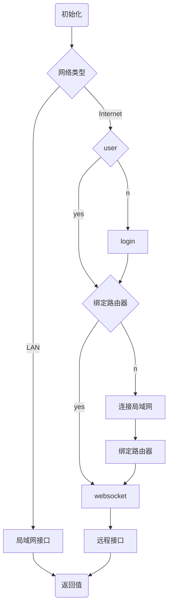
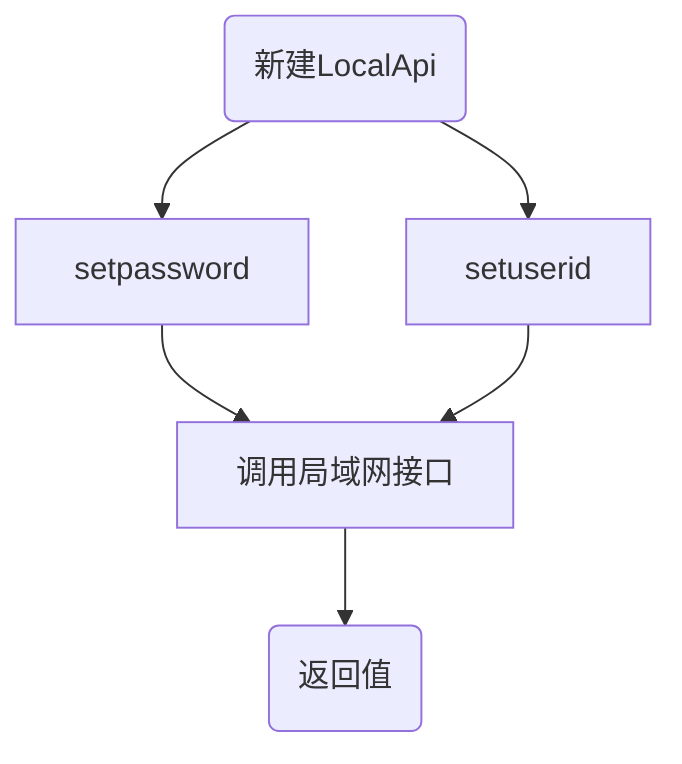

# Android SDK集成指南


**版权所有©上海矽昌微电子有限公司2019。保留一切权利。**
非经本公司许可，任何单位和个人不得擅自摘抄、复制本文档内容的部分或全部，并不得以任何形式传播。

**商标申明**
SiFlower、矽昌和矽昌其它商标均为上海矽昌微电子有限公司的商标，本文档提及的其它所有商标或注册商标，由各自的所有人拥有。

**注意**
您购买的产品、服务或特性应受矽昌公司商业合同和条款的约束，本文档所描述的全部或部分产品、服务或特性可能不在您的购买和使用范围内。除合同另有约定，矽昌公司对文档的内容不做任何明示或暗示的声明和保证。

**上海矽昌微电子有限公司**
地址：上海市浦东新区祖冲之路887弄84号楼408室
网址：http://www.siflower.com/
客户服务电话：021-51317015
客户服务传真：
客户服务邮箱：


**目录**

* TOC
{:toc}

# 目的

    本文档为接入Siflower Android SDK的开发者提供开发独立App的指导。

# 前提条件
    在App开发前，您需要:

  * 熟悉相关硬件产品的功能和使用

  * 使用SiWiFi Openwrt SDK完成产品固件的调试,可参照[快速入门](https://siflower.github.io/2020/08/05/quick_start/)

  * 了解Android开发、上线等一系列流程

# 开发环境

    JAVA版本： JDK1.8及以上

    Android SDK版本： API 15及以上

    Android 开发工具： Android Studio

# 硬件设备

    支持的固件类型：路由器、AC控制器

# 功能概述

    在Android设备上，通过Http协议调用路由器接口，实现对路由器的控制。如：WiFi设置、设备管理、网络管理等
    
# Demo程序

[Android SDK demo 程序](https://github.com/siflower-company/SiRouterSDK-Demo-Android)

## demo 架构介绍
  
[build.gradle](https://github.com/siflower-company/SiRouterSDK-Demo-Android/blob/master/app/build.gradle)
将本sdk引入到项目

[MainActivity](https://github.com/siflower-company/SiRouterSDK-Demo-Android/blob/master/app/src/main/java/sirouter/sdk/siflower/com/sirouterapi/MainActivity.java)

* onCreate()方法完成sdk初始化
* connect()方法完成用户登录，websocket连接建立
* 其余方法则包涵了所有提供接口的调用示例
  
demo包含功能：
* 获取WiFi信息，设置WiFi
* 获取设备列表，拉黑设备
* 设置WAN上网配置

等功能

<!--#0.申请AppID
完成注册后，进入控制台获取AppKey和AppSecret
-->


# 1.下载Android SDK

[点击下载Android SDK](https://open.siflower.cn/#/console/sdkDownload)

包含两个.aar文件：locallibrary-release.aar和remotelibrary-release.aar

分别对应局域网接口和远程接口。


# 2.Android Studio环境搭建

将.aar文件放入app的libs目录下


在项目的build.gradle中添加

```language
implementation(name:'remotelibrary-release', ext:'aar')
implementation(name:'locallibrary-release', ext:'aar')
```

其他引用支持

```language
    implementation "io.reactivex.rxjava2:rxjava:2.2.4"
    implementation 'io.reactivex.rxjava2:rxandroid:2.1.0'
    implementation 'com.google.code.gson:gson:2.8.2'
    implementation 'com.squareup.okhttp3:okhttp:3.12.0'
    implementation 'com.squareup.okio:okio:1.15.0'
    implementation 'com.squareup.retrofit2:retrofit:2.5.0'
    implementation 'com.squareup.retrofit2:converter-gson:2.5.0'
    implementation 'com.squareup.retrofit2:adapter-rxjava2:2.5.0'
```

 [参考Demo中的build.gradle文件](https://github.com/siflower-company/SiRouterSDK-Demo-Android/blob/master/app/build.gradle)

# 3.AndroidManifest.xml 设置

   添加权限支持

```language
 <uses-permission android:name="android.permission.ACCESS_WIFI_STATE" />
 <uses-permission android:name="android.permission.CHANGE_WIFI_MULTICAST_STATE" />
 <uses-permission android:name="android.permission.INTERNET" />
 <uses-permission android:name="android.permission.ACCESS_NETWORK_STATE" />
```
   application中添加

```language
 <uses-library android:name="org.apache.http.legacy" android:required="false" />
```

# 4.SDK 初始化

<!--将[申请的APPID](#1.申请AppID)用于SDK的初始话-->

在APP的入口Activity中初始化SDK

[参考Demo中的MainActivity文件](https://github.com/siflower-company/SiRouterSDK-Demo-Android/blob/master/app/src/main/java/sirouter/sdk/siflower/com/sirouterapi/MainActivity.java)

```language
 //后台 app key
 private String appKey = "d67d8ab4f4c10bf22aa353e27879133c";

 //后台 app secret
 private String appSecret = "d67d8ab4f4c10bf22aa353e27879133c";
 
 private void initSiRouterSDK(){
     SiWiFiManager.init(this, appKey,appSecret);
 }
```

# 5.SDK 使用流程




# 6.用户系统

## (1) SFUser类

| 属性          | 类型          | 说明                                   |
| ------------- | ------------- | -------------------------------------- |
| objectId      | String        | 服务器生成的唯一id                     |
| username      | String        | 服务器生成的用户名                     |
| binder        | List<Routers> | 用户绑定的路由器列表                   |
| loginKeyExtra | String        | 用户的注册信息（需要开发者保证唯一性） |

## (2) 用户登录
### 1、通过extra注册或登录（首次调用为注册）

loginExtra为找回帐号的唯一信息(可以是手机号、邮箱等信息）。登录成功后返回SFUser对象

```language
private void loginByExtra(Context context,String extra){
     SFUser.loginByExtra(context, extra, new SFObjectResponseListener<SFUser>() {
         @Override
         public void onSuccess(SFUser sfUser) {

         }

         @Override
         public void onError(SFException e) {

         }
     });
  }
```


### 2、通过loginKey登录
loginKey为用户生成后用于登录的唯一信息，app端进行保存。
```language
private void loginByLoginKey(Context context,SFUser sfUser){
    SFUser.loginByKey(context, sfUser.getLoginkey(), new SFObjectResponseListener<SFUser>() {
        @Override
        public void onSuccess(SFUser sfUser) {

        }

        @Override
        public void onError(SFException e) {

        }
    });
}
```

[FAQ 登录失败Debug](#1-用户登录失败)

## (3) 获取缓存用户

app上次登录后返回的用户信息，保存在app本地

```language
SFUser sfUser = SFUser.getCacheUser(this);
```

# 7.路由器系统

## (1) Routers类

| 属性     | 类型    | 说明                 |
| -------- | ------- | -------------------- |
| objectId | String  | 服务器生成的唯一id   |
| sn       | String  | sn号                 |
| mac      | String  | mac地址              |
| online   | boolean | 路由器是否连接服务器 |
| name     | String  | 名称                 |
| binder   | SFUser  | 绑定者               |

## (2) 绑定路由器

绑定路由器需要手机连接路由器的WiFi，并使路由器连接internet后，完成绑定

```language
private void bindRouter(Context context,SFUser sfUser){
        SiWiFiManager.getInstance().bindSiRouter(context, LocalApi.DEFAULT_APP_API_VERSION, sfUser, new SingleObserver<BindRet>() {
            @Override
            public void onSubscribe(Disposable d) {

            }

            @Override
            public void onSuccess(BindRet bindRet) {

            }

            @Override
            public void onError(Throwable e) {

            }
        });
    }
```

[FAQ 绑定失败Debug](#2-路由器绑定失败)

## (3) 获取用户绑定的路由器

可通过两种方式获取

从用户对象中直接获取

```language
   SFUser sfUser = SFUser.getCacheUser(this);
   List<Routers> routers = sfUser.getBinder();
```

向服务器查询

```language
   SFUser sfUser = SFUser.getCacheUser(this);
   SiWiFiManager.getInstance().getRouters(sfUser, new SiWiFiListListener<Routers>() {
          @Override
          public void onSuccess(List<Routers> list) {

          }

          @Override
          public void onError(int i, String s) {

          }
      });
```

# 8. WebSocket连接

通过internet获取路由器信息，与服务器建立WebSocket连接


```language
   private void connectServer(SFUser sfUser){
           SiWiFiManager.getInstance().createRemoteConnection(sfUser, new RemoteConnectionListener() {
               @Override
               public void onConnectSuccess() {
                   Log.i(TAG, "on connection success");
               }

               @Override
               public void onConnectionClose(int code, String reason) {
                   Log.i(TAG, "on connection close");
               }

               @Override
               public void onFailure(Exception ex) {
                   Log.i(TAG, "on Failure");
               }
           });
       }
```

连接的状态会通过RemoteConnectionListener通知。

切换用户
```language
   private void changeRemoteUser(SFUser sfUser1,SFUser sfUser2){
           SiWiFiManager.getInstance().changeRemoteUser(sfUser1,sfUser2);
       }
```

断开连接
```language
   SiWiFiManager.getInstance().closeRemoteConnection();
```

[FAQ websocket连接建立失败](#3-websocket建立连接失败)

# 9.远程接口

## (1)远程接口调用流程


## (2)调用API示例

远程接口通过internet获取路由器信息

远程接口均通过SiWiFiManager对象的方法进行调用，在SingleObserver的onSuccess方法中异步获取返回值。

以获取WiFi为例

```language
   private void getWiFi(Routers routers,SFUser sfUser){
           SiWiFiManager.getInstance().getWifiObserve(routers, sfUser, new SingleObserver<List<WiFiInfo>>() {
               @Override
               public void onSubscribe(Disposable d) {

               }

               @Override
               public void onSuccess(List<WiFiInfo> wiFiInfos) {

               }

               @Override
               public void onError(Throwable e) {

               }
           });
       }
```

接口列表

[参考远程类库文档](https://open.siflower.cn/androidremote/index.html) 中SiWifiManager部分


# 10.局域网接口

## (1) 局域网接口调用流程



## (2) LocalApi 初始化

局域网接口需要手机连接路由器的WiFi后，通过LocalApi进行调用。

```language
   //路由器版本信息
   LocalApi localApi = new LocalApi(LocalApi.DEFAULT_APP_API_VERSION);
   //设置路由器的ip地址或域名
   localApi.setmLocalIp("192.168.4.1");
```

两种方式验证：

```language
   //绑定的用户id
   localApi.setUserObject(sfUser.getObjectId());
```

或

```language
  //路由器管理员密码
  localApi.setAdminPassword("admin");
```

## (3) API调用示例

以获取WiFi为例

```language
    Single<GetWiFiDetailRet> getwifi = localApi.executeApiWithSingleResponse(getWiFiDetailParam, GetWiFiDetailRet.class);
    getwifi.subscribe(new SingleObserver<GetWiFiDetailRet>() {
        @Override
        public void onSubscribe(Disposable d) {

        }

        @Override
        public void onSuccess(GetWiFiDetailRet getWiFiDetailRet) {

        }

        @Override
        public void onError(Throwable e) {

        }
    });
```

[参数及返回值列表](https://open.siflower.cn/androidlocal/index.html)

[路由器本地接口使用手册](RM7136)

# 测试
## 1 网络状态测试

### (1) 手机与siflower服务连接测试

    在手机浏览器中访问url https://cloud.siflower.cn/ 如能正常弹出页面，则表示连接正常。如连接失败，则需要确认手机是否能正常访问internet。

### (2) 手机与局域网路由器连接测试

    在手机wifi界面中查看网关地址，如：192.168.4.1
    手机浏览器中访问网关地址(http://192.168.4.1)，如能正常弹出页面，则表示连接正常。如连接失败，则需要确认手机是否正确连接到矽昌路由器的WiFi。

### (3) 路由器与siflower服务连接测试

[参照路由器siflower服务文档](#todo)  

如连接失败，则需要确认路由器是否能正常访问internet。

## 2 局域网接口测试

### (1) sdk接口测试

    以WiFi接口为例：

    先进行wifi设置，传入参数对象setWiFiDetailParam和SetWiFiDetailRet.class，在onSuccess()和onError()中分别打印log，查看接口是否成功。

```language
    LocalApi localApi = new LocalApi(LocalApi.DEFAULT_APP_API_VERSION);
        localApi.setAdminPassword("admin");
        SetWiFiDetailParam setWiFiDetailParam = new SetWiFiDetailParam(LocalApi.DEFAULT_APP_API_VERSION);
        WifiParam param = new WifiParam();
        param.oldssid = "Siwifi-123";
        param.newssid = "Siflower-123";
        List<WifiParam> params = new ArrayList<>();
        params.add(param);
        setWiFiDetailParam.setWifiParamsList(params);
        localApi.executeApiWithSingleResponse(setWiFiDetailParam,SetWiFiDetailRet.class).subscribe(new SingleObserver<SetWiFiDetailRet>() {
            @Override
            public void onSubscribe(Disposable d) {

            }

            @Override
            public void onSuccess(SetWiFiDetailRet ret) {
                Log.e(TAG,"success "+new Gson().toJson(ret));
            }

            @Override
            public void onError(Throwable e) {
                Log.e(TAG,"error "+e.getMessage());
            }
        });
```

若接口调用失败,可根据返回的错误信息,检查:

* [手机网络状态](#2-手机与局域网路由器连接测试)

* localApi.setAdminPassword(String pwd)传入的路由器密码正确（可到路由器管理web页面登录确认）

* [路由器接口是否正常](#2-路由器接口测试)


若接口调用成功，再调用获取WiFi信息接口查看与设置的参数是否符合,可将获取到的结果转成json字串打印对比。

```language
    Single<GetWiFiDetailRet> getwifi = localApi.executeApiWithSingleResponse(getWiFiDetailParam, GetWiFiDetailRet.class);
    getwifi.subscribe(new SingleObserver<GetWiFiDetailRet>() {
        @Override
        public void onSubscribe(Disposable d) {

        }

        @Override
        public void onSuccess(GetWiFiDetailRet ret) {
            Log.e(TAG,"success "+new Gson().toJson(ret));
        }

        @Override
        public void onError(Throwable e) {

        }
    });
```


### (2) 路由器接口测试

参照[SiWiFi接口测试手册](https://siflower.github.io/2020/09/11/SiWiFi_interface_test/#42-app%E6%8E%A5%E5%8F%A3%E6%B5%8B%E8%AF%95)

## 3 远程接口测试

    以 WiFi接口为例：
    先进行wifi设置，传入参数对象router和user,wifiparam和callback，在onSuccess()和onError()中分别打印log，查看接口是否成功。
```language
    WifiParam param = new WifiParam();
        param.oldssid = "Siwifi-123";
        param.newssid = "Siflower-123";
        List<WifiParam> params = new ArrayList<>();
        params.add(param);
        SiWiFiManager.getInstance().setWiFi(routers, sfUser, params, new SingleObserver<SetWiFiDetailRet>() {
            @Override
            public void onSubscribe(Disposable d) {
                
            }

            @Override
            public void onSuccess(SetWiFiDetailRet ret) {
                Log.e(TAG,"success ");
            }

            @Override
            public void onError(Throwable e) {
                Log.e(TAG,"error "+e.getMessage());
            }
        });
```

若接口调用失败,可根据返回的错误信息,检查:

* [手机网络状态](#1-手机与siflower服务连接测试)

* app websocket连接是否正常。[FAQ websocket连接建立失败](#3websocket建立连接失败)

* [路由器网络状态](#3-路由器与siflower服务连接测试)

* 传入的user和router信息是否正确：
    检查user是否为调用登录接口后获取的对象。
    检查user的bind列表中是否存在router,只能向user.getBinder()列表中的路由器发送请求。

* 接口参数传递的合法性

若接口调用成功，再调用获取WiFi信息接口查看与设置的参数是否符合,可将获取到的结果转成json字串打印对比。

```

SiWiFiManager.getInstance().getWifiObserve(routers, sfUser, new SingleObserver<List<WiFiInfo>>() {
                    @Override
                    public void onSubscribe(Disposable d) {

                    }

                    @Override
                    public void onSuccess(List<WiFiInfo> wiFiInfos) {
                        Log.e(TAG,"get wifi success "+new Gson().toJson(wiFiInfos));
                    }

                    @Override
                    public void onError(Throwable e) {
                        Log.e(TAG,"get wifi error "+e.getMessage());
                    }
                });
```


# FAQ
## 1 用户登录失败

* 检查[手机网络是否能连接上Siflower服务器](#1-手机与siflower服务连接测试)
* 检查app key 和 app secret是否正确
  

## 2 路由器绑定失败

* [手机和路由器的网络状态](#1-网络状态测试)
* 确认路由器是否已被其他账号绑定：可根据绑定接口的返回值判定，如已被其他账号绑定，需要该账号解除绑定或将路由器恢复出厂设置后，才能用本账号绑定。


## 3 websocket建立连接失败

* 确认手机是否能连接internet
* 确认 SiWiFiManager.getInstance().createRemoteConnection(user, callback)中传入的user对象是登录后获取的对象。


## 4 局域网接口调用失败

参考
[局域网接口测试](#2-局域网接口测试)中的内容

## 5 远程接口调用失败

参考
[远程接口测试](#3-远程接口测试)中的内容