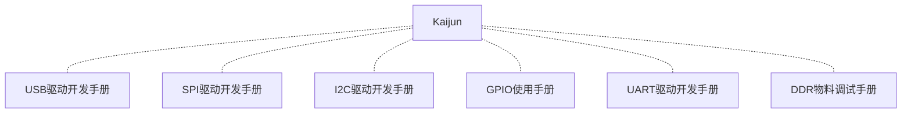
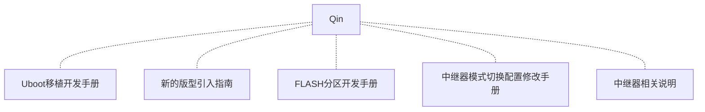
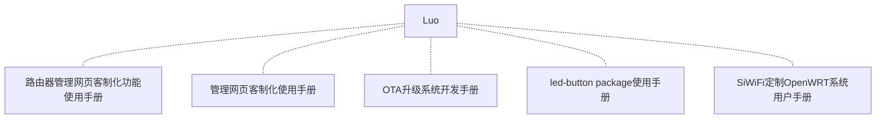
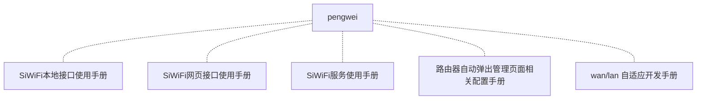
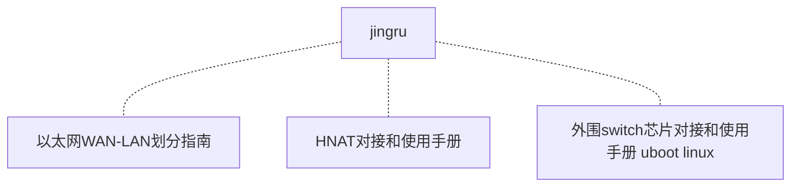
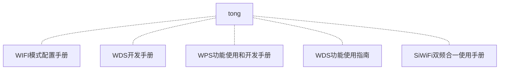
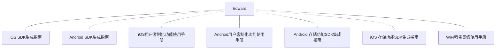

# 会议内容

## 会议任务

- SDK路线图

- 个人负责的文档规划

## 时间节点

9月份芯片回来

文档是否可以深化为专利和著作权

7月21号 下一次会议

## 文档负责人

- 底层平台
  

```mermaid
graph TB

D[Kaijun]
D-.-D1[USB驱动开发手册]
D-.-D2[SPI驱动开发手册]
D-.-D4[I2C驱动开发手册]
D-.-D5[GPIO使用手册]
D-.-D6[UART驱动开发手册]
D-.-D7[DDR物料调试手册]

click D1 "https://open.siflower.cn/#/console/documents?id=5d8368f269cee60001f80c23" "USB驱动开发手册"
click D2 "https://open.siflower.cn/#/console/documents?id=5c6cee865466e4000170474f" "SPI驱动开发手册"
click D4 "https://open.siflower.cn/#/console/documents?id=5c6a971f5466e4000170467d" "I2C驱动开发手册"
click D5 "https://open.siflower.cn/#/console/documents?id=5c6a9b505466e40001704680" "GPIO使用手册"
click D6 "https://open.siflower.cn/#/console/documents?id=5c6a9f2a5466e40001704683" "UART驱动开发手册"
click D7 "https://open.siflower.cn/#/console/documents?id=5d5f7e40fefc6d0001f73d79" "DDR物料调试手册"

```

- 系统平台

```mermaid
graph TB
E[Qin]
E-.-E1[Uboot移植开发手册]
E-.-E3[新的版型引入指南]
E-.-E5[FLASH分区开发手册]

click E1 "https://open.siflower.cn/#/console/documents?id=6e43a77b59080100011ecdd4" "Uboot移植开发手册"
click E3 "https://open.siflower.cn/#/console/documents?id=5e43b6a059080100011ecde2" "新的版型引入指南"
click E5 "https://open.siflower.cn/#/console/documents?id=5e44015259080100011ecde8" "FLASH分区开发手册"
E-.-E6[中继器模式切换配置修改手册]
click E6 "https://open.siflower.cn/#/console/documents?id=5d229e37d1606300013a8247" "中继器模式切换配置修改手册"

E-.-E7[中继器相关说明]
click E7 "https://open.siflower.cn/#/console/documents?id=5d5ce340fefc6d0001f73d73" "中继器相关说明"


```

```mermaid
graph TB
F[Luo]
F-.-F1[路由器管理网页客制化功能使用手册]
F-.-F2[管理网页客制化使用手册]
F-.-F3[OTA升级系统开发手册]
F-.-F4[led-button package使用手册]
F-.-F5[SiWiFi定制OpenWRT系统用户手册]

click F1 "https://open.siflower.cn/#/console/documents?id=5e439ecb59080100011ecdcc" "路由器管理网页客制化功能使用手册"
click F2 "https://open.siflower.cn/#/console/documents?id=5e43a0ed59080100011ecdce" "管理网页客制化使用手册"
click F3 "https://open.siflower.cn/#/console/documents?id=5e46071259080100011ece3a" "OTA升级系统开发手册"

click F4 "https://open.siflower.cn/#/console/documents?id=5e56195459080100011ecf38" "led-button package使用手册"

click F5 "https://open.siflower.cn/#/console/documents?id=5e43c00b59080100011ecde6" "SiWiFi定制OpenWRT系统用户手册"
```

```mermaid
graph TB
G[pengwei]

G-.-G1[SiWiFi本地接口使用手册]
G-.-G3[SiWiFi网页接口使用手册]
G-.-G4[SiWiFi服务使用手册]

click G1 "https://open.siflower.cn/#/console/documents?id=5c6e5c6ed76d65000148f91d" "SiWiFi本地接口使用手册"
click G3 "https://open.siflower.cn/#/console/documents?id=5c6e5d48d76d65000148f91f" "SiWiFi网页接口使用手册"
click G4 "https://open.siflower.cn/#/console/documents?id=5c6e5ba8d76d65000148f91b" "SiWiFi服务使用手册"
G-.-G2[路由器自动弹出管理页面相关配置手册]
click G2 "https://open.siflower.cn/#/console/documents?id=5e4b983c59080100011eceb0" "路由器自动弹出管理页面相关配置手册"

G-.-G5[wan/lan 自适应开发手册]
```

```mermaid
graph TB
Y[jingru]
Y-.-Y5[以太网WAN-LAN划分指南]
click Y5 "https://open.siflower.cn/#/console/documents?id=5e4267c259080100011ecdb8]" "以太网WAN-LAN划分指南"

Y-.-Y1[HNAT对接和使用手册]
Y-.-Y2[外围switch芯片对接和使用手册 uboot linux]

```

- WiFi

```mermaid
graph TB
Z[tong]
Z-.-Z2[WIFI模式配置手册]
click Z2 "https://open.siflower.cn/#/console/documents?id=5e46071259080100011ece3a" "WIFI模式配置手册"

Z-.-Z6[WDS开发手册]
click Z6 "https://open.siflower.cn/#/console/documents?id=5c788ed2d76d65000168ea44" "WDS开发手册"
Z-.-Z7[WPS功能使用和开发手册]
click Z7 "https://open.siflower.cn/#/console/documents?id=5e426a4f59080100011ecdbe" "WPS功能使用和开发手册"

Z-.-Z3[WDS功能使用指南]
click Z3 "https://open.siflower.cn/#/console/documents?id=5c788fe3d76d65000168ea46" "WDS功能使用指南"

Z-.-Z4[SiWiFi双频合一使用手册]
click Z4 "https://open.siflower.cn/#/console/documents?id=5cf62ef66080e80001cf1a95" "SiWiFi双频合一使用手册"


```

- 应用平台

```mermaid
graph TB


J[Edward]
J-.-J1[iOS SDK集成指南]
click J1 "https://open.siflower.cn/#/console/documents?id=5e42697d59080100011ecdbc" "iOS SDK集成指南"
J-.-J2[Android SDK集成指南]
click J2 "https://open.siflower.cn/#/console/documents?id=5e4268d059080100011ecdba" "Android SDK集成指南"
J-.-J3[iOS用户客制化功能使用手册]
click J3 "https://open.siflower.cn/#/console/documents?id=5e4258fe59080100011ecdb0" "iOS用户客制化功能使用手册"
J-.-J4[Android用户客制化功能使用手册]
click J4 "https://open.siflower.cn/#/console/documents?id=5d121310e3876900013217d1" "Android用户客制化功能使用手册"
J-.-J5[Android 存储功能SDK集成指南]
click J5 "https://open.siflower.cn/#/console/documents?id=5e4255df59080100011ecdac" "Android 存储功能SDK集成指南"
J-.-J6[iOS 存储功能SDK集成指南]
click J6 "https://open.siflower.cn/#/console/documents?id=5e425b7859080100011ecdb4" "iOS 存储功能SDK集成指南"

J-.-J9[WiFi租赁网络使用手册]
click J9 "https://open.siflower.cn/#/console/documents?id=5c6f528cd76d65000148f927" "WiFi租赁网络使用手册"

```

