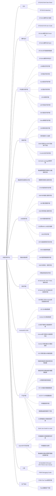

# A18 文档集合

```mermaid
graph LR


    A[矽昌开放平台]---B[芯片]
    B-.-B1[SF16A18 Brief Date Sheet]
    B-.-B2[SF16A18 datasheet]
click A "https://open.siflower.cn/#/console/documents" "开发平台"

click B1 "https://open.siflower.cn/#/console/documents?id=5e03007c4b8ddc0001b46134" "SF16A18 Brief Date Sheet"
click B2 "https://open.siflower.cn/#/console/documents?id=5d133a80e3876900013218bc" "SF16A18 datasheet"

    A---C[硬件设计]
    C-.-C1[SF16A18硬件设计指南]
    C-.-C2[SF16A18 EVB User Guide]
    C-.-C3[SF16A18硬件设计Check list]
    C-.-C4[SF16A18硬件设计Q&A]
    C-.-C5[SF16A18开发板使用指南]
    C-.-C6[SF16A18硬件参考设计]


click C1 "https://open.siflower.cn/#/console/documents?id=5e54db9259080100011ecf17 " "SF16A18硬件设计指南"
click C2 "https://open.siflower.cn/#/console/documents?id=5e44e76a59080100011ece0e" "SF16A18 EVB User Guide"
click C3 "https://open.siflower.cn/#/console/documents?id=5b17691e484ce00001974a40" "SF16A18硬件设计Check list"
click C4 "https://open.siflower.cn/#/console/documents?id=5b176947484ce00001974a42" "SF16A18硬件设计Q&A"
click C5 "https://open.siflower.cn/#/console/documents?id=5e44c0b059080100011ecdee" "SF16A18开发板使用指南"
click C6 "https://open.siflower.cn/#/console/documents?id=5d1a02cee3876900013218f0" "SF16A18硬件参考设计"

    A---D[外设接口类开发]
    D-.-D1[USB驱动开发手册]
    D-.-D2[SPI驱动开发手册]
    D-.-D3[Audio驱动开发手册]
    D-.-D4[I2C驱动开发手册]
    D-.-D5[GPIO使用手册]
    D-.-D6[UART驱动开发手册]
    D-.-D7[SDIO驱动开发手册]

click D1 "https://open.siflower.cn/#/console/documents?id=5d8368f269cee60001f80c23" "USB驱动开发手册"
click D2 "https://open.siflower.cn/#/console/documents?id=5c6cee865466e4000170474f" "SPI驱动开发手册"
click D3 "https://open.siflower.cn/#/console/documents?id=5c6a8c1c5466e40001704675" "Audio驱动开发手册"
click D4 "https://open.siflower.cn/#/console/documents?id=5c6a971f5466e4000170467d" "I2C驱动开发手册"
click D5 "https://open.siflower.cn/#/console/documents?id=5c6a9b505466e40001704680" "GPIO使用手册"
click D6 "https://open.siflower.cn/#/console/documents?id=5c6a9f2a5466e40001704683" "UART驱动开发手册"
click D7 "https://open.siflower.cn/#/console/documents?id=5c6ccbec5466e40001704743" "SDIO驱动开发手册"

    A---E[系统开发]
    E-.-E1[Uboot移植开发手册]
    E-.-E2[DDR物料调试手册]
    E-.-E3[新的版型引入指南]
    E-.-E4[SiWiFi定制OpenWRT系统用户手册]
    E-.-E5[FLASH分区开发手册]
    E-.-E6[led-button package使用手册]

click E1 "https://open.siflower.cn/#/console/documents?id=6e43a77b59080100011ecdd4" "Uboot移植开发手册"
click E2 "https://open.siflower.cn/#/console/documents?id=5d5f7e40fefc6d0001f73d79" "DDR物料调试手册"
click E3 "https://open.siflower.cn/#/console/documents?id=5e43b6a059080100011ecde2" "新的版型引入指南"
click E4 "https://open.siflower.cn/#/console/documents?id=5e43c00b59080100011ecde6" "SiWiFi定制OpenWRT系统用户手册"
click E5 "https://open.siflower.cn/#/console/documents?id=5e44015259080100011ecde8" "FLASH分区开发手册"
click E6 "https://open.siflower.cn/#/console/documents?id=5e56195459080100011ecf38" "led-button package使用手册"

A---F[路由网页及客制化开发]
F-.-F1[路由器管理网页客制化功能使用手册]
click F1 "https://open.siflower.cn/#/console/documents?id=5e439ecb59080100011ecdcc" "路由器管理网页客制化功能使用手册"

F-.-F2[管理网页客制化使用手册]
click F2 "https://open.siflower.cn/#/console/documents?id=5e43a0ed59080100011ecdce" "管理网页客制化使用手册"
F-.-F3[OTA升级系统开发手册]
click F3 "https://open.siflower.cn/#/console/documents?id=5e46071259080100011ece3a" "OTA升级系统开发手册"

A---G[wifi应用开发]
G-.-G1[SiWiFi本地接口使用手册]
click G1 "https://open.siflower.cn/#/console/documents?id=5c6e5c6ed76d65000148f91d" "SiWiFi本地接口使用手册"

G-.-G2[WIFI模式配置手册]
click G2 "https://open.siflower.cn/#/console/documents?id=5e46071259080100011ece3a" "WIFI模式配置手册"

G-.-G3[SiWiFi网页接口使用手册]
click G3 "https://open.siflower.cn/#/console/documents?id=5c6e5d48d76d65000148f91f" "SiWiFi网页接口使用手册"
G-.-G4[SiWiFi服务使用手册]
click G4 "https://open.siflower.cn/#/console/documents?id=5c6e5ba8d76d65000148f91b" "SiWiFi服务使用手册"
G-.-G5[以太网WAN-LAN划分指南]
click G5 "https://open.siflower.cn/#/console/documents?id=5e4267c259080100011ecdb8]" "以太网WAN-LAN划分指南"
G-.-G6[WDS开发手册]
click G6 "https://open.siflower.cn/#/console/documents?id=5c788ed2d76d65000168ea44" "WDS开发手册"
G-.-G7[WPS功能使用和开发手册]
click G7 "https://open.siflower.cn/#/console/documents?id=5e426a4f59080100011ecdbe" "WPS功能使用和开发手册"

A---H[路由功能说明]
H-.-H1[WDS功能使用指南]
click H1 "https://open.siflower.cn/#/console/documents?id=5c788fe3d76d65000168ea46" "WDS功能使用指南"
H-.-H2[WiFi租赁网络使用手册]
click H2 "https://open.siflower.cn/#/console/documents?id=5c6f528cd76d65000148f927" "WiFi租赁网络使用手册"
H-.-H3[SiWiFi双频合一使用手册]
click H3 "https://open.siflower.cn/#/console/documents?id=5cf62ef66080e80001cf1a95" "SiWiFi双频合一使用手册"

A---I[测试手册]
I-.-I1[矽路由性能测试手册]
click I1 "https://open.siflower.cn/#/console/documents?id=5d2c202c6fdbe80001cb30ea" "矽路由性能测试手册"
I-.-I2[SF16A18 ATE TEST TOOL 使用手册]
click I2 "https://open.siflower.cn/#/console/documents?id=5cd1396cd76d650001b2d454" "SF16A18 ATE TEST TOOL 使用手册"
I-.-I3[SF16A18 WiFi RF自动化测试使用手册]
click I3 "https://open.siflower.cn/#/console/documents?id=5c6f9a04d76d65000148f92f" "SF16A18 WiFi RF自动化测试使用手册"
I-.-I4[WiFi抓包工具Omnipeek的安装使用手册]
click I4 "https://open.siflower.cn/#/console/documents?id=5d1c068fd1606300013a8225" "WiFi抓包工具Omnipeek的安装使用手册"

A---J[Android/iOS SDK]
J-.-J1[iOS SDK集成指南]
click J1 "https://open.siflower.cn/#/console/documents?id=5e42697d59080100011ecdbc" "iOS SDK集成指南"
J-.-J2[Android SDK集成指南]
click J2 "https://open.siflower.cn/#/console/documents?id=5e4268d059080100011ecdba" "Android SDK集成指南"
J-.-J3[iOS用户客制化功能使用手册]
click J3 "https://open.siflower.cn/#/console/documents?id=5e4258fe59080100011ecdb0" "iOS用户客制化功能使用手册"
J-.-J4[Android用户客制化功能使用手册]
click J4 "https://open.siflower.cn/#/console/documents?id=5d121310e3876900013217d1" "Android用户客制化功能使用手册"
J-.-J5[Android 存储功能SDK集成指南]
click J5 "https://open.siflower.cn/#/console/documents?id=5e4255df59080100011ecdac" "Android 存储功能SDK集成指南"
J-.-J6[iOS 存储功能SDK集成指南]
click J6 "https://open.siflower.cn/#/console/documents?id=5e425b7859080100011ecdb4" "iOS 存储功能SDK集成指南"

A---K[产品手册]
K-.-K1[快速安装指南-智能双频无线路由器]
click K1 "https://open.siflower.cn/#/console/documents?id=5c7ca1ad3c32dc0001b9159b" "快速安装指南-智能双频无线路由器"
K-.-K2[智能双频无线路由器详细配置指南]
click K2 "https://open.siflower.cn/#/console/documents?id=5c7ddf773c32dc0001b9159d" "智能双频无线路由器详细配置指南"
K-.-K3[AP面板快速安装指南]
click K3 "https://open.siflower.cn/#/console/documents?id=5c8106a13c32dc000123202c" "AP面板快速安装指南"
K-.-K4[FAT AP面板详细配置指南]
click K4 "https://open.siflower.cn/#/console/documents?id=5e47b13a59080100011ecea0" "FAT AP面板详细配置指南"
K-.-K5[AC对 FIT AP的配置指南]
click K5 "https://open.siflower.cn/#/console/documents?id=5e47b1b059080100011ecea2" "AC对 FIT AP的配置指南"
K-.-K6[中继器使用手册]
click K6 "https://open.siflower.cn/#/console/documents?id=5e47b20059080100011ecea4" "中继器使用手册"
K-.-K7[智能路由器音箱用户手册]
click K7 "https://open.siflower.cn/#/console/documents?id=5e47b25c59080100011ecea6" "智能路由器音箱用户手册"
K-.-K8[AC控制器及AP面板安装手册]
click K8 "https://open.siflower.cn/#/console/documents?id=5e47b2b459080100011ecea8" "AC控制器及AP面板安装手册"
K-.-K9[Quick Use Guide for router]
click K9 "https://open.siflower.cn/#/console/documents?id=5e47b3b559080100011eceaa" "Quick Use Guide for router"


A---L[OpenWRT开发手册]

L-.-L1[中继器模式切换配置修改手册]
click L1 "https://open.siflower.cn/#/console/documents?id=5d229e37d1606300013a8247" "中继器模式切换配置修改手册"

L-.-L2[中继器相关说明]
click L2 "https://open.siflower.cn/#/console/documents?id=5d5ce340fefc6d0001f73d73" "中继器相关说明"

L-.-L3[路由器自动弹出管理页面相关配置手册]
click L3 "https://open.siflower.cn/#/console/documents?id=5e4b983c59080100011eceb0" "路由器自动弹出管理页面相关配置手册"

A---M[工具]

M-.-M1[SF19A2890 EVB board ATE TOOLS User manual]
click M1 "https://open.siflower.cn/#/console/documents?id=5e4520cc59080100011ece22" "SF19A2890 EVB board ATE TOOLS User manual"

M-.-M2[PWM Debugging Guide]
click M2 "https://open.siflower.cn/#/console/documents?id=5e465dae59080100011ece7e" "PWM Debugging Guide"

A---N[生产测试]
N-.-N1[PCBA Test Tools使用手册]
click N1 "https://open.siflower.cn/#/console/documents?id=5d43dec96fdbe800013c245e" "PCBA Test Tools使用手册"

N-.-N2[Flash镜像用户手册]
click N2 "https://open.siflower.cn/#/console/documents?id=5d43e42e6fdbe800013c2460" "Flash镜像用户手册"

```
