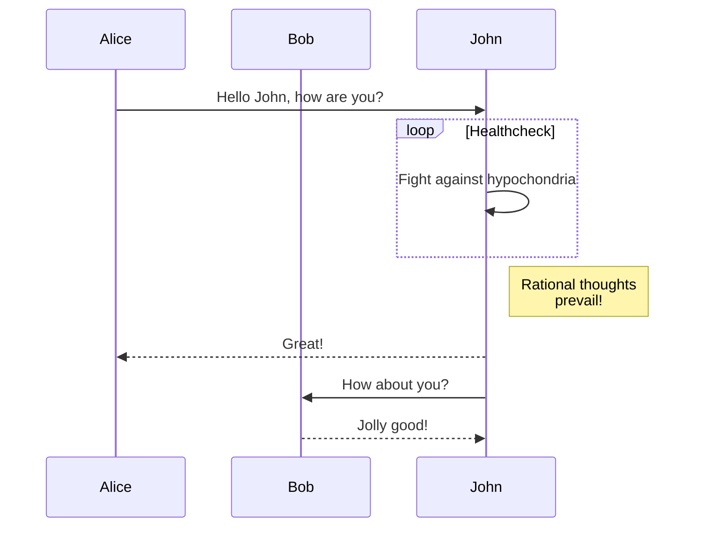
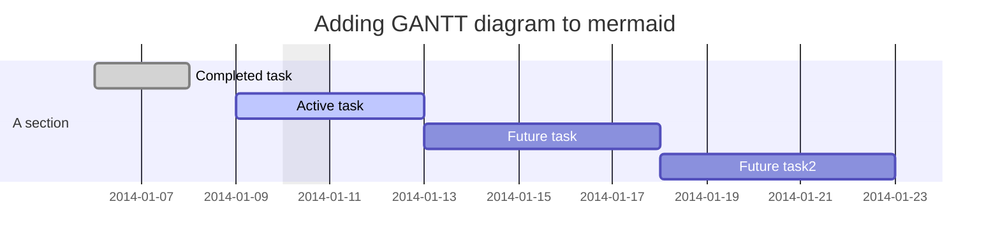
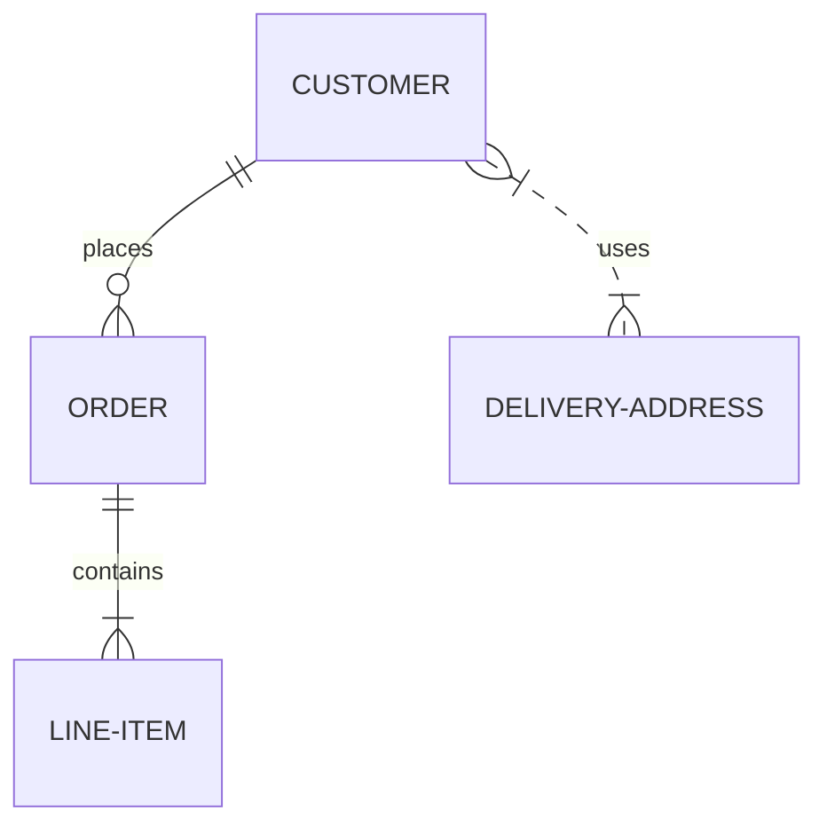

# 如何进行SDK文档开发


**注意：文件名必须用2020-07-30- 作为前缀，文件名不能带有中文**


**目录**

* TOC
{:toc}


## 文档模板

文档使用markdown语言，markdown语法参照[wiki-markdown](https://siflower.github.io/wiki/markdown/)。

文档中必须包含文档头

```
---
layout: post
title: SDK文档开发介绍
categories: develop
description: 介绍如何进行文档开发
keywords: 文档开发
mermaid: true
---
```
- layout 默认使用post
- title 为文章标题
- categories 为文章分类 目前使用develop user introduce demo 四个分类
- description keywords 按照实际需求填写
- mermaid: true 表示文档中包含使用mermaid 语言绘制的图表

```markdown
**目录**

* TOC
{:toc}
```
插入目录，效果如下，本地预览无法显示。


## 本地预览

首先下载[本项目源码仓库](https://github.com/Siflower/siflower.github.io)

本地预览可以使用常规的markdown编辑工具进行即可，推荐使用vscode+markdown all in one 插件的方式进行本地markdown预览

如果想要预览web显示样式，需要下载ruby + jekyll 环境。
然后再项目根目录下操作，就可以通过 http://127.0.0.1:4000 访问网站


## 绘制图表
使用mermaid可以绘制流程图，框图等
所有文档的图表绘制都需要使用mermaid来完成。







## 上传图片
上传图片到本项目文件夹/assets/images下，建议为自己的文章使用单独目录。


```

```

## 插入链接

在markdown中插入链接

```
[wiki-markdown](https://siflower.github.io/wiki/markdown/)
```

[wiki-markdown](https://siflower.github.io/wiki/markdown/)

在mermaid中插入链接


```
graph LR
  A[Christmas] -->|Get money| B(Go shopping)
  click B "https://open.siflower.cn/#/console/documents?id=5e03007c4b8ddc0001b46134" "SF16A18 Brief Date Sheet"
```
每篇文档中关联文档必须使用插入链接的方式进行引用。

## 注意事项

- 不同块内容请用空行隔开，比如标题和正文等. 如果连续使用标签后，使用\``` 注释，请空开两行,  结束\``` 前不要有无意义空行。

```
# title

正文

- tag 

正文

- tag1

- tag2


\```

\```
```