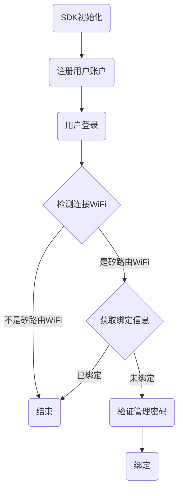
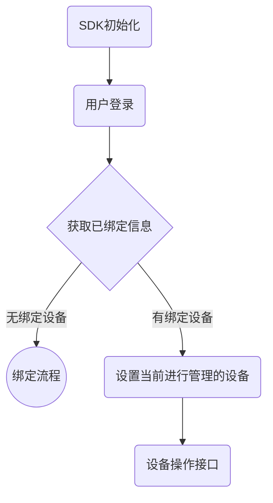

# iOS SDK集成指南


**目录**

* TOC
{:toc}

# 简介

## 使用背景

本文档为接入Siflower iOS SDK的开发者提供独立开发控制矽昌路由器、AC控制器的App提供指导。

## 适用人员

本文适用于在Siflower路由器、AC控制器的软件及硬件产品上，基于iOS SDK上进行实现控制矽昌路由器及AC控制器的iOS APP研发人员。

## 前提条件

在使用SDK开发前，您需要:

  * 熟悉相关硬件产品的功能和使用

  * 使用SiWiFi Openwrt SDK完成产品固件的调试  [快速入门](https://siflower.github.io/2020/08/05/quick_start/)
  
  * 注册 在[矽昌开放平台](https://open.siflower.cn/) 注册Siflower产品服务。 取得AppKey，AppSecret和productKey

  * 了解iOS App开发、上线等一系列流程
 
## SDK提供功能

通过SDK提供的API实现对矽昌路由器、AC控制器智能产品在局域网和远程状态下的控制，如：

  * WiFi设置：设置WiFi密码、设置WiFi名称、打开关闭WiFi、访客网络设置、租赁网络设置等；

  * 连接设备管理：设备上线提醒、设备家长管控（限流量、限上网时间、限社交、限视频、限游戏）、设备限流量、设备加入黑名单等；

  * 路由管理：设置路由上网方式 、重启、升级、恢复出厂设置、WDS设置等；

## 开发环境要求

开发环境：MAC操作系统+Xcode开发软件

运行环境：iOS 8及以上系统

# 注册账户

在[矽昌开放平台](https://open.siflower.cn/) 注册产品，获取AppKey，AppSecret和productKey。
其中:

* AppKey和AppSecret 参考《 [矽昌开放平台用户手册](https://siflower.github.io/2020/09/12/open_platform_user_guide/) 》5.4.3 APP产品参数 章节描述。

* productKey 参考《 [矽昌开放平台用户手册](https://siflower.github.io/2020/09/12/open_platform_user_guide/) 》5.4.1 硬件产品参数 章节描述。


# 下载iOS SDK
[点击下载iOS SDK](https://open.siflower.cn/#/console/sdkDownload)
SDK包包含：SiRouterApi.framwork文件

# iOS SDK集成步骤

1. 将资源包和类库导入工程中，由于是动态库,需要在Embed Frameworks(没有则手动添加)中手动加入.framework库，否则崩溃报image not found错
   


2. Build Setting -> vaild Architecture ->添加arm64,armv7s


3. 将Capabilities->access WiFi information->设置为ON


# iOS SDK使用

## 用户首次使用流程




## 用户非首次使用流程



## 添加类库头文件

在需要使用SDK接口文件中添加SDK引用
```
    #import <SiRouterApi/SiWiFiManager.h>

```
参见Demo程序的AppDelegate.m文件

## SDK 初始化

在初始化前需要准备好[productKey、appkey和AppSecret](#注册账户)。

接口示例：

```
//RouterKeys
NSArray *productKeys = [NSArray arrayWithObject:@"c20ad4d76fe97759aa27a0c99bff6710"];
//appKey
NSString *appkey = @"c20ad4d76fe97759aa27a0c99bff6710";
//初始化 SDK
[manager initializeManager:appkey andRouterKeys:productKeys];

```
参见Demo程序的AppDelegate.m文件

## SDK 用户注册

| 属性 | 类型 | 说明 | 
| ------- | :------ | :----- |
| appKey | String | 区分应用的唯一键 |
| secretKey | String | 后台 app secret |
| loginKeyExtra | String | 用户的注册信息（需要开发者保证唯一性） |

接口示例：

```
    [manager createUserKey:appKey andSecretKey:secretKey loginKeyExtra:loginKeyExtra onresult:^(id ret, int code, NSString *msg) {
       //注册成功会返回用户登录时需要的loginKey
    }];

```

说明：

* 这里注册用户成功后返回的loginKey即为一个用户帐号，SDK不提供除loginKey以外的其他任何用户信息认证方式。

* 如果开发人员需要绑定用户的手机号、微信号、邮箱帐号等个人信息，则根据自己的需求在自己或其他服务器上进行个人信息和loginKey进行绑定即可。

* SDK用户登录仅使用loginKey和appKey。


## SDK 用户登录

| 属性 | 类型 | 说明 | 
| ------- | :------ | :----- |
| loginKey | String | 用户登录账号 |
| appKey | String | 区分应用的唯一键 |

接口示例：

```
[manager userLogin:@"43fbf9db189a937511658743a47ce2f7" andAppKey:@"c20ad4d76fe97759aa27a0c99bff6710" onresult:^(id ret, int code, NSString *msg){
        if(code == 0){
           //登录成功操作
        }else{
          //登录失败操作
        }    
    }];

```

# SDK 接口调用

## 初始化本地

在使用接口前必须要调用初始化本地接口，接口示例：

```
[manager initLocalApi:^(id ret) {
        NSLog(@"initlocalapi");   
    } error:^(int code, NSString *msg) {
        NSLog(@"initlocalapi----%d,%@",code,msg);
    }];

```


## 检测连接WiFi

* 通过isSiWiFi接口判断当前手机连接的WiFi是否未矽路由WiFi（该接口判断依据是WiFi的MAC地址是否为A8：5A：3F开头，如产品自定义了MAC地址，可自行根据MAC判断是否为自己的路由器产品WiFi）；

* 通过getClientMac接口获取手机的mac地址，属于何种网络（主人网络、访客网络、租赁网络）信息；

* 通过getBindInfo接口获取设备的绑定信息。

接口示例：

```
-(void)checkSiWiFi
{
    if ([SiWiFiManager isSiWiFi]) {
	//检测连接路由是否是矽路由
        NSLog(@"SiWiFiManager isSiWiFi");
        [manager getClientMac:^(id ret, int code, NSString *msg) {
	    //获取本机设备mac 地址
            NSLog(@"getClientMac  ret == %@,code == %d",ret,code);
            if(code == 0){
                GetClientMacRet *client = (GetClientMacRet *)ret;
                if(![client.wlan containsString:@"lease"]){
                    [manager getBindInfo:^(id ret, int code, NSString *msg) {
                        if(code == 0){
                            //获取绑定信息成功操作
                            GetBindInfoRet *bind = (GetBindInfoRet *)ret;
                        }else{
                            //获取绑定信息失败操作
                        }
                    }];
                }
            }
        }];
    }else{
        //不是矽路由操作
    }
    return ;
}

```

## 检测管理密码是否正确

管理密码是登录路由器网页的密码，一般粘贴在路由器产品的底部标签上。
通过checkAdminPassword接口验证管理密码是否正确。
接口示例：

```
[manager checkAdminPassword:alert.textFields.lastObject.text flag:false onresult:^(id ret, int code, NSString *msg) {
                if(code == 0){
                    //管理员密码验证成功操作
                }else{
                   //管理员密码验证失败
                }
            }];

```

## 绑定路由

接口示例：

```
[manager bindSiRouter:^(id ret, int code, NSString *msg) {
        if(code == 0){
            //绑定路由成功操作
        }else{
            //绑定路由失败操作
        }
    }];

```

## 获取用户绑定设备信息

通过getSiRouters接口获取当前用户的所有绑定设备信息。
接口示例：

```
[manager getSiRouters:ALL_ROUTER onresult:^(id ret, int code, NSString *msg) {
                self.routerArray = ret;
                NSLog(@"routerArray ret ===== %@",self.routerArray);
                NSArray *RouterArray = [self.routerArray mutableCopy];
                if(RouterArray.count){
                    SiRouter *newRouter = RouterArray[0];
                    NSLog(@"newRouter.name ===== %@,newRouter.mac ===== %@ ",newRouter.name,newRouter.mac);
                    self.promptLab.text = [NSString stringWithFormat:@"当前绑定路由为： %@",newRouter.name];
                    [manager setCurrentRouter:newRouter onresult:^(id ret, int code, NSString *msg) {
                        MyCurrentRouter = newRouter;
                        AppDelegate *app = (AppDelegate*)[UIApplication sharedApplication].delegate;
                        [app CheckWiFiStatus];
                        NSLog(@"setCurrentRouter ret ==== %@,code ==== %d",ret,code);
                    }];
                    
                }else{
                    MyCurrentRouter = nil;
                    manager.mLocalnetWorking = 0;
                    self.promptLab.text = @"当前用户未绑定路由";
                }
}];
```

## 获取wifi信息

接口示例：

```
[manager getRouterWifi:^(id ret, int code, NSString *msg) {
        if(code == 0){
            //获取wifi信息成功操作
        }else{
            NSLog(@"getRouterWifi error");
        }
    }];

```

## 解绑路由

接口示例：

```
[manager unbindSiRouter:^(id ret, int code, NSString *msg) {
        NSLog(@"unbindSiRouter ret ==== %@,code == %d",ret,code);
        manager.mLocalnetWorking = 0;
        if(code == 0){
            //解绑成功后续操作
        }else if(code == 1016){
            //路由器尚未绑定
        }else{
            //解绑失败
        }
    }]

```
# 参考文档
[iOS SDK类库文档](https://open.siflower.cn/ios/index.html)

[iOS SDK demo程序](https://github.com/Siflower/iOS_SDK_demo)

demo程序提供了以下功能：
* SDK初始化功能；
* SDK用户登录注册功能；
* 设备绑定流程示例功能；
* 设备WiFi信息获取及设置功能；

# 测试
## 1 网络状态测试

### (1) 手机与siflower服务连接测试

    在手机浏览器中访问url https://cloud.siflower.cn/ 如能正常弹出页面，则表示连接正常。如连接失败，则需要确认手机是否能正常访问internet。

### (2) 手机与局域网路由器连接测试

    在手机wifi界面中查看网关地址，如：192.168.4.1
    手机浏览器中访问网关地址(http://192.168.4.1)，如能正常弹出页面，则表示连接正常。如连接失败，则需要确认手机是否正确连接到矽昌路由器的WiFi。
    如无法访问，请确认手机连接的WiFi是否为访客网络（是否开启了允许访问内网资源）或租赁网络，建议切换连接到主人网络。

### (3) 路由器与siflower服务连接测试

[参照路由器siflower服务文档](#todo)  

如连接失败，则需要确认路由器是否能正常访问internet。

## 2 局域网接口测试

### (1) sdk接口测试

    以获取绑定信息接口为例：

```language
    [manager getBindInfo:^(id ret, int code, NSString *msg) {
                if(code == 0){
                    //获取绑定信息成功操作
                    GetBindInfoRet *bind = (GetBindInfoRet *)ret;
                }else{
                    //获取绑定信息失败操作
                }
    }];
```

若接口调用失败,可根据返回的错误信息,检查:

* [手机网络状态](#2-手机与局域网路由器连接测试)

* [路由器接口是否正常](#2-路由器接口测试)


若接口调用成功，再调用获取绑定信息接口。

### (2) 路由器接口测试

参照[SiWiFi接口测试手册](https://siflower.github.io/2020/09/11/SiWiFi_interface_test/)


若接口调用失败,可根据返回的错误信息,检查:

* [手机网络状态](#1-手机与siflower服务连接测试)

* [路由器网络状态](#3-路由器与siflower服务连接测试)

* 传入的user和router信息是否正确：
    检查user是否为调用登录接口后获取的对象。
    检查user的bind列表中是否存在router,只能向已绑定列表中的路由器发送请求。

* 接口参数传递的合法性

若接口调用成功，再调用获取相关信息接口查看与设置的参数是否符合,可将获取到的结果转成json字串打印对比。


# FAQ
## 1 用户登录失败

* 检查[手机网络是否能连接上Siflower服务器](#1-手机与siflower服务连接测试)
* 检查app key 和 app secret是否正确


## 2 路由器绑定失败

* [手机和路由器的网络状态](#1-网络状态测试)
* 确认路由器是否已被其他账号绑定：可根据绑定接口的返回值判定，如已被其他账号绑定，需要该账号解除绑定或将路由器恢复出厂设置后，才能用本账号绑定。

## 3 局域网接口调用失败

参考
[局域网接口测试](#2-局域网接口测试)中的内容
