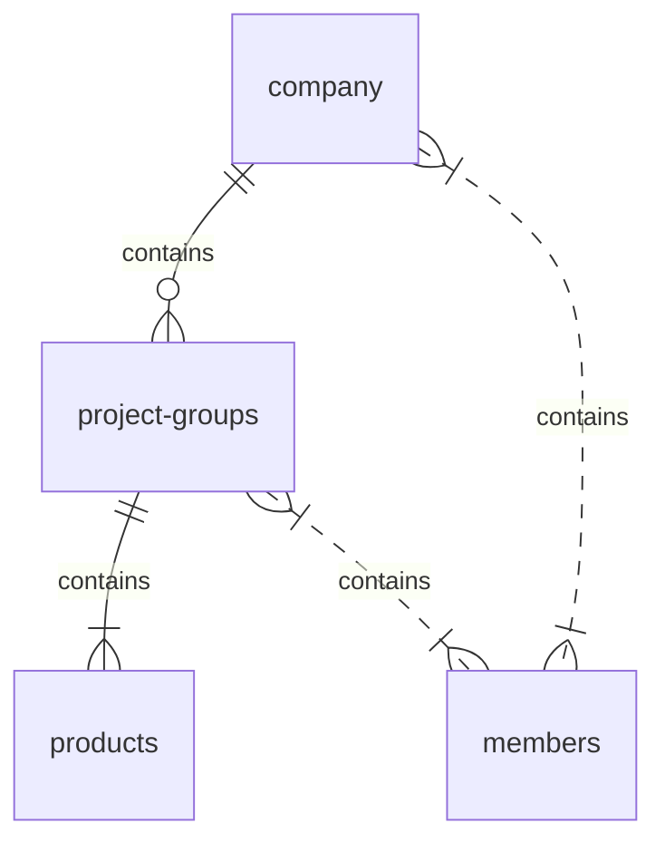

# 矽昌开放平台用户手册

**商标申明**
SiFlower、矽昌和矽昌其它商标均为上海矽昌微电子有限公司的商标，本文档提及的其它所有商标或注册商标，由各自的所有人拥有。

**注意**
您购买的产品、服务或特性应受矽昌公司商业合同和条款的约束，本文档所描述的全部或部分产品、服务或特性可能不在您的购买和使用范围内。除合同另有约定，矽昌公司对文档的内容不做任何明示或暗示的声明和保证。

**上海矽昌微电子有限公司**
地址：上海市浦东新区祖冲之路887弄84号楼408室
网址：http://www.siflower.com/
客户服务电话：021-51317015
客户服务传真：
客户服务邮箱：

**目录**
<!-- TOC -->

- [矽昌开放平台用户手册](#矽昌开放平台用户手册)
- [1 介绍](#1-介绍)
  - [1.1目的](#11目的)
  - [1.2 适用人员](#12-适用人员)
  - [1.3 相关文档](#13-相关文档)
- [2 功能概述](#2-功能概述)
  - [2.1 产品服务](#21-产品服务)
  - [2.2 文档](#22-文档)
  - [2.3 下载](#23-下载)
  - [2.4 控制台](#24-控制台)
- [3 注册登录](#3-注册登录)
  - [3.1 注册](#31-注册)
  - [3.2 登录](#32-登录)
  - [3.3 用户类型设置](#33-用户类型设置)
    - [3.3.1 企业用户](#331-企业用户)
    - [3.3.2 个人用户](#332-个人用户)
- [4 团队管理](#4-团队管理)
  - [4.1 团队结构](#41-团队结构)
  - [4.2 团队成员管理](#42-团队成员管理)
    - [4.2.1 团队管理员](#421-团队管理员)
      - [4.2.1.1 修改团队信息](#4211-修改团队信息)
      - [4.2.1.2 移除成员](#4212-移除成员)
      - [4.2.1.3 邀请成员](#4213-邀请成员)
      - [4.2.1.4 移交团队](#4214-移交团队)
    - [4.2.2 普通成员](#422-普通成员)
  - [4.3 项目组管理](#43-项目组管理)
    - [4.3.1 管理员](#431-管理员)
      - [4.3.1.1 创建项目组](#4311-创建项目组)
      - [4.3.1.2 项目组成员管理](#4312-项目组成员管理)
      - [添加成员](#添加成员)
      - [移除项目组成员](#移除项目组成员)
      - [4.3.1.3 转让项目组管理权限](#4313-转让项目组管理权限)
      - [4.3.1.4 删除项目组](#4314-删除项目组)
      - [4.3.2 普通成员权限](#432-普通成员权限)
        - [退出项目组](#退出项目组)
- [5 产品管理](#5-产品管理)
  - [5.1 产品列表](#51-产品列表)
  - [5.2 产品创建](#52-产品创建)
  - [5.3 产品数据](#53-产品数据)
    - [5.3.1 数据概览](#531-数据概览)
    - [5.3.2 产品信息](#532-产品信息)
    - [5.3.3 数据图表](#533-数据图表)
    - [5.3.4 产品反馈](#534-产品反馈)
    - [5.3.5 产品日志](#535-产品日志)
    - [5.4 产品详情](#54-产品详情)
      - [5.4.1 路由器产品](#541-路由器产品)
      - [ProductionKey](#productionkey)
      - [RomType](#romtype)
      - [绑定APP](#绑定app)
      - [5.4.2 产品固件](#542-产品固件)
      - [5.4.3 app产品](#543-app产品)
      - [5.4.3.1 AppKey](#5431-appkey)
      - [5.4.3.2 AppSecret](#5432-appsecret)
- [6 反馈系统](#6-反馈系统)
  - [6.1 反馈操作](#61-反馈操作)
    - [6.2 查看反馈](#62-查看反馈)
  - [6.3 常见问题管理](#63-常见问题管理)

<!-- /TOC -->
* TOC
{:toc}

# 1 介绍

## 1.1目的

矽昌开放平台是矽昌为了支持客户跟踪产品市场数据，运营分析，资源下载、文档浏，实时统计硬件市场运营、地域、留存分析等数据而开发的应用服务。本文档为使用矽昌开放平台的用户提供使用指导。

## 1.2 适用人员

## 1.3 相关文档

[OTA升级系统开发手册](todo)
[Flash镜像用户手册](todo)
[Android SDK集成指南](https://siflower.github.io/2020/07/29/android_sdk/#android-sdk%E9%9B%86%E6%88%90%E6%8C%87%E5%8D%97)
[iOS SDK集成指南](https://siflower.github.io/2020/08/05/iOS_SDK/#ios-sdk%E9%9B%86%E6%88%90%E6%8C%87%E5%8D%97)

# 2 功能概述

矽昌开放平台的网址：https://open.siflower.cn ，用户可以通过该链接查看矽昌开放平台，平台首页如下图所示：

平台包含的功能模块有：产品服务、文档、下载、控制台。 **其中产品服务、文档、下载可直接浏览，控制台需要登录后使用。**

## 2.1 产品服务

产品服务下的标签均跳转至到[矽昌通信官网](https://www.siflower.cn/)，主要包含商城、矽路由、WiFi面板、无线控制器、开发者套件。 点击进入即可进入官网的对应页面，进行产品的查看和购买。

## 2.2 文档

文档模块可以浏览矽昌对外开放的文档，包括使用手册，开发文档，测试文档等。

## 2.3 下载

下载模块可以下载矽昌提供的资源，包括release的SDK、镜像等。

## 2.4 控制台

控制台为注册的用户提供产品终端数据追踪、运营管理、客服等功能，实时统计用户数量、活跃度、地域、留存分析等数据，提供客服沟通渠道。下文将主要介绍控制台功能的使用

# 3 注册登录

## 3.1 注册

控制台需要注册并登录后可使用，我们提供了手机号和邮箱两种注册方式。

 

## 3.2 登录

同样，提供了账号密码和手机验证码两种方式进行登录

## 3.3 用户类型设置

首次登录会要求选择账户类型，一个企业用户选择“我是团队/企业”后进行团队创建，个人选择“我是个人”。
**只有企业/团队用户可以创建产品，个人用户无法创建产品，企业可以通过邀请的方式将个人用户加入团队中。** 建议的创建方式：每个企业创建一个团队账号，企业员工分别创建个人账号，再通过邀请的方式将员工加入团队。

  

### 3.3.1 企业用户

选择“我是团队/企业”的开发者进入企业开发者信息填写界面，界面如下图所示：

按步骤填写个人信息和企业信息后，点击保存并下一步，可以根据需求先创建一个项目组，邀请用户和创建产品，也可以直接点击页面的菜单栏进行其他的操作。

### 3.3.2 个人用户

选择“我是个人”的开发者进入个人开发者信息填写界面，界面如下图所示：

按步骤填写个人信息后，点击保存并进入下一步，即可进入个人开发者控制台界面。

# 4 团队管理

## 4.1 团队结构

企业账号可以对整个团队进行管理，团队的组织结构如下图所示

## 4.2 团队成员管理

点击菜单栏用户标签，在下拉菜单中点击团队信息

### 4.2.1 团队管理员

支持的操作有：修改团队信息、移除成员、邀请成员、移交团队。

#### 4.2.1.1 修改团队信息

点击右侧的设置->修改团队信息，进行团队信息修改

#### 4.2.1.2 移除成员

点击成员列表后的移除选项，可将成员移除团队

#### 4.2.1.3 邀请成员

邀请个人开发者加入团队的步骤

1. 点击邀请成员；

2. 复制链接，发送给需要邀请的人，受邀请者访问链接根据提示加入团队。

(3) 受邀请者访问链接进入以下界面，若已经存在合适的个人账号，则直接点击去登录即可，若尚未注册账号可根据提示注册完成后登录即可加入团队。

#### 4.2.1.4 移交团队

点击右侧的设置->移交团队：

点击移交团队后，弹出选择框，选择用户转让团队管理员，移交团队后该账号角色将变为普通成员，被移交者变成团队管理员，拥有所有团队管理权限：

 

### 4.2.2 普通成员

普通成员只有退出团队的权限，退出之后将变成个人用户，此时可以加入其它的团队。

## 4.3 项目组管理

点击菜单栏用户标签，在下拉菜单中点击项目组

### 4.3.1 管理员

管理员可以创建项目组、编辑项目组信息、转让项目组、删除项目组和成员管理。

#### 4.3.1.1 创建项目组

在项目组列表页面中，点击右侧创建项目组，在弹出框中输入项目组基本信息，点击确定即可创建一个新的项目组。

#### 4.3.1.2 项目组成员管理

在项目组列表界面，点击查看可进入项目组详情界面，此界面管理员可进行项目组成员管理。

#### 添加成员

为项目组添加成员的步骤：

1. 点击右侧的添加新成员按钮；

2. 在弹出页面中，左侧选择需要添加的团队成员，到右侧，点击确定即可添加团队成员到该项目组，团队成员在项目组中即可查看项目组，并进行项目开发。

#### 移除项目组成员

1. 点击成员列表中的删除按钮，弹出提示框；
2. 点击确定即可删除。

#### 4.3.1.3 转让项目组管理权限

1. 在项目组列表中，点击需要转让的项目组的操作栏的转让选项；

2. 出现转让项目组界面，选择接受转让的用户，点击确定即可将项目组转让。转让后，你将不具有项目组管理权限，被转让者将拥有对应的管理权限。

#### 4.3.1.4 删除项目组

1. 在项目组列表中，点击需要修改的项目组的操作栏的删除选项；

2. 在弹出框中确认删除。 **删除后不可恢复，谨慎操作。**

#### 4.3.2 普通成员权限

普通成员可以查看项目组成员、退出项目组。

##### 退出项目组

成员管理界面点击退出项目组，即可退出当前项目组。 **退出后，将无法查看该项目组的成员和产品。**

# 5 产品管理

产品隶属与项目组，组内成员可以查看所有产品。切换项目组可切换产品列表

## 5.1 产品列表

点击产品标签进入产品列表页面：

产品列表中包含 **属于本项目组的所有产品**

## 5.2 产品创建

产品列表页面点击产品接入

进入创建产品页面，创建产品时，有以下注意事项：

* 产品名称不超过32个字符；

* 图片格式必须为：png、jpg，建议大小为200PX*200PX，可修改。只能上传jpg/png文件，且不超过500kb；

* 项目组默认为当前控制台页面选择的项目组，可修改为其他项目组；

* 产品类型，一共两种：APP和硬件产品；

* 描述即产品简介，不超过255个字符。

按要求输入产品信息后，点击立即创建，成功创建产品。

 

## 5.3 产品数据

在后台显示产品数据，需要在产品端对接Siflower提供的接口，具体联系相关人员

### 5.3.1 数据概览

在控制台首页，显示了 **该项目组所有产品** 的数据概览，可供团队进行直观上的分析

### 5.3.2 产品信息

产品列表中点击查看，可进入产品信息页面对单个产品的数据进行查看

产品信息页面包含我的产品、产品数据、产品反馈、产品日志四个标签

我的产品中包含产品的基本信息，产品密钥等。 **产品密钥是非常重要的信息，为了产品使用安全，请开发者保证密钥不被泄露**

### 5.3.3 数据图表

产品数据标签中包含产品的注册总数，月活跃数，日活跃数、用户地区分部等信息，支持根据时间段查询。

### 5.3.4 产品反馈

产品反馈标签中可以查看产品的反馈统计，所有的问题均可以根据相关接口自行定义

### 5.3.5 产品日志

产品日志列表中主要包含异常类型，错误码，异常信息和时间。所有的日志信息均可以 **根据接口自行定义**，具体联系siflower相关人员

### 5.4 产品详情

#### 5.4.1 路由器产品

路由器产品详情中包含三个重要信息

#### ProductionKey

创建产品时平台自动生成，每创建一个产品，该ProductionKey是唯一的，使用ProductionKey能够通过矽昌平台找到客户同一批key下的所有产品的运营情况。该ProductionKey由客户自行维护，在PCBA生产测试的时候，通过矽昌提供的PCBA工具将该值烧录到产品的Flash分区中，详情参考《Flash镜像用户手册》中的7.1 Factory分区使用情况。(# todo)

#### RomType

RomType为版型编号，创建产品时自动生成，每个路由器产品对应唯一一个RomType，该参数关系到产品固件的镜像OTA升级。RomType和前面的ProductionKey一样，需要用户在PCBA生产测试的时候，通过PCBA工具烧录到产品的Flash分区中，详情参考《Flash镜像用户手册》中的7.1 Factory分区使用情况。(# todo)

ROMType用于用户镜像的OTA升级。具体的OTA升级参数和流程请参见《OTA升级系统开发手册》(# todo)

#### 绑定APP

如果用户创建了[APP产品](#543-app产品)，客户希望用该移动客户端APP来管控本次创建硬件产品，那么可以选择需要绑定的APP来进行硬件产品和APP产品的绑定。
点击绑定

将APP产品的[appkey](#5431-appkey)填入,点击确定即可完成绑定

#### 5.4.2 产品固件

路由器产品详情中包含产品固件选项，管理员可以进行上传固件、编辑固件信息、删除固件等。

**上传产品固件：**

**编辑固件信息：**

管理员可以上传镜像，在上传镜像时要注意以下几点：

* 镜像文件前缀自行定义，版本号应包含在文件命中如：

  镜像名为openwrt_master_p10m_fullmask_auto_4.0.0_sradassdasda, 那么版本号对应四个字段：major.minor.build.revision， 其中major、minor、build分别对应版本号中的数字4.0.0，revision当文件名不同时从0开始自增
* 镜像版本类型：正式版本和开发版本两种，默认为正式版本
* 强制升级
    是：表示该版本为需要强制升级的版本
    否：表示该版本不需要强制升级
* 截止版本
    是：表示旧版本最多能升级到该版本
    否：表示旧版本可以升级到该版本之后的版本
* 校验和：即checksum，必填参数，编译镜像的时候用MD5算法计算出来，用来验证二进制文件正确性。参考ota升级文档(# todo ota)

#### 5.4.3 app产品

APP产品包含两个重要参数：AppKey和AppSecret

#### 5.4.3.1 AppKey

创建产品时平台自动生成，对于每个产品，该AppKey是唯一的。AppKey用于Android和IOS SDK的接入，详情参照[Android SDK集成指南](https://siflower.github.io/2020/07/29/android_sdk/#android-sdk%E9%9B%86%E6%88%90%E6%8C%87%E5%8D%97) 和 [iOS SDK集成指南](https://siflower.github.io/2020/08/05/iOS_SDK/#ios-sdk%E9%9B%86%E6%88%90%E6%8C%87%E5%8D%97)。

#### 5.4.3.2 AppSecret

AppSecret为用户接入对应产品SDK时，对应必填的参数，接入SDK详情参照[Android SDK集成指南](https://siflower.github.io/2020/07/29/android_sdk/#android-sdk%E9%9B%86%E6%88%90%E6%8C%87%E5%8D%97) 和 [iOS SDK集成指南](https://siflower.github.io/2020/08/05/iOS_SDK/#ios-sdk%E9%9B%86%E6%88%90%E6%8C%87%E5%8D%97)。

# 6 反馈系统

矽昌开放平台为企业客户提供了接收用户反馈的渠道，使售后客服等工作更为便捷。 **所有反馈功能均需要在产品中对接开放平台的相关接口，详情可以咨询相关人员**

点击控制台右侧的反馈可以进入反馈列表页面

在反馈列表页面中可以进行反馈管理、通知设置、常见问题编辑等操作

## 6.1 反馈操作

点击状态选项可以修改反馈的状态，点击删除按钮可以删除该条反馈

### 6.2 查看反馈

点击查看可以查看该条反馈的详情

页面中可以查看到日期，问题详情，用户联系方式，日志，沟通过程等信息，也可以在页面的输入框中直接回复用户进行沟通。而通过接口查询，可以将沟通的内容传递到用户方。

## 6.3 常见问题管理

平台提供了常见问题的编辑功能，客服人员可以在平台编辑问题，并客户端通过相关接口，将内容显示给用户。

<!-- 功能未实现

# 8 工单

# 9 站内信

# 10 审核  -->

