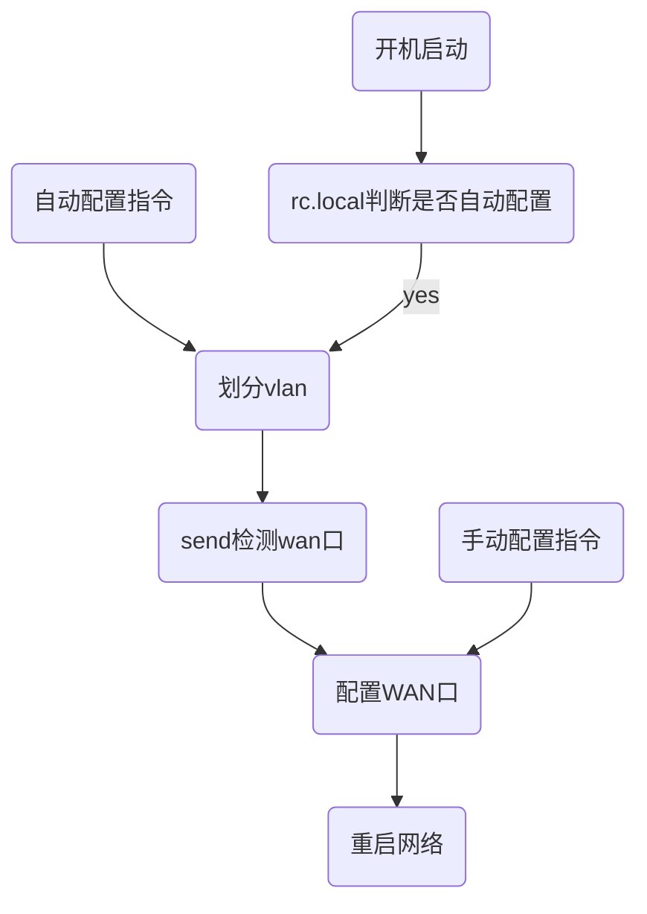

# wan-lan自适应开发手册

**目录**

* TOC
{:toc}

## 1 介绍

### 1.1 适用人员

适用于使用shell脚本进行openwrt功能开发的开发人员

### 1.2 开发环境

siflower SDK，siflower硬件平台

### 1.3 相关背景

VLAN（Virtual LAN），即“虚拟局域网”，可以使用户自由地根据实际需要分割广播域，在openwrt上可通过配置network文件实现vlan划分。但并不是每一个用户都了解vlan划分流程，因此路由器在面向普通用户的时候，应当具备方便、简洁的特点：用户甚至不需要了解什么是vlan，怎么区分wan/lan口；随便插上网线就能实现上网功能。

### 1.4 功能概述

wan/lan 自适应具有三种配置wan口的功能：开机自动配置、立即自动配置、立即手动配置。自动配置时会根据当前的网线连接情况划分wan/lan口。需要更换wan口时，只需将网线插入路由器需要配置的端口，运行脚本自动配置，就会自动将wan重新划分到该端口上。配置完成后，路由器依旧可以正常上网。

## 2 项目引用

- [维基百科-DHCP协议](https://zh.wikipedia.org/wiki/Dynamic_Host_Configuration_Protocol)

- [config文件配置手册](https://siflower.github.io/2020/09/11/config_setting/)

- [openwrt uci官方文档](https://oldwiki.archive.openwrt.org/zh-cn/doc/techref/uci)

- [以太网wan-lan划分指南](https://siflower.github.io/2020/09/05/ethernet_wan_lan_division/)

- [SiWiFi接口开发手册](https://siflower.github.io/2020/09/11/SiWiFi_interface_develop/)

## 3 开发详情

### 3.1 基础指令及原理

#### 3.1.1 uci指令

以太网相关配置是用network文件存储的，路径为/etc/config/network。我们可以直接手动修改该文件，也可以通过在串口下直接键入[uci指令](https://oldwiki.archive.openwrt.org/zh-cn/doc/techref/uci)修改network配置，还可以在shell中编写程序执行uci指令实现一定的功能。uci常用指令有：

|指令|作用|
|---|---|
|uci get network.lan.ipaddr|获取lan节点下的ip选项的值|
|uci set network.test=interface|network里加一个interface类型的节点|
|uci set network.test.a="abc"|向test节点下的a选项赋值（不存在a则创建此选项）|
|uci set network.@switch_vlan[0].vlan=1|将第一个switch_vlan节点下的vlan值改为1|
|uci delete network.test.a|删除a选项|
|uci delete network.test|删除test节点|
|uci commit|保存修改|

更多地了解如何使用uci指令配置config文件，请参考[config文件配置手册](https://siflower.github.io/2020/09/11/config_setting/)或[openwrt uci官方文档](https://oldwiki.archive.openwrt.org/zh-cn/doc/techref/uci)

#### 3.1.2 vlan划分

VLAN（Virtual LAN），即“虚拟局域网”，可以使用户自由地根据实际需要分割广播域。AC22镜像network配置中vlan相关部分如下所示：

```
config interface 'lan'
        option ifname 'eth0.1'
        option force_link '1'
        option macaddr '10:16:88:3a:8d:f4'
        option type 'bridge'
        option proto 'static'
        option ipaddr '192.168.4.1'
        option netmask '255.255.255.0'
        option ip6assign '60'
        option group '0'
        option rps_cpus '2'
        option xps_cpus '2'

config interface 'wan'
        option ifname 'eth0.2'
        option force_link '1'
        option macaddr '10:16:88:3a:8d:f5'
        option rps_cpus '1'
        option xps_cpus '0'
        option proto 'dhcp'
...

config switch
        option name 'switch0'
        option reset '1'    
        option enable_vlan '1'
                                
config switch_vlan
        option device 'switch0'
        option vlan '1'
        option ports '0 1 2 3 16t'
                             
config switch_vlan
        option device 'switch0'
        option vlan '2'      
        option ports '4 16t'    

```

lan所在的eth0.1被划到了vlan 1，对应port 0 1 2 3，也就是第1,2,3,4号口。wan所在的eth0.2被划到了vlan 2,对应第5号口。如果想要将5号口划为lan，3号口划为wan，则只需将wan对应的ports改为'2 16t'，lan对应的ports改为'0 1 3 4 16t'。uci对应的指令为：

```
uci set network.@switch_vlan[0].ports='0 1 3 4 16t'
uci set network.@switch_vlan[1].ports='2 16t'
uci commit
```

更多vlan划分的内容，请参考[以太网wan-lan划分指南](https://siflower.github.io/2020/09/05/ethernet_wan_lan_division/)。如果能划分出5个vlan分别对应5个路由器端口，那么就能通过向外发送dhcp discover数据包的方法寻找dhcp服务器，从而知道哪一个口应该成为wan口。

#### 3.1.3 dhcp协议

详细了解dhcp协议过程，请参考[维基百科-DHCP协议](https://zh.wikipedia.org/wiki/Dynamic_Host_Configuration_Protocol)。wan/lan自适应流程会利用到其中的前两步：

- 1、从某端口向dhcp server发送discover数据包。

- 2、若dhcp server收到discover数据包，则会回复一个offer包。

至此，若收到offer包，即可判断该端口与dhcp server相连，可配置为路由器的wan口。

### 3.2 功能设计流程

#### 3.2.1 自启动实现

openwrt在开机启动时，会自动执行路径为/etc/rc.local的文件。因此在rc.local的末尾部分加上运行某脚本的指令，那么这个脚本就会实现开机自启动。例如：现有一个可执行脚本auto_adapt.sh放在/bin目录下。如果在rc.local最后（exit 0之前）添加./bin/auto_adapt.sh，这个脚本就会开机自启动。若在脚本中加入对uci参数的判断（例如network.lan.auto_adapt参数为1时才执行脚本），则可以实现由用户随时设置是否开机自启动。

#### 3.2.2 wan/lan自适应流程

- 1 下发自动配置指令或路由器开机启动时，将network备份并重新划分5个vlan分别对应5个端口，替代原有配置。

- 2 利用发包工具send从这5个端口向外发送dhcp discover包，若收到dhcp server的回复，则说明检测到wan口。

- 3 恢复network原有配置，并将检测到的端口配置为wan口。下发手动配置指令时直接进行这一步。

- 4 重启网络，自适应配置完成，路由器恢复上网功能。



### 3.3 代码实现（以AC22为例）

实现wan/lan自适应的demo放在package/network/services/auto_adapt路径下。需要使用时，在sdk根目录下运行make menuconfig，选中Network下的auto_adapt，保存退出后再进行编译。files里为脚本和网页，src下为send发包工具代码。

### 3.3.1 send.c

send是配合auto_adapt.sh脚本使用的发包工具，源码路径为package/network/services/auto_adapt/src/send.c。此工具可以指定端口发送dhcp disvover数据包。根据是否能收到dhcp server回复的dhcp offer数据包判断该网口是否应该配置为wan口。可直接在串口键入指令"send + 端口名称"实现往该端口发包，例如send eth0.2。若收到回复，则会在串口返回log并将端口名称写入/tmp/dhcp_iface文件，供脚本读取并配置。

- 收到回复时会返回：

```
ifindex : 8
receive dhcp offer in ifindex 8, start setting
```

- 无法收到回复则会阻塞等待，直到auto_adapt.sh将其关闭。

利用以上指令，可以在auto_adapt.sh脚本里通过读取/tmp/dhcp_iface文件判断某个端口是否应该配置成wan口。

### 3.3.2 auto_adapt.sh

实现wan/lan自适应的核心脚本，被编译到/bin/auto_adapt.sh路径下，用法为：

- auto_adapt.sh start 立即进行自动配置

- auto_adapt.sh set 2 指定将2号端口配置号为wan口

主要函数解析：

```
start() {
    init()      --初始化，备份network配置并划分vlan
    checkport() --调用send，发送数据包寻找wan口
    kill_all()  --1s后停止send，kill所有send进程。
    dinit()     --寻找到wan口后恢复network配置
    set_wan()   --根据结果配置wan口。直接调用该函数可完成手动配置。
}
```

### 3.3.3 auto_adapt.htm

用于显示其功能的htm文件，配合feeds/luci/modules/luci-mod-network/luasrc/controller/admin/network文件，将自适应功能以网页+接口调用的形式可视化。开发流程可参考[SiWiFi接口开发手册](https://siflower.github.io/2020/09/11/SiWiFi_interface_develop/)。最终界面如下所示：


- 手动配置一栏显示当前端口的连接状态，点击"lan"按钮即可将对应端口配置为wan口。

- 自动配置一栏点击立即配置后则立即进行一次wan口自动配置。若未找到wan口则配置不变。

- 开机自启动一栏可选择是否启用。启用后，开机时会进行一次wan口自动配置。

### 3.3.4 rc.local

开机自动运行的脚本，读取/etc/config/network文件lan下的auto_adapt选项。若该选项被配置为1，则立即进行一次自动配置。


## 4 测试用例

### 4.1 测试环境配置

一台待已编译自启动脚本的待测路由、串口、能获取到ip并上网的网线。

### 4.2 测试流程

#### 4.2.1 手动配置测试

- 1、将网线插入第1号口。

- 2、串口执行auto_adapt.sh set 1，或者浏览器访问路由器配置界面，打开“网络”选项下的“wan/lan自适应”，点击手动配置下的第一个按钮。

- 3、等待约10s，同时在串口观察是否打印log。

- 4、在串口输入ping www.baidu.com检测是否能上网。更换端口，重复测试。

#### 4.2.2 自动配置测试

- 1、将网线插入路由器任意端口。

- 2、串口执行auto_adapt.sh start，或者浏览器访问路由器配置界面，打开“网络”选项下的“wan/lan自适应”，点击自动配置下的“立即配置”按钮。

- 3、等待约10s，同时在串口观察是否打印log。

- 4、在串口输入ping www.baidu.com检测是否能上网。更换端口，重复测试。

#### 4.2.3 开机自启动测试

  - 1、将外部网线插入路由器任意端口。

  - 2、在串口输入指令：uci set network.lan.auto_adapt=1;uci commit network。或者浏览器访问路由器配置界面，打开“网络”选项下的“wan/lan自适应”，启用“开机自启动”选项下的按钮。

  - 3、重启路由器。待路由器重启完成。

  - 4、在串口输入ping www.baidu.com检测是否能上网。更换端口，重复测试。

### 4.3 测试结果

以上所有操作执行后，均会有自适应脚本的相应log打印；等待一段时间后，路由器能正常上网，说明功能正常。

## 5 FAQ

- **Q: 脚本在开机后没有自启动，如何检查？**

  A：在/etc/rc.local中，运行脚本指令之前添加log，确认自启动脚本是否被调用。若此log未出现，说明rc.local有问题而非自启动脚本本身的问题。之后在auto_adapt.sh脚本中添加log,并用ps指令查看脚本是否已在后台运行。若log已打但脚本未运行，则可判断是脚本逻辑问题导致运行结束。

- **Q:配置后路由器无法上网，如何检查？**

  A：首先查看/etc/config/network文件是否按照规范配置，wan口有没有划分正确；串口输入/etc/init.d/network restart重启网络，差看是否是因为配置未生效；查看是否是外部网络不通畅的问题。

- **Q:配置之后网页无法点击？**

  A：这是因为更换了wan/lan配置并重启了网络，刷新网页或重新登录即可。
