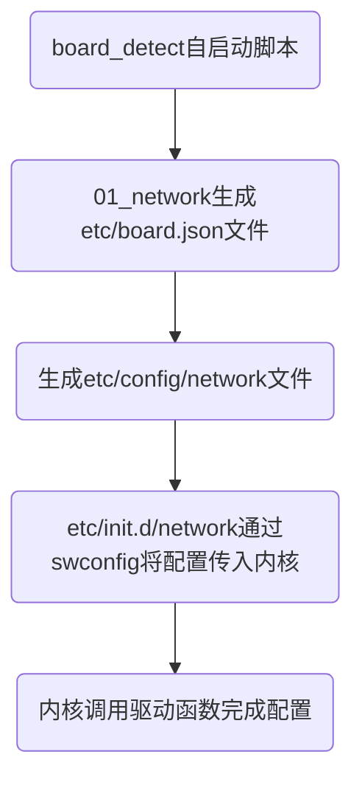

# 以太网WAN-LAN划分指南

**目录**


* TOC
{:toc}

## 1 简介

- 适用人员

对wan-lan有基本了解的人员

- 开发与测试环境

参考[快速入门](https://siflower.github.io/2020/08/05/quick_start/)

- WAN-LAN介绍

网络设备的WAN表明为广域网，通常用来连接猫、光猫、入户网线或者上级网络的，为网络设备提供入网服务；LAN表明为局域网，通常用来连接入网设备，如电脑，笔记本等，为下级设备提供入网服务。

- WAN-LAN划分

在以太网驱动中通过对以太网端口进行WAN-LAN划分，用以区分端口功能和服务配置。Siflower采用不同的network配置文件来对WAN-LAN进行划分。

## 2 项目引用

- 配置参数说明中vlan划分WAN-LAN部分可以参考[外围switch芯片对接和使用手册](https://siflower.github.io/2020/09/11/new_switch_import_guide/)

- wifi的wds功能可以参考[WDS开发及使用手册](https://siflower.github.io/2020/09/02/WDS_development_and_user_manual/)

- network文件的参数参考[config文件配置手册](https://siflower.github.io/2020/09/11/config_setting/)
  
## 3 开发详情

-  文件配置

对于不同的版型，Siflower会配置不同的base-file文件，以AC28为例，对应的base-file文件源码路径为
```
openwrt-18.06/target/linux/siflower/sf19a28-fullmask/base-files-SF19A28-AC28
```
其中在etc/board.d/01_network中对不同端口进行了WAN-LAN划分，当系统镜像启动时，自启动脚本board_detect会根据01_network中的配置在系统目录etc/board.json中生成配置，然后在/etc/config/network中生成对应的WAN-LAN配置，驱动则根据network配置自动完成相应switch中对应端口的配置。因此，如果要改变wan-lan划分，只需要修改base-file中的01_network配置即可。

-  配置参数说明

以AC28为例,01_network中对WAN-LAN的配置：
```
siflower_setup_interfaces()
{
    local board="$1"
    ucidef_set_interfaces_lan_wan "eth0.1" "eth0.2"
    ucidef_add_switch "switch0" \
        "1:lan:1" "2:lan:1" "0:lan:1" "3:wan:2" "5t@eth0"  //端口号：wan/lan：vlan id
}
```
默认配置将eth0（gmac）划分为vlan 1和 2，vlan1对应lan，vlan2对应wan，端口0，1，2配置为lan并绑定vlan 1，端口3配置为wan并绑定vlan 2，端口5作为cpu port与gmac相连(cpu port由使用的switch型号确定)，其中vlan配置与cpu port一般不需要改变。以修改端口0做为wan、3做为lan为例，只需要修改配置如下即可。
```
  "1:lan:1" "2:lan:1" "0:wan:2" "3:lan:1" "5t@eth0"
```

AC28默认配置在etc/config/network中自动生成对应的WAN-LAN配置如下，可以看到vlan和wan-lan的配置与01_network中一致，配置端口0，1，2绑定vlan1（lan），端口3绑定vlan2（wan）。
```
config interface 'lan'
        option type 'bridge'
        option ifname 'eth0.1'
        option proto 'static'
        option ipaddr '192.168.4.1'
        option netmask '255.255.255.0'
        option ip6assign '60'

config interface 'wan'
        option ifname 'eth0.2'
        option proto 'dhcp'

config switch
        option name 'switch0'
        option reset '1'
        option enable_vlan '1'

config switch_vlan
        option device 'switch0'
        option vlan '1'
        option ports '1 2 0 5t'

config switch_vlan
        option device 'switch0'
        option vlan '2'
        option ports '3 5t'
```

-  完整WAN-LAN划分配置生效流程


1. board_detect是开机自启动脚本，位于：
```
openwrt-18.06/package/base-files/files/bin/board_detect
```
2. board_detect会遍历执行etc/board.d/下的脚本，包括01_network，生成etc/board.json和etc/config/network文件
3. etc/init.d/network会根据生成的etc/config/network将配置传入内核（调用swconfig），位于
```
openwrt-18.06/package/network/config/netifd/files/etc/init.d/network
```
4. 驱动对switch进行对应的配置，完成wan-lan划分

## 4 测试用例

- 验证方法

配置对应板型base-file中的01_network划分wan-lan，如下划分（AC28）

```
"1:lan:1" "2:lan:1" "0:lan:1" "3:wan:2" "5t@eth0"
```

编译镜像并烧录，使用ifconfig命令查看参数，从eth0中划分出了eth0.1(vlan1)和eth0.2(vlan2)，做为wan的eth0.2接上级设备后能自动获取上一级分配的ip（192.168.14.152），lan口eth0.1连接pc，pc能ping通br-lan的ip192.168.4.1视为配置成功

```
root@OpenWrt:/# ifconfig
br-lan    Link encap:Ethernet  HWaddr 10:16:88:B0:E0:0C  
          inet addr:192.168.4.1  Bcast:192.168.4.255  Mask:255.255.255.0
          inet6 addr: fe80::1216:88ff:feb0:e00c/64 Scope:Link
          inet6 addr: fd92:862:c79c::1/60 Scope:Global
          UP BROADCAST RUNNING MULTICAST  MTU:1500  Metric:1
          RX packets:4076 errors:0 dropped:0 overruns:0 frame:0
          TX packets:3594 errors:0 dropped:0 overruns:0 carrier:0
          collisions:0 txqueuelen:1000 
          RX bytes:360207 (351.7 KiB)  TX bytes:353362 (345.0 KiB)

eth0      Link encap:Ethernet  HWaddr 10:16:88:B0:E0:0C  
          inet6 addr: fe80::1216:88ff:feb0:e00c/64 Scope:Link
          UP BROADCAST RUNNING MULTICAST  MTU:1500  Metric:1
          RX packets:4143 errors:0 dropped:0 overruns:0 frame:0
          TX packets:3970 errors:0 dropped:0 overruns:0 carrier:0
          collisions:0 txqueuelen:1000 
          RX bytes:443696 (433.2 KiB)  TX bytes:483517 (472.1 KiB)
          Interrupt:25 

eth0.1    Link encap:Ethernet  HWaddr 10:16:88:B0:E0:0C  
          UP BROADCAST RUNNING MULTICAST  MTU:1500  Metric:1
          RX packets:4076 errors:0 dropped:0 overruns:0 frame:0
          TX packets:3594 errors:0 dropped:0 overruns:0 carrier:0
          collisions:0 txqueuelen:1000 
          RX bytes:360263 (351.8 KiB)  TX bytes:353362 (345.0 KiB)

eth0.2    Link encap:Ethernet  HWaddr 10:16:88:B0:E0:0D  
          inet addr:192.168.14.152  Bcast:192.168.14.255  Mask:255.255.255.0
          inet6 addr: fe80::1216:88ff:feb0:e00d/64 Scope:Link
          UP BROADCAST RUNNING MULTICAST  MTU:1500  Metric:1
          RX packets:60 errors:0 dropped:0 overruns:0 frame:0
          TX packets:355 errors:0 dropped:0 overruns:0 carrier:0
          collisions:0 txqueuelen:1000 
          RX bytes:8181 (7.9 KiB)  TX bytes:111356 (108.7 KiB)

```

- 配置双wan情况

Siflower可以划分多个wan，以AC28为例，默认port3为wan，port 0、1、2为lan，如果要修改port 0、1为lan，port 2、3为wan，只需要修改01_network如下即可

```
"0:lan:1" "1:lan:1" "2:wan:2" "3:wan:2" "5t@eth0"
```

当编译并启动镜像之后，port 2、3分别接上级设备能自动获取ip，如上一节所示，视为配置成功。

## 5 FAQ

- Q：如何确定开发板上网口对应的端口编号？

A： 将一个网口连接网线，其余网口不接网线，使用cat /sys/kernel/debug/npu_debug命令查看，link status为 1 的phy代表该网口对应的端口编号。如下示例，代表当前接着网线的网口为端口2。

```
root@OpenWrt:/# cat /sys/kernel/debug/npu_debug 
check phy link status
phy0    status 0
phy1    status 0
phy2    status 1
phy3    status 0
phy4    status 0
```

- Q：如何将wifi作为wan使用？

A：wifi默认配置为lan，如果要将wifi作为wan使用需要开启网页上的wds功能，配置2.4G或者5G连接上一级的主路由器，即可将wifi作为wan使用。

- Q：当gmac外接phy的时候如何配置wan/lan？

A：当gmac外接phy时，gmac只能配置为wan或者lan，修改01_network完成配置。

gmac配置为wan：

```
siflower_setup_interfaces()
{
    local board="$1"
    ucidef_set_interfaces_wan "eth0"
}
```

gmac配置为lan：

```
siflower_setup_interfaces()
{
    local board="$1"
    ucidef_set_interfaces_lan "eth0"
}
```

- Q: 当系统镜像启动完毕后如何改变wan-lan划分？

A: 当系统镜像启动完毕后，需要修改etc/config/network中的配置，并执行/etc/init.d/network restart指令使wan-lan划分配置生效。修改方法与修改01_network相似，以将端口0做为wan，1、2、3做为lan为例，只需要修改配置如下即可。

```
config switch_vlan
        option device 'switch0'
        option vlan '1'
        option ports '1 2 3 5t'

config switch_vlan
        option device 'switch0'
        option vlan '2'
        option ports '0 5t'
```