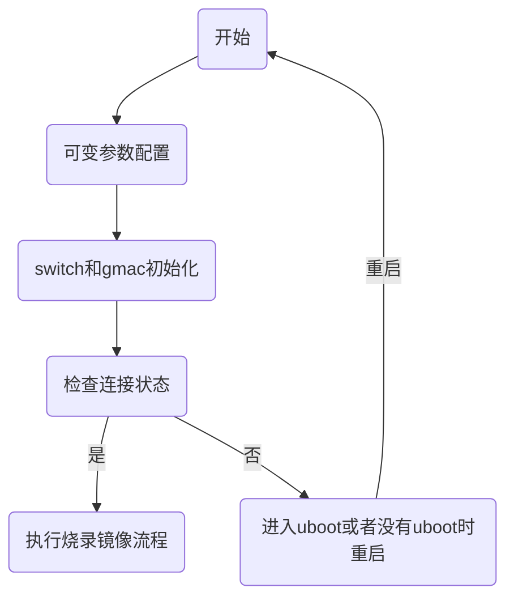
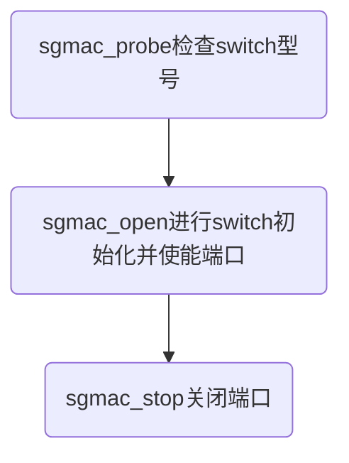
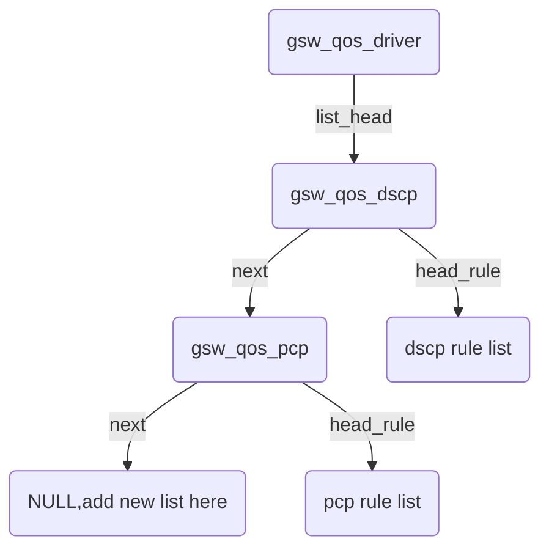

# 外围switch芯片对接和使用手册

**目录**

* TOC
{:toc}

## 1 介绍

- 适用人员

本项目适用于有基础C语言开发知识的人员。

- 开发与测试环境

参考[快速入门](../system/2020-08-05-quick_start.md)

- 简介

GMAC是SF19A28芯片中的一个模块，属于数据链路层，GMAC外部可以对接PHY芯片和SWITCH芯片。其中PHY芯片属于物理层，SWITCH芯片通常包含多个PHY可以用于收发数据包。GMAC和PHY/SWITCH芯片一起构成了SF19A28的以太网部分。

- vlan简介

vlan全称为虚拟局域网，虚拟局域网是一组逻辑上的设备和用户，这里用来区分WAN和LAN。如下图所示，对应数据包会打上vlan tag，vlan id表示该数据包所属vlan的编号，WAN和LAN采用不同的vlan id。


- switch与gmac工作介绍

如下图所示，在当前SF19A28中，只有GMAC网卡被注册为eth0，为了实现WAN-LAN的功能，在eth0的基础上划分了eth0.1和eth0.2两个虚拟网卡分别做为LAN和WAN。当接收时，GMAC收到带有vlan头的数据包并上送，系统会根据数据包中不同的vlan id区分LAN和WAN，vlan 1的数据包会剥除vlan头送到LAN，vlan 2的数据包会剥除vlan头送到WAN。当发送时，系统发送的普通数据包在经过虚拟网卡eth0.1和eth0.2后也会带上vlan tag，发送到switch的cpu port。


因此，switch的配置也需要与虚拟网卡划分相对应，配置vlan和端口绑定，这样当输入时不同端口的输入数据会打上对应的vlan tag，系统就可以区分WAN和LAN。输出时对应端口会剥除vlan tag，从而可以实现正常的WAN-LAN通信。

## 2 项目引用

- network配置可以参考[以太网wan-lan划分指南](2020-09-05-ethernet_wan_lan_division.md)

## 3 开发详情

### 3.1 对接准备

1、mdio读写

通过gmac的mdio接口既可以读写通用phy中的寄存器，也可以读写switch中的寄存器。其中不同的switch芯片有不同的mdio读写方式，查看待对接switch的说明书可以新增该switch中寄存器的mdio读写方法。使用mdio读写时，需要确定phy addr。phy addr一般通过scan的方式在0~31的范围进行查找，也可以按实际硬件情况在dts中指定，具体查看[linux dts说明文档](../linux/2020-09-03-linux_dts_introduce.md)。

2、rgmii的clock检查是否正常

当出现mdio读写不通时，可以使用示波器测量gmac和phy/switch之间的时钟是否正常。TODO:TX/RX CLOCK详细描述

3、设置gmac接口模式

可以根据switch芯片的cpu port的规格切换gmac RGMII的工作模式，gmac可以工作在10M、100M、1000M的全双工/半双工。

4、switch的reset

使用switch之前可以对switch进行硬件reset，可以防止未知错误。switch硬件复位的过程中会导致提供给gmac的时钟不正常，所以在配置完硬件reset之后需要设置一定时间的delay等待switch硬件复位完成。

5、switch的初始化

根据switch芯片说明书的要求对该switch进行初始化的寄存器配置，一般为设置cpu port为1000M全双工即可(需要与gmac工作在同一模式)，switch的初始化在irom、uboot、linux中都需要进行。

以intel switch为例，根据文档描述，intel switch的cpu port启动后会自动设置为1000M全双工。因此，如果gmac为1000M全双工模式，intel switch无需初始化。当使用的其他型号switch的cpu port不为1000M全双工时，则需要在switch初始化中配置1000M全双工。


6、phy的初始化

phy的初始化由内核完成，主要包括两个内核提供的函数，of_mdiobus_register和of_phy_connect。通过函数of_mdiobus_register将mdio的读写函数提供给内核，内核通过scan的方式获取phy addr。在of_phy_connect中内核获取phy id并注册对应的phy device，同时设置gmac和phy的接口模式。

7、调整tx/rx delay

当数据不通时通过ping和抓包的方式查看是tx不通还是rx不通，并且可以调整对应的tx/rx delay，使用devmem命令调试gmac芯片中预留的tx/rx delay寄存器，当数据流通了之后，对应的tx/rx delay设置的值应该在irom/uboot/linux中都进行配置。

```
devmem 0x19e04444  //读取tx delay的当前值
devmem 0x19e04448 //读取rx delay的当前值
devmem 0x19e04444  32 0x30 //设置tx delay = 0x30 * 0.04ns
devmem 0x19e04448  32 0x40 //设置rx delay = 0x40 * 0.04ns
//tx rx delay的设置范围为1~256
```

设置示例：


如果switch中有调整switch cpu port的tx/rx delay的方法，也可以调整switch芯片中的tx/rx delay来调通数据流。


### 3.2 irom对接

目前的irom代码可以支持通用phy，realtek和intel两种switch的型号（通过更换patch的内容进行支持），当没有patch数据时默认支持realtek switch。irom中对接switch主要包括switch的初始化以及检查端口连接状态，由于irom中的代码是不可修改的，所以对接新的switch主要通过修改patch文件完成，irom的gmac代码位于irom/gmac目录下。

- patch简介
 
patch数据存放在txt文件中，编译uboot时放入对应位置，patch文件位于uboot目录的如下位置：

```
uboot/board/siflower/sfax8_common/irom_patch_default.txt
```

每一条patch数据包括7个16进制数，patch的起始物理地址为0x6fe4，一条patch的长度为28。添加一条patch需要在上一条的起始地址加上28，然后写入相应的patch数据。例如第一条数据地址为0x6fe4，则第二条的地址为0x7000（0x7000-0x6fe4=28）。第x条数据的地址即为（0x6fe4+28*(x-1)）。patch数据的地址最大不能超过0x8000（32k）。

```
txt文件中每一行放置7个16进制数对应一条patch，用空格隔开
2	1	3	5	0	0	7d0	//第一条数据起始地址0x6fe4
60 10	1	1f 7038 78dc 78c0	//第二条数据起始地址0x7000
```

irom中gmac模块通过函数get_data_from_spl来读取patch文件中的数据，初始化以及连接函数中会循环读取patch中的数据，进行对应的mdio操作，从而支持不同类型的switch。

- patch使用说明

1、 通过uboot使用patch
irom_patch_default.txt中的数据会在编译uboot时，由代码checksum将其存放在uboot镜像中的对应位置，checksum.c代码位置如下，同目录下的checksum为checksum.c gcc编译生成。

```
uboot/bare_spl/tools/checksum.c
```

因此，如果需要改变patch来调试irom中的代码，只需要修改uboot中irom_patch_default.txt，编译uboot镜像并烧录即可。

2、patch数据还可以修改flash中对应地址的值

根据patch简介中的介绍，通过修改物理地址为0x6fe4开始的内容，也可以达到修改patch参数的目的。（例如使用flash烧录器烧录）

- patch数据框架
  
irom烧录流程如下：



patch数据分为5个部分：

||  | 功能| 
| -----| ------- | ------ | 
|1| 前两条patch数据 | 储存可变的配置参数（gmac的tx/rx delay、使用指定的phy addr或scan得到phy addr、检查link的时间等） | 
|2| 检查连接 | 通过mdio的读写读取phy的连接状态 | 
|3| switch初始化 | 通过mdio的读写完成switch的初始化 | 
|4| 触发初始化 | 这条配置触发3中配置的switch初始化  | 
|5| 触发检查连接 | 这条配置触发2中配置的检查连接 | 

各部分说明及注意点如下：
||  | 说明 | 
| -----| ------- | ------ | 
|1| 前两条patch数据 | 1、可以选择phy/switch模式，选择1000Mphy模式时，irom按照通用phy的方式进行初始化，无需后续部分的patch内容 2、可配置tx/rx delay，tx/rx delay范围为0x1~0x100 3、当选择switch模式时，irom代码需要各部分patch的起始offset，其中检查连接固定为第3条，所以这里需要存放switch初始化、 触发初始化、触发检查连接的offset，offset的计算见patch简介 | 
|2| 检查连接 | 1、对应switch示例的第三条数据 2、可以选择mdio read或write，选择read时会从参数4的地址进行mdio read，选择write时会在参数4的地址写入参数3的数值 3、参数2为1表示该部分结束，检查连接部分由1条patch组成，配置多条的方法参见下面的switch初始化部分| | 
|3| switch初始化 |  1、对应switch示例的第四至第十三条参数，这些参数的含义与第三条相同。2、其中第四至第十二条的参数2为0表示该部分未结束，第十三条的参数2为1表示该部分结束。只配置单条数据的方法参见上面的检查连接部分|
|4| 触发初始化 | 这条默认配置可以触发3中配置的switch初始化  | 
|5| 触发检查连接 | 1、这部分会将检查连接部分中最后一次读取的数据右移（参数1的值  +2）bit后，bit0为1继续进行镜像烧录，bit0为0停止烧录。2、检查连接部分可以读switch中某个phy的连接状态决定是否继续烧录，或者使检查的bit值为1进行镜像烧录|

通用phy参数示例与各参数说明如下：

```
2 1 1 5 0 0 7d0
30 40 0 0 0 0 0
```

| | 参数1 | 参数2| 参数3| 参数4| 参数5| 参数6| 参数7| 
| -----| ------- | ------ | ------ | ------ | ------ | ----- | ---- |
| 第一条参数 |2  | 1 | 1 | 5 | 0 | 0 |7d0|
| 说明 | default | default  | 1-选择1000Mphy模式 3-选择switch模式 |default|default|default | 7d0-检查连接时间为2000ms| 
| 第二条参数| 30 | 40 |0 | 0 | 0| 0|0|
| 说明| tx delay-0x30*0.04ns | rx delay-0x40*0.04ns | 1-使用给定的phy addr 0-scan获取phy addr| phy addr的值为0| deflaut|deflaut |deflaut |

intel switch参数示例与各参数说明如下：

```
2 1 3 5 0 0 7d0
60 10 1 0 7038 716c 7150
0 1	0 16 1 0 0
0 0 e93c 1f 0 0 0
0 0 0 0 1 0 0
0 0 f410 1f 0 0 0
0 0 0 0 1 0 0
0 0 f410 1f 0 0 0
0 0 32a5 0 0 0 0
0 0 e943 1f 0 0 0
0 0 0 0 1 0 0
0 0 e943 1f 0 0 0
0 0 1914 0 0 0 0
0 1	0 10 5	0	0
4 1	0 10 7	0	0
```


参数说明：

| | 参数1 | 参数2| 参数3| 参数4| 参数5| 参数6| 参数7| 
| -----| ------- | ------ | ------ | ------ | ------ | ----- | ---- |
| 第一条参数 |2  | 1 | 3 | 5 | 0 | 0 |7d0|
| 说明 | default | default  | 1-选择1000Mphy模式 3-选择switch模式 |default|default|default | 7d0-检查连接时间为2000ms| 
| 第二条参数| 60 | 10 |1 | 1f | 7038| 716c|7150|
| 说明| tx delay-0x60*0.04ns | rx delay-0x10*0.04ns | 1-使用给定的phy addr 0-scan获取phy addr| 指定phy addr的值为31| switch初始化的offset| 触发初始化的offset| 触发检查连接的offset|
| 第三条参数| 0 | 1 |1 | 16 | 1 | 0| 0 |
| 说明| default | 0-该部分未结束 1-该部分结束 | mdio write写入的值| mdio write/read的地址|0-mdio_write 1-mdio_read | mdio read/write执行前的delay配置，单位ms|default | 
| 第四条参数| 0 | 0 |1c0 | 1f | 0 | 0| 0 |
| 说明| default | 0-该部分未结束 1-该部分结束 | mdio write写入的值| mdio write/read的地址|0-mdio_write 1-mdio_read | mdio read/write执行前的delay配置，单位ms|default | 
| ... | ... | ... | ...| ... | ... | ...| ... |
| 第十三条参数| 0 | 1 | 0 | 10 | 1 | 0| 0 |
| 说明| default | 0-该部分未结束 1-该部分结束 | mdio write写入的值| mdio write/read的地址|0-mdio_write 1-mdio_read | mdio read/write执行前的delay配置，单位ms|default | 
| 第十四条参数| 0 | 1 | 0 | 10 | 5 | 0| 0 |
| 说明| default | default| default|default |default | default|default | 触发switch初始化部分|
| 第十五条参数| 4 | 1 | 0 | 10 | 7 | 0| 0 |
| 说明| 读取bit的偏移量 | default | default|default|default | default|default | 

- 代码结构参见redmine#[5197](http://redmine.siflower.cn/redmine/issues/5197)

- irom烧录参考[快速入门](../system/2020-08-05-quick_start.md)

irom烧录截图

pc烧录成功截图


串口烧录成功截图


### 3.3 uboot对接

- 对接准备

见3.1节的介绍，可以参考[U-boot移植应用开发手册](../system/2020-09-08-ubootDevelopmentManual.md)

- 对接流程

uboot中gmac和switch的代码存放在

```
uboot/drivers/net/sfa18_gmac.c
```

switch对接：
每个switch中有多个phy的接口，根据switch的说明书可以查看读写单个phy中通用phy寄存器的方法。
对接新的switch或phy，只需要在函数sf_gmac_register中增加对phy id的判断（用来区分不同的switch或phy），并且增加初始化函数（一般为设置cpu port为1000M全双工，按switch要求进行初始化）、设置tx/rx delay即可。
对应代码如下（以intel switch为例）：

```
gsw_reg_rd(priv,(PHY_ADDR_0_ADDR_OFFSET - 1),
				PHY_ADDR_0_ADDR_SHIFT,
				PHY_ADDR_0_ADDR_SIZE, &pa);//intel switch获取phy寄存器的地址
md.nAddressReg = PHY_IDENTIFY_1;//首先读取通用phy寄存器 PHY_IDENTIFY_1
md.nAddressDev = pa;
GSW_MDIO_DataRead(priv, &md);
phy_id |= md.nData << 16;

md.nAddressReg = PHY_IDENTIFY_2;//然后读取通用phy寄存器 PHY_IDENTIFY_2
GSW_MDIO_DataRead(priv, &md);
phy_id |= md.nData;//两者组合成为完整的phy id

if (phy_id == 0xd565a409) {//判断是否为该型号的switch
		// intel giga switch
		priv->gswitch = 1;
		intel_rgmii_init(priv, 5);//进行switch的初始化
		gsw_reg_wr(priv, PCDU_5_TXDLY_OFFSET,
				PCDU_5_TXDLY_SHIFT,
				PCDU_5_TXDLY_SIZE,
				2);//设置delay
```

phy对接：

如果读取phyid判断外接的为phy，那么phy的初始化可以按照通用流程，配置速度双工、设置软件reset等完成配置。如果这个phy有其他的初始化要求，进行相应的配置即可。

```
phy的初始化流程：
	struct phy_device *phydev;
	int mask = 0xffffffff, ret;

	phydev = phy_find_by_mask(priv->bus, mask, PHY_INTERFACE_MODE_RGMII);//寻找phy设备
	if (!phydev)
		return -ENODEV;

	phy_connect_dev(phydev, dev);//连接phy设备

	phydev->supported &= PHY_GBIT_FEATURES;
	if (priv->max_speed) {
		ret = phy_set_supported(phydev, priv->max_speed);//设置接口速度双工
		if (ret)
			return ret;
	}
	phydev->advertising = phydev->supported;

	priv->phydev = phydev;
	phy_config(phydev);//设置
```

phy配置相关函数定义在：

```
uboot/drivers/net/phy/phy.c
```

### 3.4 linux对接

- 对接准备

见3.1节的介绍

- 代码结构

gmac模块和switch模块的代码分别位于

```
openwrt-18.06/package/kernel/sf_gmac
openwrt-18.06/package/kernel/sf_gswitch
```

要对接新的switch需要分别修改sf_gmac和sf_gswitch模块中的代码
sf_gmac: 加入switch的初始化函数，使能和关闭端口，配置端口的ethtool函数
sf_gswitch: 新增switch的api源代码，修改Makefile进行编译，对接vlan初始化和wan-lan划分的函数

- sf_gmac部分

1. sf_gmac模块中关于switch的代码主要在sf_gmac.c中，流程如下：



sgmac_probe调用sfax8_get_gswitch_type检查phy id来确定型号（与uboot中相同），sgmac_open和sgmac_stop中配置初始化和开启关闭端口函数。在gmac模块中配置switch的初始化函数主要是为了当只加载gmac模块时，gmac数据能通，此时switch芯片没有vlan功能，只起到数据交换功能。

```
sgmac_open:
 if (priv->gswitch == INTEL7084)
 {
         intel_rgmii_init(5);//初始化，一般为配置cpu port为1000M全双工
         intel_port_rgmii_dalay_set(5, 1, 0);//设置tx/rx delay
         intel7084_enable_all_phy();//使能phy端口
 }
sgmac_stop：
if (priv->gswitch == INTEL7084)
         intel7084_disable_all_phy(); //关闭phy端口
```

其中配置开启关闭端口函数，当重新配置板子的ip时，如果phy连接不断开，与之相连的pc不会改变ip。重启端口可以使得phy重新连接，从而使连接的pc重新获取ip

2. ethtool部分只需要在函数gsw_read_phy_reg和gsw_write_phy_reg中增加对应型号switch读写phy寄存器的api即可。
在sf_gswitch_ethtool.c中，以函数gsw_read_phy_reg为例，在函数中加入intel switch的phy读写函数即可：

```
if (priv->gswitch == INTEL7084)
{
	parm.nAddressDev = phyNo;
	parm.nAddressReg = phyReg;
	intel7084_phy_rd(&parm);
	phyData = parm.nData;
}
```

具体ethtool使用参考[有线网络和服务介绍](../linux/2020-09-08-ethernetGuide.md)

3. phy的对接

当gmac外接phy时，调用sfax8_get_gswitch_type检查phy id确定为phy之后，调用内核of_phy_connect和phy_disconnect即可完成通用的phy的对接。同时需要调整gmac和phy的接口模式一致。如果这个phy有其他的初始化要求，也需要进行相应的配置。

```
sgmac_open:
priv->phydev = of_phy_connect(ndev, priv->phy_node, sgmac_adjust_link, 0,PHY_INTERFACE_MODE_RGMII);
sgmac_stop:
phy_disconnect(priv->phydev);
```

- sf_gswitch部分

以新增intel switch为例：

1. 新增源码

在sf_gswitch/src/下新建文件夹intel7084_src来存放intel switch对应的api函数

2. 修改Makefile

在新建文件夹intel7084_src中编写Makefile编译所需的C代码，intel_config.mk内容如下：

```
INC_DIR := $(intel_dir)/include  //intel switch头文件所在目录
SRC_DIR := $(intel_dir)/src  //intel switch C代码所在目录

SFAX8_INTEL7084_SRC_OBJS   += $(SRC_DIR)/sf_intel7084_ops.o //加入需要编译的C代码对应的.o文件

ccflags-y += -I$(INC_DIR) //包括头文件
```

修改sf_gswitch/src/下的Makefile，包括switch文件夹下的Makefile

```
intel_dir=./intel7084_src
export intel_dir   //将文件夹的相对路径给到子目录的Makefile
include $(SUBDIRS)/$(intel_dir)/intel_config.mk   //包含子目录里switch的Makefile
SFAX8_INTEL_API_OBJS :=	$(SFAX8_INTEL7084_SRC_OBJS)
gswitch-y   += $(SFAX8_INTEL_API_OBJS) //编译gswitch模块包含对应源码
```

3. 对接函数

新的switch函数对接需要用到位于sf_gswitch/src/sf_gswitch.h的结构体sfax8_gswitch_api_t

```
struct sfax8_gswitch_api_t {
	struct switch_dev_ops *ops; //内核提供的switch设备函数
	void (*init)( struct sfax8_gsw *gsw); //switch初始化函数
	void (*deinit)( struct sfax8_gsw *gsw); //swicth卸载函数
	int (*check_phy_linkup)(int port); //检查switch端口的连接状态
};
```

在intel7084_src/src/sf_intel7084_ops.c中完成对应函数的编写，sf_gswitch/src/sf_gswitch.c中同样依据sfax8_get_gswitch_type检查phy id来确定型号，并且选择使用对应switch的函数和相应的参数，硬件参数一般由具体的硬件型号确定

```
sf_intel7084_ops.c中注册函数：
struct sfax8_gswitch_api_t intel7084_api = {
	.ops = &gswitch_switch_ops,//switch设备函数中主要包括端口的vlan配置
	.init = intel7084_init,//switch初始化函数，一般由switch厂商提供
	.deinit = intel7084_deinit,//swicth卸载函数，设置软件reset
	.check_phy_linkup = intel7084_check_phy_linkup,//检查switch的phy端口的连接状态
};

sf_gswitch.c中gswitch_probe：
 if (gsw->gswitch_type == INTEL7084) {
	gsw_api = &intel7084_api; //选择对应switch的api函数
	gsw->num_port = INTEL_PHY_PORT_NUM; //当前外接端口数量
	swdev->ports = INTEL_SWITCH_PORT_NUM; //总端口数量
	swdev->cpu_port = RGMII_PORT0; //cpu port的端口号
}
```

除了.init .deinit.check_phy_linkup这3个函数， 在结构体 switch_dev_ops中存放了配置switch vlan功能的函数，switch_dev_ops为内核提供的标准switch设备的结构体，其中的内容如下。

```
struct switch_dev_ops gswitch_switch_ops = {
	.attr_global = {
		.attr = intel7084_globals, //设置switch使能vlan功能
		.n_attr = ARRAY_SIZE(intel7084_globals),
	},
	.attr_port = {
		.attr = intel7084_port, //空
		.n_attr = ARRAY_SIZE(intel7084_port),
	},
	.attr_vlan = {
		.attr = intel7084_vlan, //设置使用的vlan id
		.n_attr = ARRAY_SIZE(intel7084_vlan),
	},

	.get_vlan_ports = intel7084_get_vlan_ports,  //获取端口tag模式，设置vlan entry
	.set_vlan_ports = intel7084_set_vlan_ports, //设置端口tag模式
	.get_port_pvid = intel7084_get_port_pvid, //获取switch各个端口的vlan id
	.set_port_pvid = intel7084_set_port_pvid, //设置switch各个端口的vlan id
	.get_port_link = intel7084_get_port_link, //查看端口连接和速度双工模式
	.reset_switch = intel7084_reset_switch, //switch重置
};
```

.set_vlan_ports与.set_port_pvid这两个函数为配置vlan所需的主要函数，根据network文件里的配置，内核会将vlan配置的信息下发到这里，然后由这里的switch驱动对switch芯片进行相应的vlan配置。


### 3.5 Qos功能对接

- qos说明

qos功能主要是对不同类型的数据流提供不同优先级的服务。qos模块对接switch中支持的各种qos功能，然后用户空间可以通过qos模块注册的debug_fs节点完成相应的qos功能配置。目前qos模块可以根据数据流中dscp或pcp的值对数据进行分类，并且按照SP（Strict Priority）或WFQ（Weighted Fair Queuing）的策略对数据流进行相应的调度。

- qos对接说明

qos对接使用的结构体位于package/kernel/sf_qos/sf_qos_out.h中，目前已经拷贝到switch模块package/kernel/sf_gswitch/src/sf_qos_out.h下。以intel7084为例，代码在sf_intel7084_qos_api.c，在其中主要完成了3个结构体的初始化并使用qos模块提供的函数进行注册，实现qos功能的对接，对接函数如下。

```
int sf_intel7084_qos_unregister(void){
	sf_qos_driver_unregister();//qos模块提供的函数
	return 0;
}

int sf_intel7084_qos_register(void){
	sf_qos_driver_register(&gsw_qos_driver);//qos模块提供的函数
	return 0;
}
```

可以看到所有的功能通过结构体gsw_qos_driver进行传递，其内部结构如下：

```
sf_switch_qos_driver gsw_qos_driver = {
	.init = sf_gsw_qos_init, //qos功能的初始化
	.deinit = sf_gsw_qos_deinit, //qos功能移除
	.change_algo = sf_gsw_qos_change_algo, //改变调度策略，SP/WFQ
	.help = sf_gsw_help, //打印关于该switch qos功能的描述
	.param = &gsw_qos_param, //储存一些参数
	.list_head = &gsw_qos_dscp, //qos规则的入口
};
```

gsw_qos_dscp和gsw_qos_pcp为两个具体的qos功能规则，分别根据数据中的dscp或pcp设置不同的优先级并按调度策略进行调度，编写好对应函数后第一个dscp结构体挂在gsw_qos_driver中的list_head 上，后续的pcp结构体挂在dscp结构体的next上。

```
sf_switch_qos_common_list gsw_qos_dscp = {
	.pattern_e.patt_e = SF_QOS_PATTERN_DSCP_ENABLE_BIT,//根据dscp进行分类
	.action_e.act_e = SF_QOS_ACTION_SCH_ENABLE_BIT, //对分类后的数据包进行调度
	.next = &gsw_qos_pcp,//下一条规则为pcp
	.head_rule = NULL,//entry初始为空
	.max_entry_num = 8,//最大8条entry
	.status = SF_QOS_LIST_EMPTY,//初始没有entry
	.enable = sf_gsw_dscp_enable,//开启该功能
	.disable = sf_gsw_portcfg_disable,//关闭该功能
	.set_rule = sf_gsw_qos_acl_cfg,//配置entry函数
};
sf_switch_qos_common_list gsw_qos_pcp = {
	.pattern_e.patt_e = SF_QOS_PATTERN_PCP_ENABLE_BIT, //根据pcp进行分类
	.action_e.act_e = SF_QOS_ACTION_SCH_ENABLE_BIT, //对分类后的数据包进行调度
	.next = NULL,//下一条规则无
	.head_rule = NULL,//entry初始为空
	.max_entry_num = 8, //最大8条entry
	.status = SF_QOS_LIST_EMPTY, //初始没有entry
	.enable = sf_gsw_pcp_enable, //开启该功能
	.disable = sf_gsw_portcfg_disable, //关闭该功能
	.set_rule = sf_gsw_qos_acl_cfg, //配置entry函数
};
```

在结构体dscp和pcp中，head_rule指向qos模块配置的具体entry，整体结构如下：



## 4 测试用例

- uboot对接测试用例

uboot对接完成后，编译镜像并烧录，命令行使用httpd配置ip地址之后，pc能正常ping通视为对接成功。

- linux对接测试用例

linux对接完成后，编译镜像并烧录，wan口连接上级设备后能自动获取ip，lan口能ping通默认ip 192.168.4.1视为对接成功。

- switch的吞吐测试

测试包括普通网线下的lan-lan,host-lan,wan-lan的测试，百米网线的测试，千兆网卡的百兆模式下的测试。
具体的测试环境搭建和测试方法可以参考[以太网测试介绍](../system/2020-09-08-ethernetTestGuide.md)

- qos测试用例

qos测试通过qos模块提供的debug_fs接口进行，以intel switch为例，测试如下：
测试环境：intel switch lan口连接三个设备A、B、C，由A、B向C跑udp iperf（100M），
将intel switch与C相连的口设置为100M（A、B发包速率不到1000M），进行测试。

SP（Strict Priority）测试：

1、iptable给A的数据流配置dscp优先级，命令：
iptables -A POSTROUTING -t mangle -p udp --dport 5001 -j DSCP --set-dscp 0x2A

2、使用 echo choose dscp > /sys/kernel/debug/qos_debug
echo change_algo 0 > /sys/kernel/debug/qos_debug
选择dscp优先级，SP调度策略

3、echo pattern dscp 0x2a > /sys/kernel/debug/qos_debug
echo action sch 2 3 > /sys/kernel/debug/qos_debug
echo rule 1 > /sys/kernel/debug/qos_debug
配置dscp 0x2a到队列2，并配置规则

4、A、B跑流，由于A映射到队列2，B为默认队列0，
所以C优先收到A的数据流

WFQ（Weighted Fair Queuing）测试：

1、echo change_algo 1 > /sys/kernel/debug/qos_debug
选择调度策略WFQ

2、 echo pattern dscp 0 > /sys/kernel/debug/qos_debug
echo action sch 0 3 > /sys/kernel/debug/qos_debug
echo rule 1 > /sys/kernel/debug/qos_debug

echo pattern dscp 0x2a > /sys/kernel/debug/qos_debug
echo action sch 2 5 > /sys/kernel/debug/qos_debug
echo rule 1 > /sys/kernel/debug/qos_debug
配置dscp 0到队列0权重3（B），配置dscp 0x2a到队列2权重5（A），
跑流C收到的数据为A：B = 5：3

## 5 FAQ

- Q：当mdio读写不通时如何处理？

A： 当出现mdio读写不通时，可以使用示波器测量gmac和phy/switch之间的时钟是否正常。

- Q：当配置初始化之后，数据tx/rx不通时如何处理？

A： 当出现数据不通时，可以调整对应的tx/rx delay，使用devmem命令调试gmac芯片中预留的tx/rx delay寄存器。