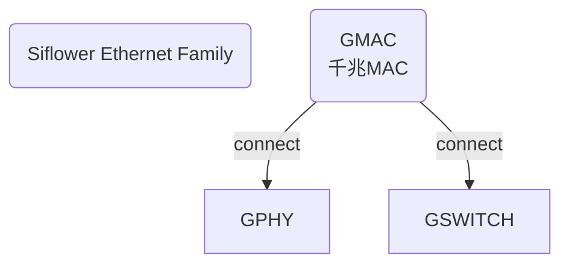
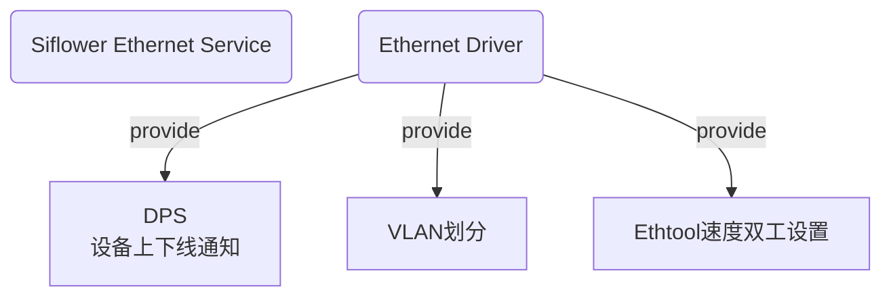

# 有线网络和服务介绍


**目录**

* TOC
{:toc}


## 适用人员

本文适用于想要了解Siflower有线网络和服务的相关从业人员。

## 开发环境

Siflower代码编译环境以及开发板测试环境。

## 相关背景

随着Siflower SDK的相继Release，使用Siflower开发板进行开发测试的人员越来越多，了解以太网相关硬件和软件就变得尤为重要。

## 功能概述

本文主要介绍Siflower以太网家族包含那些现有成员，我们基于以太网能提供那些服务，以及我们将做下一步改进计划。

### 硬件组成

Siflower有线网络现有成员如下：


### 软件服务

基于现有以太网我们提供的基础软件服务：


#### DPS服务介绍

DPS全称为Detect Port Status，用于检测设备上下线状态，在网页和APP上正确显示，整体的流程如下。


设备上下线示例：
在路由器串口下，执行```logread -f &```然后插拔网线，可以看到设备上下线日志如下：
```
root@OpenWrt:/# logread -f &
Wed Aug 26 16:42:28 2020 user.crit : dps msg received!
Wed Aug 26 16:42:28 2020 daemon.notice netifd: sf_eth_event port 3 updown 1 is_wan 0 vlanid 1 ifname eth0
Wed Aug 26 16:42:32 2020 user.crit : dps_check_newdev_process has finished!

Wed Aug 26 16:42:40 2020 user.crit : dps msg received!
Wed Aug 26 16:42:40 2020 daemon.notice netifd: sf_eth_event port 3 updown 0 is_wan 0 vlanid 1 ifname eth0
Wed Aug 26 16:42:44 2020 user.crit : dps_check_newdev_process has finished!
```
在设备插上或者拔出后可以去网页查看设备列表显示是否正常。

### 下一步优化

2020我们全新的SF19A28芯片已经在路上，届时以太网将新增HNAT模块，吞吐性能将更强，功耗更小，速率更稳定，支持智能硬件加速，智能QoS等全新功能．


## 如何基于Siflower的硬件进行二次开发

### 环境搭建

参考：[快速入门](https://siflower.github.io/2020/08/05/quick_start/)

### 我们对外提供的接口

#### 标准接口

提供了标准net_device_ops接口，switch_dev_ops接口，ethtool_ops接口，以intel7084 gswitch为例，展示详细接口介绍如下。

##### net_device_ops接口

我们提供的net_device_ops接口为标准接口，如下：
```
static const struct net_device_ops sgmac_netdev_ops = {    
        .ndo_open = sgmac_open,                            
        .ndo_start_xmit = sgmac_xmit,                      
        .ndo_stop = sgmac_stop,                            
        .ndo_change_mtu = sgmac_change_mtu,                
        .ndo_set_rx_mode = sgmac_set_rx_mode,              
        .ndo_tx_timeout = sgmac_tx_timeout,                
        .ndo_get_stats64 = sgmac_get_stats64,              
        .ndo_do_ioctl = sgmac_do_ioctl,                    
#ifdef CONFIG_NET_POLL_CONTROLLER                          
        .ndo_poll_controller = sgmac_poll_controller,      
#endif                                                     
        .ndo_validate_addr = eth_validate_addr,            
        .ndo_set_mac_address = sgmac_set_mac_address,      
        .ndo_vlan_rx_add_vid = sgmac_vlan_rx_add_vid,      
        .ndo_vlan_rx_kill_vid = sgmac_vlan_rx_kill_vid,    
        .ndo_set_features = sgmac_set_features,            
#if IS_ENABLED(CONFIG_NF_FLOW_TABLE)                       
    .ndo_flow_offload_check = sgmac_ndo_flow_offload_check,
    .ndo_flow_offload = sgmac_ndo_flow_offload,            
#endif                                                     
};                                                         
```

##### switch_dev_ops接口

我们提供的switch_dev_ops接口为标准接口，如下：
```
 struct switch_dev_ops gswitch_switch_ops = {
    .attr_global = {
        .attr = intel7084_globals,
        .n_attr = ARRAY_SIZE(intel7084_globals),
    },
    .attr_port = {
        .attr = intel7084_port,
        .n_attr = ARRAY_SIZE(intel7084_port),
    },
    .attr_vlan = {
        .attr = intel7084_vlan,
        .n_attr = ARRAY_SIZE(intel7084_vlan),
    },

    .get_vlan_ports = intel7084_get_vlan_ports,
    .set_vlan_ports = intel7084_set_vlan_ports,
    .get_port_pvid = intel7084_get_port_pvid,
    .set_port_pvid = intel7084_set_port_pvid,
    .get_port_link = intel7084_get_port_link,
    .reset_switch = intel7084_reset_switch,
};                                                    
```

##### ethtool_ops接口

针对ethtool_ops接口我们进行了优化，不仅支持单个GPHY的速度双工获取/设置，也支持GSWITCH每个口的速度双工获取/设置，详细使用方法如下：
* GPHY Ethtool支持
  * 支持的标准接口如下：
  ```
  static const struct ethtool_ops sgmac_ethtool_ops = {     
    .get_drvinfo = sgmac_ethtool_get_drvinfo,             
    .get_link = ethtool_op_get_link,                      
    .get_pauseparam = sgmac_ethtool_get_pauseparam,       
    .set_pauseparam = sgmac_ethtool_set_pauseparam,       
    .get_ethtool_stats = sgmac_ethtool_get_ethtool_stats, 
    .get_strings = sgmac_ethtool_get_strings,             
    .get_wol = sgmac_ethtool_get_wol,                     
    .set_wol = sgmac_ethtool_set_wol,                     
    .get_sset_count = sgmac_ethtool_get_sset_count,       
    .get_regs_len = sgmac_ethtool_get_regs_len,           
    .get_regs = sgmac_ethtool_gregs,                      
    .nway_reset = sgmac_nway_reset,                       
    .get_link_ksettings = phy_ethtool_get_link_ksettings, 
    .set_link_ksettings = phy_ethtool_set_link_ksettings, 
  };                                                        
  ```
  * 使用方法：
  标准ethtool使用方法，可通过```ethtool -h```查看ethtool使用方法；
* GSWITCH Ethtool支持
  * 支持的标准接口如下：
  ```
  struct ethtool_ops gswitch_ethtool_ops = {              
        .get_settings           = gsw_get_settings,     
        .set_settings           = gsw_set_settings,     
        .get_drvinfo            = gsw_get_drvinfo,      
        .get_sset_count         = gsw_get_sset_count,   
        .get_ethtool_stats      = gsw_get_ethtool_stats,
        .get_strings            = gsw_get_strings,      
        .get_link               = ethtool_op_get_link,  
        .nway_reset             = gsw_nway_reset,       
        .get_ringparam          = gsw_get_ringparam,    
  };                                                      
  ```
  * 使用方法：
    * 获取指定phy速度双工：
      命令：
      ```
      echo phyad phyid > /sys/kernel/debug/gmac_debug
      ethtool eth0
      ```
      第一条命令：第一个参数phyad为固定字符串，表示选用此功能，第二个phyid为指定phy的id，取值0～5，表示指定phy；  
      第二条命令：为标准ethtool获取速度双工命令，参数eth0为网卡名；  
    * 设置指定phy速度双工：
      命令：
      ```
      ethtool -s eth0 speed 1000 duplex full phyad 3
      ```
      前面部分为标准ethtool设置速度双工命令，最后一个参数phyid为指定phy的id，取值0～5，为必填参数；  

#### 私有接口

提供了自定义的Debugfs节点供技术人员使用，如内部寄存器读写函数，phy/switch寄存器读写函数，检测phy link状态函数等等。不同的硬件对应不同的调用方法，以下将以Intel千兆switch为例展示提供的接口函数调用方法。

**示例：**

- 获取当前phylink状态：  
  命令：  
  ```cat /sys/kernel/debug/gsw_debug```  
  结果展示如下：  
  ```
  root@OpenWrt:/# cat /sys/kernel/debug/gsw_debug 
  check phy link status
  phy0    status 0
  phy1    status 0
  phy2    status 0
  phy3    status 0
  root@OpenWrt:/#
  ```

- 读写gswitch内部寄存器：  
  读命令：  
  ```echo 0 regAddr > /sys/kernel/debug/gsw_debug```  
  第一个参数为选用此功能，第二个为读取的寄存器地址；

  写命令：  
  ```echo 0 regAddr value > /sys/kernel/debug/gsw_debug```  
  第一个参数为选用此功能，第二个为写寄存器的地址，第三个参数为写入的值；

- 读写gswitch外围通用phy寄存器：  
  读命令：  
  ```echo 8 port regAddr > /sys/kernel/debug/gsw_debug```  
  第一个参数为选用此功能，第二个为phy的id，第三个为读取的寄存器地址；

  写命令：  
  ```echo 8 port regAddr value > /sys/kernel/debug/gsw_debug```  
  第一个参数为选用此功能，第二个为phy的id，第三个为写寄存器的地址，第四个参数为写入的值；

- 读写gswitch外围MMD寄存器：（此功能仅支持intel7084）  
  读命令：  
  ```echo 9 port regAddr > /sys/kernel/debug/gsw_debug```  
  第一个参数为选用此功能，第二个为phy的id，第三个为读取的寄存器地址，如0x1f01e2；

  写命令：  
  ```echo 9 port regAddr value > /sys/kernel/debug/gsw_debug```  
  第一个参数为选用此功能，第二个为phy的id，第三个为写寄存器的地址，第四个参数为写入的值；


#### 支持的外围芯片列表
目前Siflower有线网络已支持如下外围芯片，如需增加新的外围设备可联系我们进行支持。

| 设备类型 | 设备型号 |
| -- | -- |
| 千兆PHY | Realtek8211 |
| 千兆PHY | Intel7061 |
| 千兆SWITCH | Realtek8367C |
| 千兆SWITCH | Intel7084 |
| 千兆SWITCH | IP1707 |

## 项目引用

### 参考文档

[快速入门](https://siflower.github.io/2020/08/05/quick_start/)

## FAQ
