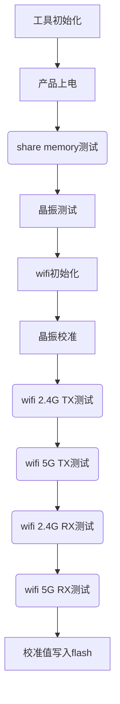
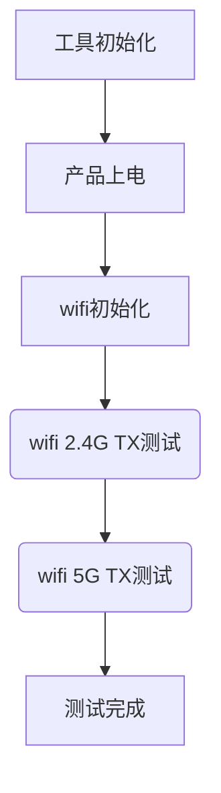
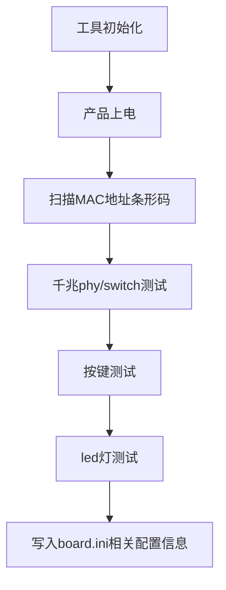
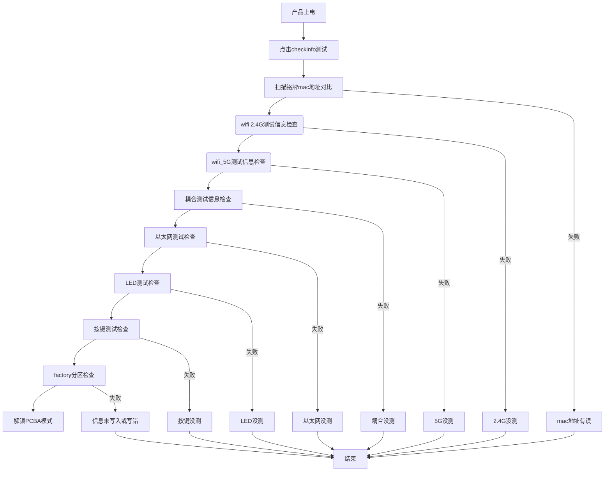

# PCBA工具使用手册

**目录**

* TOC
{:toc}

## 1 介绍

矽昌通信使用PCBA测试工具，在产线上对产品进行测试，旨在自动化、批量化、快速地完成产品基本功能的测试。

### 1.1 适用人员

本文档重点介绍基于siflower芯片方案设计开发的产线生产测试工具，旨在帮助客户及可能的使用者方便快速掌握工具使用方法，工具目前可支持的仪器设备如下：

|仪器|型号|
|---|---|
|极致汇仪|WT200、WT208、WT208C|
|莱特波特|IQflex、IQxel80、IQxel智|
|安捷伦|E6640A|

**注：如果有其他测试仪器的对接需求，可以另行提出需求，由我们提供支持。**

### 1.2 开发环境

工具为使用Visual Studio 2015平台开发的（c++ Windows Forms） PC端Windows UI界面工具，适用于烧录具有pcba镜像的siflower方案芯片的产品，要求板端运行在uboot模式下且进入PCBA测试流程。

### 1.3 相关背景

为保证产品RF性能达到设计指标要求及满足大批量快速生产要求，需要开发产线生产测试工具对产品RF进行校准以及对产品其它基本功能进行测试。

### 1.4 功能概述

#### 1.4.1 工具目录介绍

**工具下载地址**  
百度网盘下载链接：(待添加)  
提取码：(待添加)  

测试工具文件夹名称为PCBA_Release，大小大约为500MB左右，主要有以下文件：
SF_PCBA_TEST.exe：运行程序  
help文件夹：主要包含一些兼容性软件，用户手册、系统需要的dll文件  
waveforms文件夹：主要包含Itest/IQ仪器用到的波形文件  
log文件夹：主要包含测试中的log文件  
pass_log文件夹：主要包含测试成功的产品的log文件  
fail_log文件夹：主要包含测试失败的产品的log文件  
sf_setup文件夹：主要包含测试的配置文件  
其他：一些iTest仪器所需的库文件等  
其他：一些IQ仪器所需的库文件等  

#### 1.4.2 工具主要功能

工具功能主要包括wifi校准测试（2.4G,5G wifi校准）、WIFI耦合测试、功能测试、检查每一站测试信息  
其中功能测试包括MAC地址烧录，按键功能测试，LED灯测试，以太网测试，以及往产品写入国家码等信息测试  
工具功能界面如下图所示：

- 主界面
  主界面一共分为四个测试站，可根据产线实际情况进行适配和调整  
  
  
- wifi校准测试
  单击（Calibrtion Test）按钮后，会弹出如下界面，以itest208为例，可同时对四个产品裸板进行wifi校准  
  
- 耦合测试
  单击（WIFI_NFT Test）按钮后，会弹出如下界面，对焊接好天线组装完成的产品进行耦合测试  
  
- 功能测试
  单击（Function Test）按钮后，会弹出如下界面，待测产品进行mac地址烧写，以太网，按键，灯测试，并且写入产品相关信息  
  
- 检查测试信息
  单击（CheckInfo Test）按钮后，会弹出如下界面，对完成前面三站测试的产品进行测试信息检查，是否有漏测或误测，检查无误后解锁PCBA模式正常启动系统  
  

- 产品端
  需要提前烧录好PCBA镜像，进入pcba模式等待工具开启后进行测试，此时产品led灯会被全部点亮，产品接串口，串口log打印如下图：  
  

#### 1.4.3 工具配置文件说明

- board.ini配置说明
    board.ini包含了factory分区信息写入，参考[FLASH分区开发手册](https://siflower.github.io/2020/09/08/flashPartitionGuide/)   
    factory说明包含了待测板PA类型（内置或者外置），wlan port选择(gswitch/phy)，网口数量,led数量,按键等，可根据产品实际情况修改适配，具体列表及含义如下：

    |内容|含义|
    |---|---|
    |flash_size|Flash大小|
    |wifi_lb=external_PA|2.4G RF链路外置PA类型，如是内置PA，修改为internal_PA|
    |wifi_hb=external_PA|5G RF链路外置PA类型，如是内置PA，修改为internal_PA|
    |wlan=switch|测试wlan_port为外接类型switch/phy(A18外接千兆phy时这里写gmac)|
    |gmac=rgmii|测试wlan_port外接类型为千兆phy或者switch时为rgmii,为百兆phy/switch时为rmii|
    |pmu_button=0|0：没有PMU按键；1：有PMU按键|
    |eth_port_list=0x56|switch 测试网口配置 0x56即0x01010110(对应为port0作为wan 1 2 3作为lan)|
    |switch_eth_led_num=0x56|switch 测试网口灯数量，必须与eth_port_list保持一致|
    |gpio_button=60 -1 -1 -1|GPIO按键的GPIO号，-1表示没有|
    |gpio_button_value=0 0 0 0|GPIO按键测试值，0和1有效，gpio_button中为-1的这里也无效|
    |gpio_button_timeout=10000|按键测试时间设置 0为不超时 10000为等待10000ms|
    |gpio_led=12 -1 -1 -1 -1 -1 -1 -1|连接在芯片上的LED的GPIO号，-1表示没有|
    |led_cnt=5|连接在芯片GPIO的LED数量，在弹窗中显示数字(led_cnt+switch_eth_led_num)，对测试无影响|
    |hardware_version=AC28|要写入产品的硬件版本号|
    |model_version=AC28|要写入产品的产品型号|
    |country_code=CN|要写入产品的国家码|
    |hw_feature=0xfffffffe|要写入产品的硬件特性,默认为0xffffffff，每一位表示一个特性|
    |login_info=0xfffffffe|要写入产品的登录信息，控制telnet server，ssh server，uart等(目前仅实现telnet)|
    |vender=siflower|要写入产品的公司名称|
    |product_key=c63999ff2e99971f2adbf9375be748fb|要写入产品的产品密钥，从开放平台获取，参考[矽昌开放平台用户手册](https://siflower.github.io/2020/09/12/open_platform_user_guide/)|
    |rom_type=87|要写入产品的rom_type，从开放平台获取，参考[矽昌开放平台用户手册](https://siflower.github.io/2020/09/12/open_platform_user_guide/)|
    |24g_rx_test_power=-40|2.4G接收信号能量|
    |5g_rx_test_power=-40|5G接收信号能量|
    |xo_default_value=0xfb|校准晶振时的默认值(试产时根据多次校准结果从测试log中读取)，可减少晶振校准时间|
    |mac_addr=a8 5a f3 00 00 00 |MAC地址前六码，可根据不同客户MAC地址段修改适配|

- config.ini配置说明
    config.ini配置文件包含了仪器IP设置，使用的测试端口数量，仪器型号等，具体含义如下：

    |内容|含义|
    |---|---|
    |Instrument_type=iTest|iTest(使用极致汇仪仪器)；IQxel(使用莱特波特仪器)|
    |Instrument_ip=192.168.10.254|iTest(使用192.168.10.254)；IQxel(使用192.168.100.254)|
    |24g_NFT_cable_loss=30|NFT测试时的空气衰减+耦合板线材的衰减(需要实际测试产品后填到此处做补偿)|
    |5g_NFT_cable_loss=30|NFT测试时的空气衰减+耦合板线材的衰减(需要实际测试产品后填到此处做补偿)|
    |cable_loss_button_need=1|“线损校准”按钮，设0不显示，设1显示|
    |users=1|配置WT-208一拖多测试DUT数量，1~4有效|
    |user1_2g_port=1|user 1 2.4G口，1～4有效值。1对应RF1，依次类推|
    |user1_5g_port=1|user 1 5G口，1～4有效值。1对应RF1，依次类推|
    |user2_2g_port=2|user 2 2.4G口，1～4有效值。1对应RF1，依次类推|
    |user2_5g_port=2|user 2 5G口，1～4有效值。1对应RF1，依次类推|
    |user3_2g_port=3|user 3 2.4G口，1～4有效值。1对应RF1，依次类推|
    |user3_5g_port=3|user 3 5G口，1～4有效值。1对应RF1，依次类推|
    |user4_2g_port=4|user 4 2.4G口，1～4有效值。1对应RF1，依次类推|
    |user4_5g_port=4|user 4 5G口，1～4有效值。1对应RF1，依次类推|
    |bypass_2g_rx=0|0:不跳过2.4G RX测试；1：跳过2.4G RX测试|
    |bypass_5g_rx=0|0:不跳过5G RX测试；1：跳过5G RX测试|
    |wt200=0|0：不使用wt200；1:使用wt200|
    |func_test_priority=1|功能测试优先级，与wifi_test_priority比较，如果大于则先function测试，再进行WiFi测试|
    |wifi_test_priority=2|wifi测试优先级，与func_test_priority比较，如果大于则先wifi校准测试，再进行function测试|
    |wifi_or_func_macaddr=0|1：在功能测试站烧录mac地址，在WiFi测试站跳过扫码;0：在WiFi测试站烧录mac地址  在功能测试站跳过扫码|
    |func_test_time=1|功能测次数，默认为1 最大为2，主要用于二次测试功能测试|
    |nft_test=1|1：进行NFT测试 0：不做NFT测试(做打流测试)|
    |wifi_to_func_test=0|1：测试完wifi后连续功能测试; 0：不连续测试|

- wifi_limit.txt配置说明
    wifi_limit.txt配置文件包含测试目标功率设置，测试EVM标准，测试接收灵敏度标准，接收指标，**对于标准参数，不得随意修改**，可根据产品实际开发情况设置合适的目标功率。
   
    

    

    

## 2 工具使用环境

工具使用环境需注意以下几点，

 - 工具运行在windows系统，xp,Win7，Wind10均可

 - 运行工具exe文件，如报错缺少dll文件
   - 请进入help文件夹运行vcredist_x86.exe和vc_redist.x86.exe
   - **如果是64位的电脑，将help目录下的DLL/64/下的dll文件拷贝到 C:\Windows\SysWOW64**
  
 - 待测产品具有千兆网口，测试电脑需要支持千兆网口；
  
 - 搭建wifi校准环境

    如仪器为极致汇仪仪器，与仪器连接的电脑网卡IP为：192.168.20.10，此IP与产品通信，不得更改；另外在同一张网卡上新增与仪器同一网段的IP，192.168.10.25；
    同一张网卡上增加同产品网段IP，192.168.4.xx  
    相同仪器ETH-1连接待产品1wan口,仪器ETH-2连接待测产品2wan口,其余类推  
    测试时一个RF口接一台待测产品，与ETH相对应  
      

    如使用莱特波特仪器，测试电脑除主板网卡外需要增加1-2张网卡，增加一张网卡即增加测试一个产品，最多可同时测试两块待测板  
    其中一张电脑网卡连接仪器，另外网卡连接对应待测板，连接待测产品1网卡IP设定为:192.168.4.2；连接待测产品2网卡IP设定为:192.168.5.3  
    在每张网卡上增加一个仪器同一网段ip:192.168.100.15  
    测试时一个RF口接一台待测产品  
      
    

### 2.1 测试流程

- 结合工具讲述产线主要测试流程

如工厂自行开发Throughput测试wifi吞吐，可不必测试wifi耦合，其中Throughput测试是在板端进入openwrt系统后进行，跳过耦合测试，直接检查测试信息成功后，产品即从pcba模式解锁进入openwrt

**注意：需要再次进入pcba模式测试需要重新烧录pcba镜像**

- 动态配置
  
  矽昌产线工具支持多种测试方式，可以通过config.ini进行动态调节。详情见[动态配置方案介绍章节](#3-动态配置方案介绍)

### 2.2 测试流程说明

针对主要的测试流程，根据工具设计功能详细讲述产测工具的每一站该如何操作。

#### 2.2.1 wifi校准测试

##### 2.2.1.1 环境线损校准

产线生产时需要通过线材以及治具连接天线座到仪器，所以在对wifi进行校准之前，需要先对测试环境进行线损测试，以校准RF1口为例

- 首先将RF1/RF2连接到一起形成回环
 
  **注：若测试RF3口线损，则将RF3 RF4连接到一起形成回环，依次类推**  
  线损测试接线示意图如下  
  

- 打开工具wifi校准测试，初始化成功后点击窗口1(窗口1对应RF1)“线损校准”按钮
  

- 开启线损校准
  

- 线损校准结束
  

- 测试结果保存
  
  RF1测试结果会保存到wifi_atten_dut_1.txt文件中  
  其中wifi_atten_dut_1.txt对应端口1的线损校准值，具体内容如下图：  
  

- 线损文件说明
  wifi_atten_dut_1.txt到wifi_atten_dut_4.txt，记录了不同RF端口到板端的线损值  
  Fixed attenation为不易量测的夹具RF探针估计衰减值，原则上2.4G估计0.5db左右，5G估计0.8db左右，需要手动填写到此文件中  
  Delta attenation为仪器量测的仪器RF端口到板端馈线线损值，量测时仪器RF1与RF2对接，点击一拖四wifi校准界面1工位线损测试按钮，测试完成线损值保存在wifi_atten_dut_1.txt  
  点击点击一拖四wifi校准界面2工位线损测试按钮，测试完成线损值保存在wifi_atten_dut_2.txt，RF3与RF4到板端线损量测方法一致  

  Fixed attenation衰减值估计如下：

  

- 注意事项
  
  测试工具在测试时调用的线损补偿值为Fixed attention + Delta attenation  
  确认配置文件线损配置写入后，即可开始测试wifi，在环境不变以及线材没有损耗的情况下无线重新校准线损，使用已保持的值即可  
  如果线材长时间使用需要更新线材，则需要重新进行线损校准再进行wifi校准测试。

##### 2.2.1.2 WiFi校准测试

- wifi测试内容
  

- 仪器初始化成功
 

- 勾选对应窗口跳过扫码
  **注:如果配置在wifi测试站写入mac地址，则不勾选跳过，扫描条码后开始测试**   
 

- 给板子上电，等待1~2s,开始测试
 

- 测试成功

 

 板端完成测试，串口打印log如下：

 

如过程中遇到问题，见FAQ帮助解决。

#### 2.2.2 WIFI 耦合测试

##### 2.2.2.1 WIFI 耦合测试功率设置

wifi耦合测试目标功率需与产品校准目标功率设置保持一致(即wifi_limit配置文件中的目标功率)，考虑实际环境空气衰减，馈线衰减补偿困难，业界允许上下限4db range，如wifi校准目标功率设定18dbm，wifi耦合测试同信道同速率耦合量测功率为（14,22）；测试时可取少许待测产品（10pcs）左右测试后取平均值补偿环境线损+空气衰减；也可制作耦合板使用网络分析仪进行回路量测  
测试后的值填入config.ini的NFT_cable_loss  

##### 2.2.2.2 WIFI 耦合测试流程

耦合测试需要使用iTest/IQ仪器配合耦合测试板进行使用  
 

iTest仪器，在测试前需要保证仪器正常工作，与PC相连，PC端IP设为192.168.100.254。
该测试支持最多4块产品同时测试。iTest仪器的RF1通过射频线和耦合板连到产品1的天线上，产品1的WAN口与仪器ETH1相连；RF2通过射频线和耦合板连到产品2的天线上，产品2的WAN口与ETH2相连，依次类推

IQ仪器，与PC相连，PC端IP设为192.168.10.254,该仪器测试支持最多2块产品同时测试,且需要电脑增加网卡。测试时RF1通过射频线和耦合板连到产品1的天线上，产品1的WAN口与PC网卡1相连，PC端IP设为192.168.4.2；RF2通过射频线和耦合板连到产品2的天线上，产品2的WAN口与PC网卡2相连，PC端IP设为192.168.5.3.
- 耦合测试流程图
  

- 产品上电
  
- 点击WIFI_NFT_TEST
  
  

- 初始化成功
  
- 勾选跳过扫码，开始测试
  

如过程中遇到问题，见FAQ帮助解决；

#### 2.2.3 功能测试

功能测试包含按钮测试和LED测试，需要工人按键和观察LED灯的暗灭情况，以及网口测试，需要将产品的LAN口用治具或网线连接。  
测试时将WAN口与PC相连，PC端IP设为192.168.4.2

##### 2.2.3.1 功能测试流程

- 产品上电
  
- 开始测试，扫码
  **注:如果配置在wifi测试站写入mac地址，则此站勾选跳过，然后开始测试**  

 

- 测试成功

 

 板端完成测试，串口打印log如下：

 

如过程中遇到问题，见FAQ帮助解决；

##### 2.2.3.2 功能测试具体描述

功能测试包括MAC地址烧录，按键功能测试，LED灯测试，以太网测试，以及往产品写入制造商、产品型号、国家码等信息测试  
详细内容及含义见board.ini配置说明。

- 产品上电
  
- 点击功能测试按键

- 扫描写入mac地址

    扫码枪扫描产品张贴铭牌上的MAC条形码，与board.ini中设定的MAC前六位进行比较，比较一致则烧录，否则停止测试  
    **注意:此时电脑的输入法一定要为英文输入法**

- 网口测试

    测试工具首先根据配置文件读取外围配置为phy/switch进而发送不同的测试指令。
    lan口为偶数，测试时使用短网线两个一组回环连接，lan发送信息给另一个lan口，进行判断测试。
    lan口为奇数，测试时使用短网线回环连接其中两个lan口，单独的一个lan口需要接到一块专用的PCBA测试板，进行判断测试。

- 按键测试 

    按键测试弹框后需要产线操作员在规定时间内按压按键，超时工具会提示测试失败。这个时间可以通过gpio_button_timeout进行配置
    按键测试时测试工具根据board.ini配置文件读取配置测试的按键gpio数，测试工具发送指令给产品板，产品端收到数据后根据读取的配置文件中按键的gpio号在产线操作员按压按键后判断其gpio状态，
    由此判断按键功能是否正常。

- LED测试  

    进行到led测试时，所有待测led会被点亮，需要产线操作员肉眼观察led点亮情况及led灯点亮数量；进而进行判断是否测试正常，测试正常则点击弹框“是”按钮，不正常则点击弹框“否”按钮  
    led测试会全部点亮产品LED灯，测试工具根据配置文件中设定的led对应的gpio号进行点亮led，
    然后将正常应该亮灯的数量进行弹框提示，操作员在弹框时查看提示的亮灯数目与产品的实际亮灯数目是否一致，进而选择是否正常。

- 写入产品信息 
  
    写入board.ini中的信息如下  
    

#### 2.2.4 信息检查测试

测试信息检查会对前面测试的信息进行读取判断，查看产品是否有遗漏测试或者未测试，测试流程如下 

- 扫描机身mac条码开始测试
  
- 测试完成
  
 
    
## 3 动态配置方案介绍

目前矽昌PCBA测试工具支持通过配置文件调整，适用于不同工厂调节不同的测试方案，进而达到最优的测试流程，节省测试时间

### 方案一

此时无需WiFi耦合测试，故从主界面隐藏，支持三站即可

- 配置文件
 
 

- 测试界面
  
  - 先测wifi再测功能 
  
    

    如果测试板子未测wifi 直接去功能测试则会提示  

    

  - 先测功能再测wifi

    

    如果测试板子未测功能 直接去wifi测试则会提示 

    

- mac地址
  通过wifi_or_func_macadd值配置在哪一站写入macaddr  
  1：在功能测试站烧录mac地址  在WiFi测试站跳过扫码  
  0：在WiFi测试站烧录mac地址  在功能测试站跳过扫码  

  - 如果设置在wifi站写地址，此时点击跳过扫码则会提示
    
   
  - 如果设置在功能测试站写地址，此时点击跳过扫码则会提示
    

### 方案二

- 配置文件
  
 

- 测试界面
  
 

### 方案三

- 配置文件
  
 

- 测试界面
  
 

- 第二次测试
  
 配置 func_test_time，功能测次数，默认为1 最大为2，主要用于二次测试功能测试

 

 

 - check info
  
 进行一次功能测试和两次功能测试，在checkinfo时会根据测试flag有不同的判断

  - 只进行一次功能测试
   
    

  - 进行二次功能测试
    
    

checkinfo 目前检查的信息有

|info|描述|
|---|---|
|macaddr|比对机壳与板子写入的mac地址|
|wifi_flag|检查2.4G/5G是否测试成功|
|以太网_flag|检查以太网是否测试成功|
|led_flag|检查LED是否测试成功|
|btn_flag|检查按键是否测试成功
|NFT_flag|检查是否测试耦合|
|HW_VERSION|检查硬件信息是否正确|
|ROM_TYPE|检查版型信息是否正确|

如果某一项检查失败，则会弹框提示

 

## 4 FAQ

**Q:wifi校准测试常见问题有哪些?**
A:
- 工具初始化失败
    请检查仪器IP地址是否与配置文件config配置文件中一致  
    检查测试电脑网卡IP设置，详细见上文工具使用注意  
- 没有检测到设备(断ping)
    检查网线是否连接正常  
    检查产品是否进入PCBA模式  
- share_memory测试失败
    芯片不良
- WIFI晶振测试失败
    晶振不良，或者芯片不良，没有检测到时钟；
- WIFI初始化失败
    网络不通，wifi_init指令发送失败  
    芯片不良
- WIFI校准测试发射功率低
    夹具探针接触不良  
    线材松动或者损坏
    芯片不良等
    可焊接线测试debug；
- WIFI 2.4G/5G 发射功率低
    夹具探针接触不良  
    线材松动损坏，线损较大
    芯片不良
    可焊接线测试debug；
- WIFI 2.4G/5G 测试失败
    芯片问题
    index table值设置偏差太大
    线材问题，线损或者接触不良
- WIFI 2.4G/5G 接收测试失败
    检查产品RX链路是否异常  
    检查屏蔽箱屏蔽效果是否不好  

**Q:WIFI耦合测试常见问题有哪些?**
A:
- 工具初始化失败
    请检查仪器IP地址是否与配置文件config配置文件中一致  
    检查测试电脑网卡IP设置，详细见上文工具使用注意
- 产品灯不亮
    产品系统没有正常上电  
    产品led灯损坏
- WIFI晶振测试失败
    晶振不良  
    初始XO值给的不合适，请根据测试结果到board.ini中修改  
    芯片不良，没有检测到时钟  
- WIFI初始化失败
    芯片不良
- WIFI耦合测试发射功率低
    检查空气衰减补偿是否正确  
    检查夹具耦合板是否位置变动  
    检查产品天线位置是否变动  
    天线焊接异常

**Q:手动测试常见问题有哪些？**
A：
- 工具初始化失败
    检查测试电脑网卡IP设置，详细见上文工具使用注意
- 没有检测到设备
    检查网线是否连接正常  
    检查产品是否进入PCBA模式 
    检查是否网络不通
- 提示SWITCH/PHY测试失败
    检查测试电脑网卡是否是千兆网卡及是否设定为千兆全双工模式或自动侦测模式;  
    检查板端千兆phy/switch芯片是否有焊接不良等问题  
    检查网口或者网络变压器是否有损坏
    测试用网线不支持千兆；
- 产品灯不亮
    产品系统没有正常上电  
    产品led灯损坏
- MAC地址错误
    请检查待扫描的MAC条形码前六位与board.ini文件中配置是否一致  
    请检查电脑输入法是否为英文，防止扫描枪回车无效
- 以太网LAN测试失败
    请检查产品RJ45网口焊接，检查产品swich焊接，检查测试用网线是否损坏
- 按键测试失败
    请注意是否按键超时，如正常操作，检查产品按键焊接是否异常
- led灯测试失败
    检查产品led灯是否损坏
- 写入factory分区失败
    检查FLASH是否正常
    检查产品SPI线路是否正常

