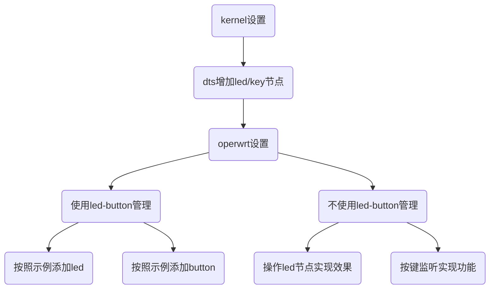

* TOC
{:toc}

# GPIO综合使用手册

## 1 介绍  

### 1.1 适用人员  
适用于siflower硬件版型下使用gpio实现按键功能和led功能的开发人员  
### 1.2 开发环境
ubuntu系统  
已完成编译的siflower SDK
正常运行的siflower硬件平台
### 1.3 相关背景
在siflower各个硬件平台下，通过文档介绍修改，可以实现按键功能，或者设置LED状态，完成目标需求
### 1.4 功能概述
本文档详细地说明了siflower平台下可选用的GPIO用于按键和led灯的配置方法  
目前siflower openwrt下提供了一个led-button package统一管理siflower不同板型的led和button，  
将led操作和按键检测等功能封装成函数，只需要文档按照示例修改添加，即可完成相关功能 

另外本文也提供了使用通用方式配置按键和灯的说明和示例。

**注：led-button仅供XC内部开发使用，SDK不带此package**

## 2 项目引用
### 2.1 参考文档  
参考[快速入门手册](https://siflower.github.io/2020/08/05/quick_start/)  
参考[GPIO使用手册](https://siflower.github.io/2020/09/03/iomux_table/)  
参考[Linux DTS说明文档](https://siflower.github.io/2020/09/03/linux_dts_introduce/)

## 3 开发详情  
### 3.1 功能设计和流程  
目前siflower内核使用linux4.14，在内核添加加按键或者led，只需要在对应版型的dts中添加相应GPIO节点  
openwrt下按键功能控制使用标准的input子系统进行监听按键中断，应用层检查到中断后，再实现相应功能。  
led在dts中配置好并勾选上相应配置后会生成响应的LED节点，按照标准的LED节点控制方式在应用层进行控制即可  



### 3.2 代码架构和实现 
### 3.2.1 LED实现
#### 3.2.1.1 kernel led 配置
- linux-4.14.90/linux-4.14.90/arch/mips/boot/dts/siflower/版型.dts中添加led节点配置  
```
&leds {
    status = "okay";
    test-led {
        label = "test-led";
        gpios = <&gpio 36 1>;//实际gpio num根据硬件来选择
        linux,default-trigger = "none";
    };
};
```
- kernel_menuconfig 选择
```
  Device Drivers
    -->LED_Support
        -->LED Support for GPIO connected LEDs
```  
  
至此在内核中添加LED相关节点完成。

#### 3.2.1.2 openwrt led 配置
**使用led-button package进行管理**   
  led-button package是为了统一管理siflower不同板型的led和button而实现的，代码在github SDK不开源，其基础就是按照标准的led/button控制实现的  
  如果是新的版型引入，在此之前请确认版型已建立，如果没有请新建版型，siflower版型添加参考[新的版型引入指南](https://siflower.github.io/2020/09/08/newBoardImportGuide/)  
- 在action.h中根据版型定义行为编号，对使用led-button package的led行为进行了统一管理，具体对编号的使用在led.c中体现  
```
enum {
	LED_ACTION_NONE,
	LED_ACTION_1,  LED_ACTION_2,  LED_ACTION_3,  LED_ACTION_4,
	LED_ACTION_5,  LED_ACTION_6,  LED_ACTION_7,  LED_ACTION_8,
	LED_ACTION_9,  LED_ACTION_10, LED_ACTION_11, LED_ACTION_12,
	LED_ACTION_13, LED_ACTION_14, LED_ACTION_15, LED_ACTION_16,
	LED_ACTION_17, LED_ACTION_18, LED_ACTION_19, LED_ACTION_20,
	LED_ACTION_21, LED_ACTION_22, LED_ACTION_23, LED_ACTION_24,
	LED_ACTION_MAX,
};
```

- 在led.c中根据版型和led行为编号添加判断判和调用plat_led.c中哪一个功能函数

```
switch (action << 16 | board) {
	case mACTION(LED, 1, 1):
	case mACTION(LED, 1, 4):
	case mACTION(LED, 1, 7):
		ret = plat_set_led_on();
		break;
	case mACTION(LED, 2, 4):
		ret = plat_set_led_timer();
		break;
	case mACTION(LED, 3, 1):
	case mACTION(LED, 3, 4):
	case mACTION(LED, 3, 7):
		ret = plat_set_led_off();
		break;
	case mACTION(LED, 9, 0):
		ret = plat_set_led_p10m();
		break;
	case mACTION(LED, 17, 3):
		ret = plat_set_led_rep_1();
		break;
	case mACTION(LED, 18, 3):
		ret = plat_set_led_rep_2();
		break;
	case mACTION(LED, 19, 3):
		ret = plat_set_led_rep_3();
        ......
        .........
```

- mACTION(x,y,z)在action.h中定义如下，新版型需要在plat.c和plat.h进行添加并保存

```
#define mACTION(x, y, z) (x##_ACTION_##y << 16 | BOARD_##z)
X代表：led/btn
Y代表：enum中的行为编号，
Z代表：版型编号
```

```
plat.h

enum {
	BOARD_0, /* SF19A28_REPEATER */
	BOARD_1, /* SF19A28_86V */
	BOARD_2, /* SF19A28_AC28 */
	BOARD_3, /* SF19A28_EVB */
	BOARD_MAX, /* not used */
};

plat.c

/* This table is used to match board & boardname. */
struct board_name bd_name[] = {
	{ BOARD_0, "sf19a28-rep" },
	{ BOARD_1, "sf19a28-86v" },
	{ BOARD_2, "sf19a28-ac28" },
	{ BOARD_3, "sf19a28-evb" },
	{ BOARD_MAX, "none" }, /* Ending flags. */
};
```

- 在plat_led.c中，已经统一将led基本操作写成了代码封装成了函数，根据版型名称和dts中led设备节点进行设置。  
  实际功能函数根据需求在plat_led.c中自行实现，参考其它已有版型的实现函数即可，这样就可以完成对版型led的控制。


```
* All leds in arg "name" must be available! */
static int led_set_trigger(const char *trig, int cnt, char **name)
{
	return led_config("trigger", trig, cnt, name);
}
static int led_set_delayon(const char *trig, int cnt, char **name)
{
	return led_config("delay_on", trig, cnt, name);
}
static int led_set_delayoff(const char *trig, int cnt, char **name)
{
	return led_config("delay_off", trig, cnt, name);
}
static int led_set_owner(const char *trig, int cnt, char **name)
{
	return led_config("owner", trig, cnt, name);
}
int plat_set_led_on(void)
{
	return led_set_trigger("default-on", bd_info.ledcnt, bd_info.bd_leds);
}
```

- EVB led实现功能函数示例：

```
/*
 * evb led action definition
 *
 * */
int plat_evb_check(char **ledx, int cnt)
{
	if (bd_info.bn.board == BOARD_4) {
		if (plat_led_check(ledx, bd_info.bd_leds, cnt, bd_info.ledcnt) == 0)
			return 0;
	}

	return -EINVAL;
}

int plat_set_led_evb_eth(char *trigger)
{
	int ret;
	char *led[2] = {"eth_led0", "eth_led1"};
	ret = plat_evb_check(led, 2);
	if (!ret) {
		ret = led_set_trigger(trigger, 2, led);
		ret += led_set_owner("gpio", 2, led);

	}
	return ret;
}

void sigalrm_fn_evb(int sig)
{
	plat_set_led_evb_eth("default-on");
	exit(0);
}

int plat_set_led_evb(void)
{
	int ret;
	ret = plat_set_led_evb_eth("timer");
	signal(SIGALRM, sigalrm_fn_evb);
	alarm(7);
	for (;;);
	return ret;
}
```

注：这些函数生效，首先确定在/sys/class/leds存在，并且leds/下存在与dts中名称相对应的节点，才可以对led进行控制操作

- 完成上述修改后，在menuconfig选中led-button，进行编译即可
 ```
  Utilities
    --->led-button
```  


**不使用led-button package进行管理**
siflower使用linux标准的led子系统，故不使用led-button，按照标准流程自行实现led控制功能也是可以的
- 按照上述方式完成kernel中相应版型dts添加

```
&leds {
    status = "okay";
    test-led {
        label = "test-led";
        gpios = <&gpio 36 1>;
        linux,default-trigger = "none";
    };
};
```

- 确认在/sys/class/leds存在，并且leds/下存在与dts中名称相对应的节点，然后可以自行编写代码实现对led控制操作。

- 控制led打开/关闭(以test-gpio为例，下同)


```
echo default-on > sys/class/leds/test-led/trigger //打开

echo none > sys/class/leds/test-led/trigger       //关闭
```

- 控制LED闪烁，默认500ms闪烁

```
echo timer > sys/class/leds/test-led/trigger //打开闪烁

echo none > sys/class/leds/test-led/trigger  //停止闪烁
```

- 自定义LED闪烁，设置亮灭时常：200ms  亮/灭

```
echo timer > sys/class/leds/test-led/trigger //打开闪烁 

echo 200 > sys/class/leds/test-led/delay_on  //设置200ms亮

echo 200 > sys/class/leds/test-led/delay_off //设置200ms灭
```

以上为直接在串口操作kernel生成的LED节点，实际使用可以按照标准的方式在编写应用程序实现功能，或者在脚本中实现然后调用脚本实现控制

### 3.2.2 BUTTON实现

#### 3.2.2.1 kernel button 配置

- linux-4.14.90/linux-4.14.90/arch/mips/boot/dts/siflower/版型.dts中添加key节点配置

```
&gpio_keys {
    status = "okay";
        test-btn {
            label = "test-btn";
            gpios = <&gpio 37 1>; 
            linux,code = <0x100>; //按键编号
            debounce-interval = <20>; //按键抖动
        };
};
```

- kernel_menuconfig 配置
  siflower按键检测依赖input子系统，并且解析dts的节点是由input/keyboard/gpio_keys.c这个驱动解析的，所以kernel config中需要配置  

```
CONFIG_INPUT_EVDEV=y
CONFIG_KEYBOARD_GPIO=y
```

```
Device Drivers
    --->Input device support
        --->Keyboards
            --->GPIO Buttons
```

  

#### 3.2.2.2 openwrt button 配置

**使用led-button package进行管理**   
以实现reset按键为例，介绍siflower硬件版型在SDK下实现流程  

- 在plat.h/plat.c中添加或者修改版型名称并保存

```
plat.h

enum {
	BOARD_0, /* SF19A28_REPEATER */
	BOARD_1, /* SF19A28_86V */
	BOARD_2, /* SF19A28_AC28 */
	BOARD_3, /* SF19A28_X1 */
	BOARD_4, /* SF19A28_EVB */
	BOARD_MAX, /* not used */
};

plat.c

/* This table is used to match board & boardname. */
struct board_name bd_name[] = {
	{ BOARD_0, "sf19a28-rep" },
	{ BOARD_1, "sf19a28-86v" },
	{ BOARD_2, "sf19a28-ac28" },
	{ BOARD_3, "sf19a28-x1" },
	{ BOARD_4, "sf19a28-evb" },
	{ BOARD_MAX, "none" }, /* Ending flags. */
};
```

- 复制参考版型base-files-版型/etc/config/btn_ctrl_cfg文件到自己新增的版型目录下，按键实现主要在这里配置

```
btn_ctrl_cfg的内容如下：

# @btn_code: Must be exactly the same as "linux,code" in kernel dts
#            The format must be as follows:
#                1. Must be 0x at the beginning('x' must be lowercase)
#                2. Linux dts follow the same rules
# @btn_action: Action should follow the content in the table below
#              ---------------------------------
#              |       Action        | Number  |
#              | Long Press          |    1    |
#              | Short Press         |    2    |
#              | Extra Long press    |    3    |
#              | High Level Trigger  |    4    |
#              | Low Level Trigger   |    5    |
#              | Edge Level Trigger  |    6    |
#              ---------------------------------
# @btn_cmd: Command that needs to be executed. You should try to put your
#            own functions in a script and then execute the script.

# factory reset when button long prees
config btn_config
        option btn_code '0x100'
        option btn_action '1' 
        option btn_cmd 'sh /bin/sf_reset.sh'

# factory reset when button extra long prees
config btn_config
        option btn_code '0x100'
        option btn_action '3' 
        option btn_cmd 'sh /bin/sf_reset.sh'
# wps function when button short press
config btn_config
        option btn_code '0x100'
        option btn_action '2' 
        option btn_cmd 'reboot'
```

> btn_code：必须是0x开头的十六进制表示形式(x应该用小写), 在dts中的linux,code的值用来和这里进行匹配,建议两边都使用十六进制(0x)的表示形式,如果dts中没有使用十六进制,那么一定要做好对应的转换,再次强调,在button的config文件里面必须使用十六进制表示形式。  

> btn_action：按键动作，主要用来匹配按键动作  

```
在action.h中
enum {
	BTN_ACTION_NONE,
	BTN_ACTION_LPRESS,
	BTN_ACTION_SPRESS,
	BTN_ACTION_ELPRESS,
	BTN_ACTION_HIGH,
	BTN_ACTION_LOW,
	BTN_ACTION_EDGE,
	BTN_ACTION_MAX,
};
```


| 编号 | 按键类型 | 说明 | 
| - | - | - |  
| 1 | BTN_ACTION_LPRESS | 长按 (4s <= press time < 12s) |
| 2 | BTN_ACTION_SPRESS | 短按 (press time < 4s) |
| 3 | BTN_ACTION_ELPRESS | 超长按 (press time >= 12s) |  
| 4 | BTN_ACTION_HIGH | 高电平 |
| 5 | BTN_ACTION_LOW | 低电平 |
| 6 | BTN_ACTION_EDGE | 边沿触发 | 

> btn_cmd：按键对应执行的指令（只能是单条指令），或者需要执行的脚本。  
  实现reset功能的话，确保在target/linux/siflower/sf19a28-fullmask/base-files-SF19A28-板型名称/bin/下有对应的脚本即可，默认脚本为sf_reset.sh
- 按键事件检测测在button.c中实现，参考evdev_handled()函数实现
  
- 检测到按键动作后，执行功能实现在plat_btn.c中，目前默认实现的是按键reset功能，如果想要实现别的功能可以在plat_btn_handler(int action, struct board_name *bn, int btn)进行修改实现
  
- 完成上述修改后，在menuconfig选中led-button，进行编译即可
	 ```
  	Utilities
    	--->led-button
	```  
	  

**不使用led-button package进行管理**   
如果不使用siflower自带的led-button package进行统一监测按键和实现功能，可以在config中不选中led-button，然后按照标准的建立package流程，自行实现应用程序  
- 使用input子系统进行监听  
	> 按照之前的配置选中kernel相关设置，然后在应用层监听按键事件，实现相关控制功能即可。  
	> 配置好之后首先检查在板子启动起来后在/dev/input/下面有没有对应的event节点信息,如果没有,则应确定kernel的dts中是否正确添加了按键的相关信息,以及再次确定config配置是否正确  
- 不使用input子系统进行监听  
	> 按照其他方式配置好kernel，可能会修改kernel配置或者驱动代码，需要自行实现，然后同样在应用层实现监听完成按键功能即可。完全按照标准的linux流程以及openwrt应用开发实现。  
- openwrt本身提供了两个内核模块实现按键检测
	> 第一种是gpio-button-hotplug，这个模块无需依赖input子系统就可以独立工作，它利用工作队列，本质上是内核线程，去轮询GPIO的状态，一旦注册的GPIO状态改变，  
	> 就会发送一个消息到用户空间，hotplug2会捕捉到消息，然后调用/etc/hotpulg.d/button/>目录下脚本来实现功能。  
	> 第二种方式跟前一种原理上是差不多的，openwrt以内核补丁的形式给出了一个叫gpio-button-keys-polled的内核模块，此模块会依赖input子系统，当有EV_KEY事件发生事调用注册的handler，也就是广播netlink事件到用户空间，进而捕捉按键


### 3.3 关键点

#### 3.3.1 led配置关键
- dts中led节点配置
- kernel config相关配置选中，这个是生成led节点的关键

	```
  	CONFIG_LEDS_GPIO=y
  	文件路径在target/linux/siflower/sf19a28/-fullmask/config-4.14_xx
	```
- led功能实现主要是在led-button/src/plat_led.c，却在其中按照示例修改  
  
#### 3.3.2 button配置关键

- dts中key节点设置  
- kernel config相关配置选中，这个是按键检测的关键  
	```
  	CONFIG_KEYBOARD_GPIO=y
  	CONFIG_INPUT_EVDEV=y
  	文件路径在target/linux/siflower/sf19a28/-fullmask/config-4.14_xx
	```
- 按键功能实现主要是在led-button/src/plat_btn.c  
- 使用led-button在openwrt config需要选中led-button  

#### 3.3.3 关键检查点

- led-button中添加版型
	使用led-button package添加新的led或者按键时，一定要检查在  
	plat.h 和 plat.c代码中，按照规则添加了新的版型名称

- 内核配置检查
	确认添加led或者button内核添加是否没有问题，可以通过系统起来后分别查看如下节点  
	led添加查看 sys/class/leds/下配置的节点是否生成  
	  
	button添加查看 dev/input/下是否有对应的节点生成  
	  

## 4 测试demo

本demo实现在evb版型中添加一个GPIO按键，短按实现按键控制灯亮灭，长按恢复出厂设置的示例  
按照下面方法进行修改代码

1. 在版型dts中添加按键配置
	```
	gpio_keys {
    	status = "okay";
        	test-btn {
            	label = "test-btn";
            	gpios = <&gpio 37 1>; 
            	linux,code = <0x100>; //按键编号
            	debounce-interval = <20>; //按键抖动
        	};
	};
	```
2. 在plat_btn.c中，可以通过监测到的按键动作，版型来判断，修改代码添加功能
	```
	int plat_btn_handler(int action, struct board_name *bn, int btn)
	{
		int ret = -1;
		switch (action << 16 | bn->board){
		case (mACTION(BTN, SPRESS, 10)):
			system("sh /usr/share/led-button/testbtn.sh SPRESS");
			ret = 0;
			break;
		case (mACTION(BTN, ELPRESS, 10)):
			system("sh /usr/share/led-button/testbtn.sh ELPRESS");
			ret = 0;
			break;
		default:
			debug(LOG_DEBUG, "%s: nothing to be done with %d, %s, %d\n", __func__, action, bn->name, btn);
			break;
		}
		return ret;
	}
	```
	> mAction(BTN，SPRESS, 10)；
	> 第一个参数BTN: 代表的是判断按键  
	> 带二个参数SPRESS: 为action.h结构体中定义的按键动作  
	> 第三个数字参数: 取决于plat.c中版型定义的board_name机构体的定义，evb_v5就是10  
	> 可以看到我这里是通过长按/短按的不同动作来判断如何执行脚本的，当然也可以直接在这里通过代码调用实现相关功能。
3. 调用脚本实现，脚本放置在led-button/files/下面，修改Makefile编译的时候会将files下的脚本拷贝到板子系统/usr/share/led-button/下
	```
	testbtn.sh
	**********************************************************
	#!/bin/sh

	case "$1" in
		SPRESS)	
			echo "-------test short btn-------" > /dev/ttyS0
			echo default-on > /sys/class/leds/test-led/trigger
			;;
		ELPRESS)
			echo "-------test long btn-------" > /dev/ttyS0
			sleep 3
			echo "-------FACTORY RESET-------" > /dev/ttyS0
			jffs2reset -y && poweroff
			;;
	esac

	return 0
	```

	```
	Makefile修改，增加copy testbtn.sh到板子文件系统
	***********************************************************************
	define Package/led-button/install
		$(INSTALL_DIR) $(1)/bin
		$(INSTALL_DIR) $(1)/usr
		$(INSTALL_DIR) $(1)/etc
		$(INSTALL_DIR) $(1)/etc/config
		$(INSTALL_DIR) $(1)/etc/init.d
		$(INSTALL_DIR) $(1)/usr/share
		$(INSTALL_DIR) $(1)/usr/share/led-button
		$(INSTALL_CONF) ./files/led    $(1)/etc/config/
		$(INSTALL_BIN) $(PKG_BUILD_DIR)/led-button $(1)/bin/
		$(INSTALL_BIN) ./files/check_btn_cfg $(1)/bin/
		$(INSTALL_BIN) ./files/led_button_init  $(1)/etc/init.d/
		$(INSTALL_BIN) ./files/wps.sh  $(1)/usr/share/led-button/
		$(INSTALL_BIN) ./files/wps_func.sh  $(1)/usr/share/led-button/
		$(INSTALL_BIN) ./files/wps_config.sh  $(1)/usr/share/led-button/
		$(INSTALL_BIN) ./files/wifi_ctrl.sh  $(1)/usr/share/led-button/
		$(INSTALL_BIN) ./files/testbtn.sh  $(1)/usr/share/led-button/
	endef
	```

## 5 测试用例  
### 5.1 测试环境配置
- 使用siflower芯片且gpio接有按键和led的硬件版型
- siflower  sdk开发环境（已编译好的环境）
- 串口工具
### 5.2 测试流程和测试结果  
- 在SDK中按照测试demo进行修改
- 修改完成后，编译镜像烧录到板子即可测试按键效果  
   短按：控制灯亮
   长按：恢复出厂设置  
   建议测试时接上串口，如果遇到问题使用logread进行查看

## FAQ
 **Q：siflower版型，添加led或者button新功能失败，如何检查？**  
 A：首先应该做的检查是kernel和openwrt下面的config选项是否已经正确配置

**Q：确定config配置正确，添加新的led行为依旧失败，如何检查？**  
A：首先检查在板子启动起来后在/sys/class/leds/下面有没有对应的led节点信息,如果没有则检查led的命名或者gpio是否不可用,gpio可以通过在系统启动过程中的log判断是否申请失败,如果没有解决问题,再次确定config的配置是否正确  
   如果在/sys/class/leds/下面有对应的节点信息,可以通过直接操作对应的节点,看led灯是否会有预期效果(操作方法和标准的linux的led驱动一样),如果直接操作节点失败,则检查对应的led是否可用(可能硬件问题)   
   如果上一步检查没有问题,这个时候应该考虑的是led-button package中的相关功能的实现是否存在问题(对应的行为没有实现,板型匹配失败等) 

**Q：确定config配置正确，添加新的button依旧失败，如何检查？**  
A：首先检查在板子启动起来后在/dev/input/下面有没有对应的event节点信息,如果没有,则应确定kernel的dts中是否正确添加了按键的相关信息,以及再次确定config配置是否正确  
   如果在/dev/input/下面有对应的节点信息,可以通过cat /dev/input/eventxxx,然后按键看是否有按键事件上报,如果按键之后没有事件上报,同时dts中的按键相关信息无误,config配置无误,那么应该考虑硬件问题  
   如果上一步检查没有问题,这个时候应该考虑的是button的/etc/config/btn_ctrl_cfg文件的配置是否有问题