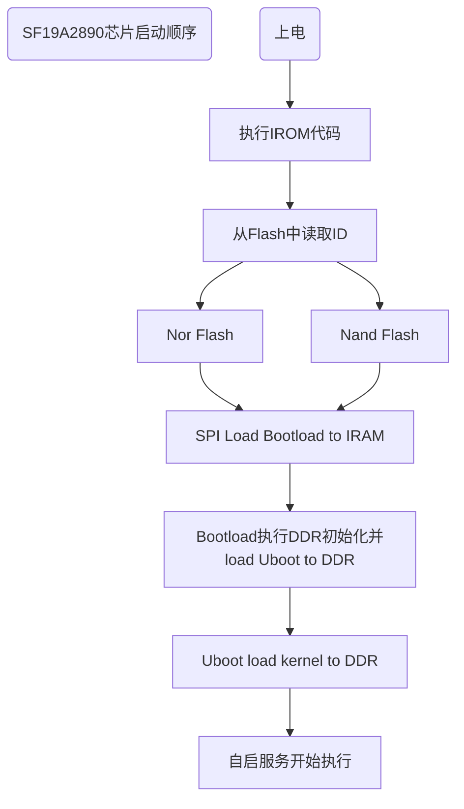

# FLASH分区开发手册


**目录**

* TOC
{:toc}

## 适用人员

本文适用于使用FLASH进行软件开发的技术人员

## 开发环境

Siflower代码编译环境，详细见：[快速入门](https://siflower.github.io/2020/08/05/quick_start/)

开发板调试环境

## 相关背景

Flash属于内存器件的一种，是一种非易失性内存，一般的嵌入式系统软件程序主要存储在Flash中。软件通常会对Flash进行分区存储，如依据启动顺序不同引导加载分区在前，系统分区在后，而且产品在出厂时有部分参数写在FLASH分区固定位置中，比如MAC地址，国家码等，所以在Flash上进行软件开发的话，对Flash的分区内容参数一定要了解清楚。

## 功能概述

本文主要介绍了系统各个分区的功能以及如何自定义修改flash分区。

### 系统分区

Siflower 目前Flash系统分区如下：
<table>
   <tr>
      <td colspan="3" align="center">spl (128K)</td>
   </tr>
   <tr>
      <td colspan="3" align="center">uboot (384K)</td>
   </tr>
   <tr>
      <td colspan="3" align="center">uboot-env (64K)</td>
   </tr>
   <tr>
      <td colspan="3" align="center">factory (64K)</td>
   </tr>
   <tr>
      <td rowspan="3" align="center">firmware (640K~16M)</td>
      <td colspan="2" align="center">kernel</td>
   </tr>
   <tr>
      <td rowspan="2" align="center">rootfs</td>
      <td></td>
   </tr>
   <tr>
      <td align="center">rootfs-data</td>
   </tr>
   <tr>
      <td colspan="3" align="center">pcba-test (512K)</td>
   </tr>
</table>
 

#### spl  

spl分区是uboot的bootloader，主要用于ddr初始化。spl分区从flash的0地址开始，镜像约22KB，分区最小支持32KB。spl镜像为u-boot-spl.img 。  
**注意：**
一般spl分区大小为128k，但是实际spl镜像约为22k，后面未使用部分位于0x7000位置存储了一个irom patch，用于irom下载时从此位置读取数据，详细irom patch使用方法参考：[gmac外围芯片对接手册](https://siflower.github.io/2020/09/11/new_switch_import_guide/)。

#### uboot  

uboot是用于引导和启动内核程序的bootloader。uboot镜像为uboot.img，uboot一般与spl一般不会单独修改，共同合并为uboot_full.img使用。  

#### uboot-env  

uboot-env是用于保存uboot使用的环境变量的分区，可以在uboot控制台中通过printenv命令查看其内容。如果uboot的配置固定不需修改，可以去掉该分区。详细的uboot-env内容请参照：[U-boot开发手册](https://siflower.github.io/2020/09/08/ubootDevelopmentManual/)。  

#### factory  

前面2KB 作为系统信息：  

| index | counts(Bytes) | content | P10h example |Usage |
| --- | --- | --- | --- | --- |
| 0-5 | 6 | mac起始地址 | 0xa8,0x5a,0xf3,0,0,0 | 必须有一个唯一mac地址 |
| 6-21 | 16 | sn号 |  全0xff  |app使用（由云服务器将为每台设备分配一个sn号）|
| 22 | 1 | sn号设置确认码 |0xff |app使用（由云服务器配置） |
| 23-26 | 4 | 区分pcba和uboot |  0   |必须为0，在spl中进行判断，跳转uboot还是pcba代码 |
|27-28 | 2| 硬件版本号确认码（'h''v'表示下面的硬件版本号是有效的） |'hv'   |硬件版本号有效时才填写|
|29-60| 32| 硬件版本号 |'A18_XC-LY801-C4_V3_20190412  '  |app使用，仅在网页上显示，可以不配置 |
|61-62| 2| 国家码 | 'CN' |影响wifi信道选择，如果为0xff，则为CN |
|63-64 | 2| 产品型号确认码（'m''v'表示下面的产品型号是有效的） | 'mv'  | 产品型号有效时才填写|
|65-96 | 32| 产品型号 | 'XC1200'  |  app使用，仅在网页上显示，可以不配置 |
|97-100 | 4| 硬件特性（默认为0xffffffff，每一位表示一个特性） |0xfffffffe  |必须确认硬件规格后填写！|
|101-102 | 2| 公司名称确认码（'v''d'表示下面的公司名称是有效的） |'vd' |公司名称有效时才填写|
|103-118 | 16| 公司名称 |   'siflower'    | app使用，可以不配置 |
|119-120 | 2| 产品秘钥确认码（'p''k'表示下面的产品秘钥是有效的） |  'pk'  | 产品秘钥有效时才填写|
|121-152| 32| 产品秘钥  （改成32个字节） |'c51ce410c124a10e0db5e4b97fc2af39'  |app使用，可以不配置（使用时秘钥需要根据不同设备向PM申请）|
|153-154| 2|登录信息确认码（'l''i'表示下面的登录信息是有效的）| 'li'|登录信息有效时才填写|
|155-158| 4|登录信息  |0xffffffff |   控制telnet server，ssh server，uart等（目前仅实现telnet）|

后面2KB 作为wifi的校准信息。 
wifi校准信息是pcba测试软件实现填写，由wifi驱动负责解析。
>硬件特性：目前仅bit 0和bit 1有效。
- bit 0：
- 1-> hw could provide 32K low power clock by PMU  or by external CLK 
- 0-> can not provide
- bit 1：
- 1->hw connect GPIO to 32K low power pin
- 0->no this connection

>登录信息：目前仅bit 0有效。
- bit 0：
- 1-> disable telnet sever
- 0-> enable telnet sever  （telnet目前主要用于产线测试，出厂时telnet sever都是关闭的）

以下是p10h在pcba测试时所使用的board.ini文件，facotry分区的很多内容都是在这里配置，然后通过pcba测试软件写入factory分区的：

```
############### board info ################
[setting]
flash_size=8M
wifi_lb=external_PA
wifi_hb=external_PA
24g_antenna_test_power=-18
5g_antenna_test_power=-30
wlan=gmac
gmac=rgmii
pmu_button=0
gpio_button=60 -1 -1 -1
gpio_button_value=0 0 0 0
gpio_led=36 55 56 57 58 -1 -1 -1
led_cnt=5
hardware_version=A18_XC-LY801-C4_V3_20190412
model_version=XC1200M
country_code=CN
hw_feature=0xfffffffe
login_info=0xfffffffe
vender=siflower
product_key=c51ce410c124a10e0db5e4b97fc2af39
24g_rx_test_power=-40
5g_rx_test_power=-40
############################################
```

##### 增加factory分区内容

以factory分区增加一个uuid为例，做说明

- 在linux-4.14.90-dev/linux-4.14.90/arch/mips/boot/dts/siflower/sf19a28_fullmask.dtsi中

  

  找到factory信息，在mtd-rom-type后按照相同格式添加mtd-uuid，偏移量数值增加参考前文factory信息

- 修改pcba工具，并且在board.ini中增加uuid信息

   **注意：PCBA工具修改需要联系矽昌**

   

- 在系统下读取此节点
  
  在进入系统后可以读取此节点的信息，需要修改sfax8_factoty_read驱动

  在linux-4.14.90-dev/linux-4.14.90/drivers/sfax8_factory_read下  
  参考sf_factory_read_entry.c/sf_factory_read_sysfs.c中其它信息的写入，按照相同格式增加uuid

  增加成功后进入系统使用以下指令可以查看写入的值是否正确

  ```
   cat /sys/devices/platform/factory-read/uuid  
  ```


#### firmware

firmware包括整个openwrt系统和用户数据，对应镜像为openwrt-*.bin。其中kernel为内核镜像，rootfs为文件系统，其中rootfs-data指用户数据（jffs2可写）。

#### pcba-test

pcba-test为flash最后的512KB。正常系统启动时不存在这个分区，仅供pcba测试使用。在pcba测试结束后，该分区会作为系统的rootfs-data使用。详细pcba介绍可参考：[PCBA介绍](待添加)  

### 修改分区

#### 修改分区大小

分区信息定义在各个版型的dts文件中，如果要修改分区大小，将涉及修改uboot和openwrt两部分分区信息，以ac28为例，修改分区大小方法如下。

##### 修改uboot分区大小

在uboot/bare_spl/main.c中定义了分区的地址信息等，如下：

```
 30 #ifdef CONFIG_SFA18_UBOOT_LITE
 31 #define SYS_SPI_U_BOOT_OFFS (32 * 1024)
 32 #define SYS_FACTORY_OFFS    (SYS_SPI_U_BOOT_OFFS + 164 * 1024)
 33 #define SYS_SPI_PCBA_OFFS   (4 * 1024 * 1024 - 256 * 1024)
 34 #else /* CONFIG_SFA18_UBOOT_LITE */
 35 #define SYS_SPI_U_BOOT_OFFS (128 * 1024)
 36 #define SYS_FACTORY_OFFS    (SYS_SPI_U_BOOT_OFFS + 384 * 1024 + 64 * 1024)
 37 #if (SFA18_FLASH_SIZE_MB == 8)
 38 #define SYS_SPI_PCBA_OFFS   (8 * 1024 * 1024 - 512 * 1024)
 39 #elif (SFA18_FLASH_SIZE_MB == 32)
 40 #define SYS_SPI_PCBA_OFFS   (32 * 1024 * 1024 - 512 * 1024)
 41 #else
 42 #define SYS_SPI_PCBA_OFFS   (16 * 1024 * 1024 - 512 * 1024)
 43 #endif
 44 #endif /* CONFIG_SFA18_UBOOT_LITE */
```

其中SYS_SPI_U_BOOT_OFFS为spl分区大小（uboot分区起始地址），默认为128k，SYS_FACTORY_OFFS为factory分区起始地址，uboot分区大小为（384 * 1024 + 64 * 1024）（u-boot分区大小 + u-boot-env分区大小），SYS_SPI_PCBA_OFFS为PCBA分区起始位置，分区大小为512k。如果要修改分区大小，对应修改相应的宏定义即可。

##### 修改openwrt分区大小

openwrt分区信息存储在dts中，dts路径为linux-4.14.90-dev/linux-4.14.90/arch/mips/boot/dts/siflower/sf19a28_fullmask_ac28.dts，分区信息如下：  

```  
51     w25q128@0 {
52         compatible = "w25q128";
53         reg = <0>;  /* chip select */
54         spi-max-frequency = <33000000>;
55 
56         bank-width = <2>;
57         device-width = <2>;
58         #address-cells = <1>;
59         #size-cells = <1>;
60 
61         partition@0 {
62             label = "spl-loader";
63             reg = <0x0 0x20000>; /* 128k */
64             read-only;
65         };
66 
67         partition@20000 {
68             label = "u-boot";
69             reg = <0x20000 0x60000>; /* 384k */
70         };
71 
72         partition@80000 {
73             label = "u-boot-env";
74             reg = <0x80000 0x10000>; /* 64k */
75         };
76 
77         factory:partition@90000 {
78             label = "factory";
79             reg = <0x90000 0x10000>; /* 64k */
80         };
81 
82         partition@a0000 {
83             label = "firmware";
84             reg = <0xa0000 0xf60000>; /* 640k-16M */
85         };
86     };
87 };
```  

其中partition@后面的地址为该分区在flash中的起始地址；label为分区名；regs的第一个值为起始地址，第二个值为分区大小。  
比如示例中flash总共为16MB，若是想将替换为8MB的flash，则需要将fireware分区的size减少为8\*1024\*1024-0xa0000=0x760000。


#### 修改分区内容

修改分区内容目前有2种方法，一种是系统起来之前，烧录完整16M镜像进行修改；一种是系统起来之后通过mtd/dd/debugfs节点命令修改。

##### 系统起来之前

通过烧录16M Flash完整镜像更新所有分区，详细见：[快速入门](https://siflower.github.io/2020/08/05/quick_start/)

##### 系统起来之后

* mtd命令修改  

串口下，通过```cat /proc/mtd ```命令可以获取分区信息，如下：  
1. 通过mtd命令可以升级对应分区镜像
  mtd升级对应分区镜像，命令如下：    


2. 通过mtd命令擦除对应分区内容  
```
mtd erase /dev/mtd5
```

* dd命令修改  
  
  通过dd命令修改对应分区对应位置的数据内容：  

  ```
  1. 使用dd命令将分区内容读取出来：
  dd if=/dev/mtd5 of=/tmp/mtd5_file (可以搭配bs count skip等参数配合读取指定位置指定长度的数据)
  2. 使用hexdump打印出对应数据：
  hexdump /tmp/mtd5_file (可以搭配 -n -s 等参数选择打印数据长度和位置)
  3. 使用dd命令修改分区内容：
  dd if=/tmp/source_file of=/dev/mtd5 (可以搭配bs count skip等参数确定写入数据位置大小)
  ```  
  通过dd命令可以对应修改factory分区具体位置的内容，如修改镜像进入PCBA模式命令如下：
  
  ```
  printf "PCBT"| dd of=/dev/mtdblock3 bs=1 count=4 seek=23
  ```   
  
  Linux下详细的dd命令使用方法可以使用```man dd```获取。   


* debugfs节点修改   
  
  ```/sys/kernel/debug/sfax8_factory_read```目录下提供有部分debugfs节点，可以对应修改查看部分分区内容，如下：   
  


### Flash启动顺序

Siflower硬件在上电后，主要从Flash中读取信息进行初始化，依据外围设备的不同和存储信息不通启动顺序也略有不同，以SF19A2890为例详细启动顺序如下：



## 支持的物料

目前Siflower支持的Flash物料型号如下：

## 调试/新增对应的物料

详细可以参考：[Flash和DDR物料调试指南](https://siflower.github.io/2020/09/03/ddr_flash/)


## 项目引用

### 参考文档

[快速入门](https://siflower.github.io/2020/08/05/quick_start/)

[Flash和DDR物料调试指南](https://siflower.github.io/2020/09/03/ddr_flash/)


## FAQ
