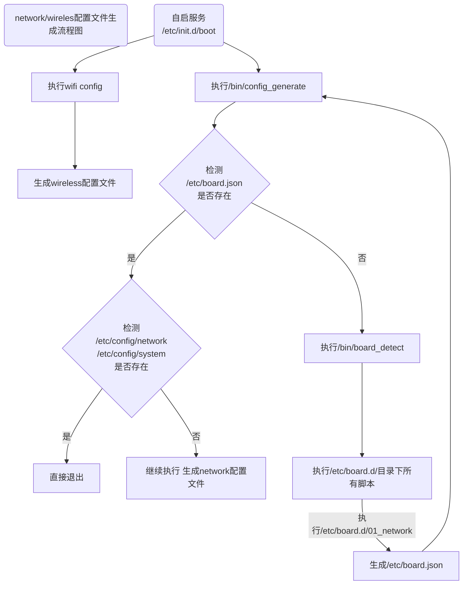
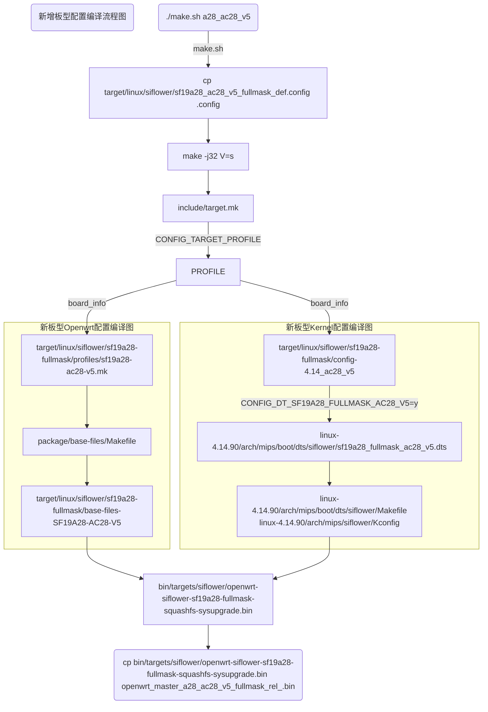

# 新的版型引入指南


**目录**

* TOC
{:toc}


## 适用人员

使用Siflower硬件进行Openwrt系统开发的技术人员，要求具备基础脚本和Makefile编写能力。

## 开发环境

openwrt系统编译环境，环境搭建参考：[快速入门](https://siflower.github.io/2020/08/05/quick_start/)

开发板调试环境

## 相关背景

随着客制化的需求越来越多，越来越多的硬件差异开始体现，这时就需要引入新的板型进行对应的软件配置。

## 功能概述

新板型引入包含uboot引入，Openwrt引入两方面，下面将从上述两方面介绍如何添加新板型。

### uboot引入新版型

uboot引入新版型详细可以参考：[U-boot开发手册](https://siflower.github.io/2020/09/08/ubootDevelopmentManual/)

### Openwrt引入新版型

Openwrt引入新版型包含系统和内核两部分。

#### openwrt关于不同版型的配置介绍

所有关于版型的配置内容统一归类在target目录下。  
siflower芯片相关配置在target/linux/siflower目录下。  

其中sf16a18-fullmask 目录代表了量产芯片sf16a18的配置目录  


其中sf19a28-fullmask 目录代表了量产芯片sf19a2890的配置目录  


**config-4.14_ac28_v5**  
表示了不同版型对应kernel config，此文件由make kernel_menuconfig 生成  

**base-files-SF19A28-AC28-V5**  
表示针对AC28-V5这个版型，需要预留在rootfs下的文件

**profiles**
该目录下面存放每个版型对应的mk文件，这边可以增加一些配置，在编译过程中生效，包含选择软件包和config项，这里制定了**版型的名称**和描述内容。

**base-files** 
目录用于存放用户希望预先存放到rootfs下指定路径的文件


>该目录下文件路径和rootfs下一致，在相应路径下防止文件，编译完成后，体现到rootfs中，
该目录下文件对于所有siflower 版型**通用**。

target/linux/siflower 目录下的sf19a28_ac28_v5_fullmask_def.config 为config文件，为对应版型的openwrt文件配置。

>config 文件为在编译根目录下使用make menuconfig 选择不同openwrt软件模块后生成
后文实例中会具体介绍。


#### kernel关于不同版型的配置

kernel中有关版型的配置为dts配置部分，kernel本身config，在openwrt中已有描述。

linux-4.14.90/arch/mips/boot/dts/siflower/ 为siflower dts所在路径位置。

>sf19a28_full_mask.dtsi 为所有siflower 芯片通用dts配置项
sf19a28_fullmask_ac28_v5.dts为ac28_v5版型配置项。

### Openwrt新版型引入示例

下文为增加一个SF19A2890芯片型号，板型名为AC28_V5的新版型的示例。

#### Openwrt 增加配置

##### 通用配置引入

- 首先在target/linux/siflower/sf19a28-fullmask/profiles 目录下新建对应的mk文件。
  修改所有相应的名称为指定型号，需要和文件名统一，注意大小写。

  

- 根据需要，决定是否建立target/linux/siflower/sf19a28-fullmask/base-files-SF19A28-AC28-V5 目录，放置额外文件,注意文件夹名称统一。  
  

- 在target/linux/siflower/sf19a28-fullmask/目录下复制其他版型的kernel config文件作为新板型的kernel config文件，后续在kernel部分会进行修改。  
  

- 下面进入target/linux/siflower 目录
  复制其他版型的 openwrt config文件，后续进行修改。

  

- 进入根目录
  这一步我们修改make.sh, 增加对于新版型的编译指令，如下：
  ```
  ac28)
      target_board=target/linux/siflower/sf19a28_ac28_fullmask_def.config
      ;;
  ac28_v5)
      target_board=target/linux/siflower/sf19a28_ac28_v5_fullmask_def.config
      ;;
  ```

- 将拷贝的openwrt config配置变成默认配置，并进行差异化配置。
  

- 如下界面中选择新添加的版型。
  
  保存配置后并退出。  

  **注意：如果make menuconfig选择时没有新版型选项，请在openwrt根目录下，删除tmp/ 和 .config**  
  **然后重新拷贝新建版型配置为 .config,再进行make menuconfig即可**

- 保存最终配置  
  
  将生成的config文件覆盖回target目录下的文件，使配置永久保存。

##### 差异配置引入

在target/linux/siflower/sf19a28-fullmask/下有各个版型的差异化配置，如base-files-SF19A28-AC28-V5，其包含了不同版型的差异化配置，如生成network配置文件的关键脚本01_network，因为硬件差异其配置可能略有不同。  

network和wireless两个配置文件是新版型引入的关键配置，因为其决定了产品有线和无线的可用性，是产品的关键所在，所以了解其生成和配置差异尤为重要。  
其中关于上述2个配置文件的详细内容和参数说明可参考：[config文件配置手册](https://siflower.github.io/2020/09/11/config_setting/)  
其中network、wireless配置文件的生成流程如下：


以intel7084 gswitch为例，在引入新的有线网络硬件版型时，其需要对应修改关键配置文件/etc/board.d/01_network，依据gswitch硬件文档提供的信息修改port信息，01_network中关键配置如下：
```
siflower_setup_interfaces()
{
    local board="$1"
    ucidef_set_interfaces_lan_wan "eth0.1" "eth0.2"
    ucidef_add_switch "switch0" \
        "1:lan:1" "2:lan:1" "0:lan:1" "3:wan:2" "5t@eth0"
}
```
其中"1:lan:1"表示port 1作为lan口，vlan id为1； "3:wan:2"表示port 3作为wan口，vlan id为2；"5t@eth0"表示cpu口为port5；所以整体含义表示port1/2/0作为lan vlan id为1 interface 为eth0.1，port3作为wan vlan id为2 interface为eth0.2；port5为cpu口。port id依据硬件文档得来一般取值0~5，cpu port依据硬件厂商定义而来，故引入新版型时需要依据硬件信息不同进行修改。

#### Linux 增加配置

linux需要增加相应的dts文件和Kconfig选项。

- 首先进入linux-4.14.90/arch/mips/boot/dts/siflower/目录
增加新的dts文件，根据版型修改dts文件内容。


编辑此目录下的Makefile文件，建立dts文件对应宏选项


- 进入linux-4.14.90/arch/mips/siflower 目录

新增新dts对应Kconfig的配置项。


- 最后回到**openwrt根目录**下使用命令
  


在下图中选择对应的新的DTS，并且保存退出


#### 编译新版型镜像

保存相关文件，回到openwrt根目录，这个时候可以通过执行

可以编译出对应新配置版型的镜像。

#### 烧录编译出来的镜像

参考[快速入门](https://siflower.github.io/2020/08/05/quick_start/) 镜像更新章节

注意：第一次烧录镜像到新板子之后，需要调一下rgmii接口的delay值以及确认switch gpio reset脚gpio

方法参考[外围switch对接和使用手册](https://siflower.github.io/2020/09/11/new_switch_import_guide/)  
 ```3.1 对接准备``` 第4点 switch的reset   
 ```3.1 对接准备``` 第7点 调整tx/rx delay

 设置验证好之后保存相关配置，重新编译镜像烧录即可。
 
## 项目引用

### 参考文档

[快速入门](https://siflower.github.io/2020/08/05/quick_start/)


## 开发详情

### 功能设计和流程

开始引入新板型后，首先确定其与之前板型的不同之处，增加对应的配置文件进行区分兼容，然后按照流程增加一套对应的编译方法即可。

### 代码架构和实现

新板型引入的编译流程框架如下：
<!--  -->



### 关键点

Makefile组织

### TODO

自动化

## 测试用例

编译好镜像，烧录完成后，可以进行基础有线/无线上网测试，基础网页设置测试等，可参考：[以太网测试介绍](https://siflower.github.io/2020/09/08/ethernetTestGuide/)。

### 测试环境配置

编译好对应板型镜像后，烧录测试即可，烧录方法见：[快速入门](https://siflower.github.io/2020/08/05/quick_start/)

### 测试流程和测试结果

编译好镜像，烧录测试即可，正常运行且基础功能正常即视为正常。

## FAQ
