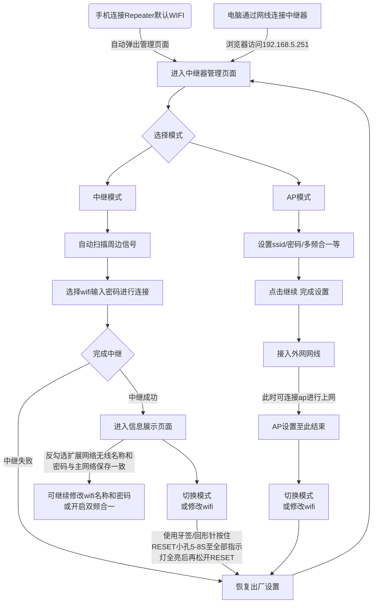

# 中继器配置相关说明

**目录**

* TOC
{:toc}

## 适用人员

此文档适用于进行中继器开发和配置的技术人员，要求具备C语言基础，UCI命令使用，LUA/HTML阅读能力。

## 开发环境

Openwrt源码编译环境，环境搭建见：[快速入门](https://siflower.github.io/2020/08/05/quick_start/)

中继器串口调试环境

## 相关背景

如果房间或建筑面积较大，那么仅有一个路由器可能无法提供您所需的无线覆盖面积，这时正是您需要一个无线中继器的时候。中继器是局域网环境下用来延长网络距离的，它对在线路上的信号具有放大再生的功能，用于扩展局域网网段的长度（仅用于连接相同的局域网网段）。

## 功能概述

Siflower中继器具有2种模式：中继模式和AP模式。控制方式有WIFI接入控制，和有线网络接入控制这2种方式。本文主要介绍如何配置2种模式和接入方法。

### 中继器配置流程图

### 自动弹窗说明

Siflower中继器自行开发了手机连接中继器自动弹窗功能，支持市面上多款手机自动弹窗功能，如华为、小米、oppo、vivo、苹果等厂商，当手机连接中继器WIFI后，会自动弹出中继器管理页面。  

### 中继器模式配置介绍

参考内部redmine：[中继器模式配置说明](http://redmine.siflower.cn/redmine/issues/7402)

### 中继器配置示例

- **1. 手机/电脑连接中继器**  
  中继器上电，建议插在被中继的网络附近的插座上，电源指示灯常亮，稍等片刻后，中继器完全启动。出厂默认情况下，双频无线中继器会发射两个无线信号：  
  默认名称：SiWiFi-Repeater和SiWiFi-Repeater-5G  
  默认密码：没有加密，无密码  
  手机可通过WIFI连接中继器，电脑可通过网线连接中继器。  
  **注意：**  
  在每次进行中继器的模式切换/配置修改之前，都需要进行恢复出厂设置，恢复出厂设置的方法如下：  
  通电状态下，使用牙签/回形针按住RESET小孔5-8S至全部指示灯全亮后，再松开RESET。

- **2. 进入中继器管理网页**  
  在手机的设置中连接上述默认无线信号，成功连接后，手机会自动弹出配置页面，如果没有自动弹出配置页面，请打开手机浏览器，在地址栏手动输入192.168.5.251；电脑网线连接中继器后，可直接打开浏览器访问192.168.5.251页面。配置页面如下图所示:  

  
  
- **3. 中继模式设置**  
  - 3.1 选择<中继模式>，进入无线网络的搜索界面，中继器会自动扫描周边信号，并且按照信号的强度进行排列,具体页面如下图所示
  
  

  **注意：**  
  如果搜索不到，可能信号太弱，可尝试调整中继器与主Wi-Fi之间的距离。
  - 3.2 在扫描到的信号列表中找到您要扩展的主网络信号，输入无线密码，点击<确定>，中继器进入扩展模式,具体界面如下图所所示
  
  
  
  - 3.3 扩展成功后，进入中继模式的网络状态设置界面，界面如下图所示
  
  

	设置完成后，即中继器已经能够和主网络通信，用户根据指示灯查看中继状态  
	1） 中继连接信号灯常亮，表示中继好之后与主Wi-Fi连接信号强度很好  
	2） 中继连接信号灯慢闪，表示信号较差。

  - 3.4 中继模式下默认勾选<扩展网络无线名称和密码与主网络保存一致>，此时不支持修改中继器的无线名称和密码；如果您想修改中继器的名称和密码，需要把<扩展网络无线名称和密码与主网络保存一致>设为不选，然后进行设置。选择上图的<继续>按钮，进入中继成功的提示界面，具体界面如下图所示
  
  
  
  - 3.5 中继器同时支持2.4G和5G，您可以选择多频合一，2.4G和5G显示为同一个信号，在使用过程中根据信号强度进行自动切换，与主网络实现无缝切换，界面如下图所示
  
  
  
  - 3.6 中继成功后，中继的出厂默认信号消失，发射的无线名称和密码与主网络一致。手机等无线终端设备连接到扩展后的信号即可上网。
  
  
- **4. AP模式设置**  
  AP模式是把中继器当路由器使用，中继器可以通过直接连接外网实现上网功能。   
  **注意：**  
  在每次进行中继器的模式切换/配置修改之前，都需要进行恢复出厂设置，恢复出厂设置的方法如下：  

  通电状态下，使用牙签/回形针按住RESET小孔5-8S至全部指示灯全亮后，再松开RESET。

  - 4.1 登入中继器的管理页面，同中继器模式设置方法一致
  
  - 4.2 选择管理页面主页< AP模式>，进入设置界面，界面如下图所示

  

  - 4.3 AP模式下如上图所示，您可以设置网络的SSID和密码，也可以选择多频合一
  
  - 4.4 设置完成后，点击右下角<继续>按钮，会进入设置成功的提示页面，具体页面如下
  
  

  - 4.5 退出界面，根据提示插入外网的网线，即可完成AP模式的设置
  
  - 4.6 设置完成后，此时可以用手机搜索到设置好的中继器无线网络信号，手机连接该网络即可实现上网。

## FAQ

**Q：如何判断中继是否成功？**  
A：设置完成后检查指示灯状态，如果中继信号灯和WIFI指示灯均为常亮，表示中继成功，可以正常上网；如果异常，请根据指示灯的状态做相应的调整。如中继信号灯慢闪，表示距离主路由太远，需要调整中继器与主路由的距离。

**Q：中继失败怎么办？**  
A：设置完成后检查指示灯状态，如果中继信号灯不亮，表示中继失败。中继设置失败后，wifi指示灯快闪。此时需要恢复出厂设置后，重新进行设置，确保主网络的密码不要输入错误，同时保证中继器和主路由的距离不能过远。

**Q：为什么中继器热点没有5G信号？**  
A：可能是设置的时候启动了多频合一的功能。您可以对中继器进行恢复出厂设置，重新设置中继器，且不要勾选多频合一。

**Q：如何恢复出厂设置？**  
A：您可以长按中继器上的reset按键，待全部指示灯出现快闪后，松开reset键，系统开始恢复出厂设置，连接默认的中继器出厂无线热点，然后使用章节3、4中介绍的设置。

**Q：如何修改中继器的无线网络名称和密码？**  
A：中继模式下默认勾选<扩展网络无线名称和密码与主网络保存一致>，此时不支持修改中继器的无线名称和密码；如果您想修改中继器的名称和密码，需要把<扩展网络无线名称和密码与主网络保存一致>设为不选，然后进行设置即可。