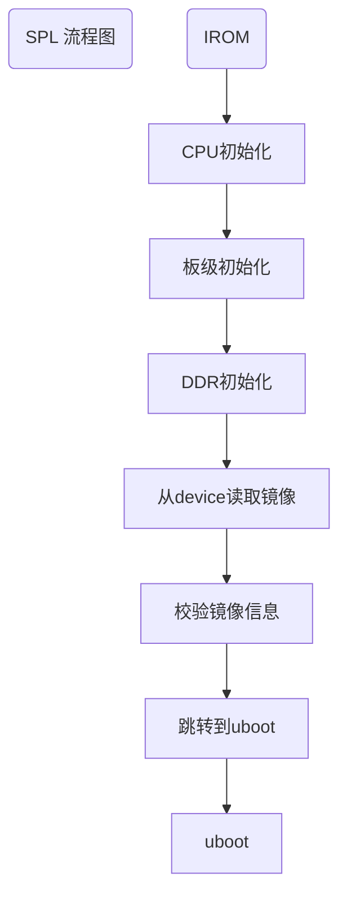

# U-boot移植应用开发手册


**目录**

* TOC
{:toc}


## 适用人员

本文适用于需要使用Uboot的所有人员。

## 开发环境

Uboot代码编译环境，环境搭建见：[快速入门](https://siflower.github.io/2020/08/05/quick_start/)

Siflower开发板测试环境。

## 相关背景

UBOOT属于bootloader的一种，是用来引导启动系统/内核的。随着客制化的需求越来越多，硬件的差异也越来越多，而不同的硬件需要不同的引导程序，所以就需要适配不同的Uboot，开发对应的Uboot就显得尤为重要。

## 功能概述

本文介绍了U-boot的结构和使用方法。其中使用方法包括了代码下载，开发，编译，烧录uboot镜像，以及通过uboot更新内核镜像。本文介绍的U-boot包括了uboot-spl和uboot两部分。

### U-boot的介绍

#### SPL

SPL是介于芯片内部rom程序与uboot之间的一个BootLoader，其主要功能为初始化ddr，系统管理器，时钟，以及加载uboot。SPL程序本身需要加载到系统内部ram中运行，是一个轻量级的uboot。  
在U-boot开源程序中，本身是包含SPL选项的。Uboot-spl是用Uboot同一套代码，通过CONFIG_SPL_BUILD宏分割编译出的结果。在MPW0和MPW1的测试时，我们采用了Uboot-spl作为Irom与Uboot之间的BootLoader，但FULLMASK版本将芯片内部ram减少到了64KB，不足以同时支持Uboot-spl的rom+ram的需求，因此采用了一份裸机实现的bare_spl。Bare_spl相比于原Uboot-spl更加简单可控，也可以同样实现引导uboot的功能。同时，bare_spl也同时支持mpw0和mpw1芯片，并且减少了存储空间，为flash优化、分区的重新定义提供了支持。
SPL的流程如下（uboot-spl和bare-spl实现主要功能一致）： 


在bare_spl中，默认支持三种boot device：spi-flash，sd card，emmc。按照spi>sd>emmc的优先级，只要检测到device存在，spl便会自动从其启动。因此如果想要在同时包含spi-flash与sd的板子中，使用sd作为device存放uboot镜像，需要定义SKIP_SPI_FLASH。由于spi与emmc存在复用关系，因此不会同时存在。Uboot-spl需要在编译阶段就指定使用哪一种boot device。而SF19A2890目前仅支持一种boot device：spi-flash，依据读取flash型号决定使用nand falsh还是nor flash。
SPL与uboot相同，引导的镜像需要包含一个uimage的header，其中会包含所引导镜像的类型。因此，SPL不只可以引导uboot，进而启动内核，还可以引导pcba测试程序。  

#### U-boot

Uboot的启动分为两个阶段：stage1和stage2。stage1可以认为是uboot认定的rom阶段，stage2是ram阶段。Stage1向stage2转换的主要标志就是代码段的relocation，即将代码段从“rom”复制到“ram”。  
Uboot的流程图如下：


每个stage都有一个主要执行的函数序列，即init_sequence_f和init_sequence_r。由于SPL的存在，uboot的stage1其实并没有什么实质性的功能，整个uboot都是运行在ddr上的。在进入stage2前，uboot会进行一个代码段的重定向，由于uboot本身是位置无关的，因此只需要同时更新堆栈信息，全局变量表等即可，重定向后的代码依旧可以正常执行。按照uboot的思想，这个stage2是运行在ram中的，因此速度要比stage1要快。  
init_sequence_r中主要是进行了各个模块驱动的初始化，网络的初始化和一些其他准备工作，比如环境变量的初始化等。在准备结束后，uboot最终会进入一个main_loop，进行控制台的初始化。此时uboot提供了一个3s的倒计时，如果不在时间内从控制台（默认串口）进行输入，则会进入自动启动流程，根据预设的环境变量参数，进行引导启动；如果有输入，就可以停下来进入控制台，与uboot进行交互。此时uboot会根据输入的命令情况进行解析并执行，目前支持的命令如下：  

```
sfa18 # help
?       - alias for 'help'
base    - print or set address offset
bdinfo  - print Board Info structure
boot    - boot default, i.e., run 'bootcmd'
bootd   - boot default, i.e., run 'bootcmd'
bootelf - Boot from an ELF image in memory
bootm   - boot application image from memory
bootp   - boot image via network using BOOTP/TFTP protocol
bootvx  - Boot vxWorks from an ELF image
cmp     - memory compare
coninfo - print console devices and information
cp      - memory copy
crc32   - checksum calculation
date    - get/set/reset date & time
dhcp    - boot image via network using DHCP/TFTP protocol
dm      - Driver model low level access
echo    - echo args to console
editenv - edit environment variable
env     - environment handling commands
exit    - exit script
false   - do nothing, unsuccessfully
fdt     - flattened device tree utility commands
go      - start application at address 'addr'
help    - print command description/usage
httpd   - start www server for firmware recovery with [localAddress]

iminfo  - print header information for application image
imxtract- extract a part of a multi-image
itest   - return true/false on integer compare
loop    - infinite loop on address range
lzmadec - lzma uncompress a memory region
md      - memory display
mm      - memory modify (auto-incrementing address)
mmc     - MMC sub system
mmcinfo - display MMC info
mw      - memory write (fill)
nm      - memory modify (constant address)
ping    - send ICMP ECHO_REQUEST to network host
printenv- print environment variables
reset   - Perform RESET of the CPU
run     - run commands in an environment variable
saveenv - save environment variables to persistent storage
setenv  - set environment variables
sf      - SPI flash sub-system
showvar - print local hushshell variables
sleep   - delay execution for some time
source  - run script from memory
spld    - update spl from device
test    - minimal test like /bin/sh
tftpboot- boot image via network using TFTP protocol
true    - do nothing, successfully
version - print monitor, compiler and linker version
```

想要增加新的命令，可以通过menuconfig在编译时选择对应的command。如果有新的功能需求，也可以添加自己的命令进去，只需要按照格式在cmd目录下添加相应处理函数并注册即可。  
其中有一些常用的命令：boot 可以让uboot继续执行默认命令； reset 可以重启；sf 与 mmc 分别对应spi-flash与mmc的操作命令。Spld 与 httpd 会在后面镜像更新部分详述。  
Uboot环境变量可以通过env命令进行查询和设置：  

```
sfa18 # env print -a
baudrate=115200
bootcmd=sf probe 0 33000000;sf read 0x81000000 0xa0000 0xa00000;bootm
bootdelay=2
ethact=sf_eth0
fdtcontroladdr=8fe9d57c
stderr=serial@8300000
stdin=serial@8300000
stdout=serial@8300000

Environment size: 219/65532 bytes

sfa18 # setenv efuse_data aabbccdd
sfa18 # printenv efuse_data 
efuse_data=aabbccdd
```

通过环境变量可以设置一些如串口波特率，auto boot delay时间等，最终环境变量会保存u-boot-env分区中，因此下次启动也是有效的。  
Uboot引导kernel也是通过控制台命令进行的，默认的命令bootcmd保存在default env中，可以在include/configs/sfax8.h中进行配置。目前这个过程分为两步：1.将镜像从boot device中读到ram中。2.引导ram中的镜像。  
根据boot device的不同，读取的命令也不同。从spi-flash中加载是通过 sf 命令实现的：  

```
sfa18 # help sf
sf - SPI flash sub-system
Usage:
sf probe [[bus:]cs] [hz] [mode] - init flash device on given SPI bus
                                  and chip select
sf read addr offset|partition len       - read `len' bytes starting at
                                          `offset' or from start of mtd
                                          `partition'to memory at `addr'
sf write addr offset|partition len      - write `len' bytes from memory
                                          at `addr' to flash at `offset'
                                          or to start of mtd `partition'
sf erase offset|partition [+]len        - erase `len' bytes from `offset'
                                          or from start of mtd `partition'
                                         `+len' round up `len' to block size
sf update addr offset|partition len     - erase and write `len' bytes from memory
                                          at `addr' to flash at `offset'
                                          or to start of mtd `partition'
sf protect lock/unlock sector len       - protect/unprotect 'len' bytes starting
                                          at address 'sector'
sfa18 #
```
根据当前的分区情况，uboot从flash的0xa0000位置加载内核镜像，并读取到ram地址0x81000000。  

```
sfa18 # sf probe 0 33000000
do_spi_flash----cmd = probe
SF: Detected W25Q128BV with page size 256 Bytes, erase size 4 KiB, total 16 MiB
sfa18 # sf read 0x81000000 0xa0000 0xa00000
do_spi_flash----cmd = read
device 0 offset 0xa0000, size 0xa00000
SF: 10485760 bytes @ 0xa0000 Read: OK
sfa18 # 
```
Sf read的最后一个参数是读取的长度，目前默认是0xa00000，10MB。  

从设备中读取镜像后，从ram引导镜像的命令为bootm：  

```
sfa18 # help bootm
bootm - boot application image from memory

Usage:
bootm [addr [arg ...]]
    - boot application image stored in memory
        passing arguments 'arg ...'; when booting a Linux kernel,
        'arg' can be the address of an initrd image
        When booting a Linux kernel which requires a flat device-tree
        a third argument is required which is the address of the
        device-tree blob. To boot that kernel without an initrd image,
        use a '-' for the second argument. If you do not pass a third
        a bd_info struct will be passed instead

Sub-commands to do part of the bootm sequence.  The sub-commands must be
issued in the order below (it's ok to not issue all sub-commands):
        start [addr [arg ...]]
        loados  - load OS image
        ramdisk - relocate initrd, set env initrd_start/initrd_end
        fdt     - relocate flat device tree
        cmdline - OS specific command line processing/setup
        bdt     - OS specific bd_t processing
        prep    - OS specific prep before relocation or go
        go      - start OS
sfa18 # 
```
Bootm启动的默认地址由CONFIG_SYS_LOAD_ADDR宏来定义，目前为0x81000000。因此可以通过任何方法将镜像加载到ram的这个地址后通过bootm引导，而不仅限于从flash中读取。  

```
sfa18 # bootm
## Booting kernel from Legacy Image at 81000000 ...
   Image Name:   MIPS OpenWrt Linux-3.18.29
   Created:      2017-08-31   6:27:49 UTC
   Image Type:   MIPS Linux Kernel Image (lzma compressed)
   Data Size:    1635008 Bytes = 1.6 MiB
   Load Address: 80100000
   Entry Point:  80105360
   Verifying Checksum ... OK
   Uncompressing Kernel Image ... OK
```


### 代码下载、编译

#### 代码下载

- 账号注册
  
uboot代码需要向siflower申请gerrit权限，同意开放后需要提供相关邮箱进行账号注册，注册通过后会给到对应的账号以及密码

- 账号登录

  - 获取账号后，使用账号密码登陆[gerrit网站](gerrit.siflower.cn:9001)

- 获取代码
  
  - 登陆gerrit.siflower.cn:9011后
  
  - 打开申请列表可以看到代码仓库信息，获取复制下载链接

    

  - 开始下载代码，下载密码在基本资料，Git密码
  
    

  - 开始下载

#### 编译

- 编译uboot
  
由于同时需要spl和uboot两部分，而为了简化烧录过程，会将两部分拼成一个镜像，统一作为BootLoader，因此uboot的编译推荐直接使用编译脚本sf_make.sh。  
由于存在不同的板型和芯片，因此该脚本还支持若干个参数：use_mti，ver，prj，mode和cmd。  
use_mti：表示编译工具链选择，支持0（默认）和1。其中０表示使用当前目录toolchain中工具链，１表示使用系统编译工具链。　　
Cmd：表示命令，支持distclean、clean、make、dmake（默认）。其中dmake指的是先进行distclean，再make。  
Mode：表示选择release或debug模式，支持r（默认）和d。Mode=r时编译出的binary文件包含设备树信息，elf debug文件不包含；mode=d时binary不包含，debug文件包含。Mode=d一般是配合jtag进行调试使用的。  
Ver：表示芯片型号，支持mpw0（默认）、mpw1和fullmask。  
Prj：表示板型，支持sfa28_evb、sfa28_p20b、sfa28_ac28等  
因此，实际编译时只要根据板子的情况，设置非default的参数即可。比如想要编译一个flash启动的fullmask最新evb镜像，编译命令如下：  

```
./sf_make.sh ver=fullmask
```

想要提交代码时，可以通过  

```
./sf_make.sh cmd=clean  
```

删掉编译生成的多余文件。  

- 编译带版型编号的uboot镜像
  
当需要生成正式的带版型名称编号分支版本号等信息的uboot镜像时，可以使用如下面指令进行编译，具体可以参考该脚本的实现

```
./make.sh sfa28_evb 
```

这样编译的进行会生成在根目录，此镜像就等同于uboot/sfax8/uboot_full.img，但是带有分支版型版本号等信息

#### 编译结果

编译生成的文件均copy到了uboot/sfax8/目录下，包括：  
uboot_full.img：spl和uboot的组合，烧录就使用这个文件。  
spl_128k.img：spl编译的binary镜像添加了irom-header后，扩充到128KB的结果，可以用于更新mpw验证代码在使用boot_ddr时的BootLoader.bin。  
u-boot.img：uboot的binary镜像加uimage header。  
u-boot-spl.img：spl binary加irom header。  
p20b.img：与uboot_full.img相同，会以板子型号命名。  


### 以太网烧录

#### 适用平台

sf16a18/sf19a28 evb开发板。

#### 烧录步骤

1. 板子接串口，重启进入uboot，回车进入command模式，输入命令httpd 192.168.1.1 （或者其它和PC同网段的ip），回车，界面如下：  
   
2. 电脑网线接板子上的网口。  
 浏览器地址根据不同的需求输入不同的网址，如下表，以192.168.1.1为例：

 | 网址 |	功能 | 适合文件 |
 | - | - | - |
 | 192.168.1.1 | 烧录firmware | *sysupgrade.bin, uImage-initramfs.lzma, uImage.lzma |
 | 192.168.1.1/uboot.html | 烧录纯uboot | 	uboot_full.img (慎用) |

 正常的烧录界面如下：
 
3. 烧录完毕会自动重启  
 


### uboot新版型引入

uboot引入新版型主要涉及到新版型配置文件改动，以太网驱动适配等，下面将以ac28为例给出uboot新版型引入的示例。

#### 配置文件适配

- 增加对应版型的配置文件夹，如uboot/board/siflower/sfa28_ac28/，目录内容如下：
  
  ```
  qin@ubuntu:~/uboot$ ls board/siflower/sfa28_ac28/
  Kconfig  MAINTAINERS  Makefile
  ```
  其中Kconfig定义了版型的名字等信息，MAINTAINERS定义了配置文件的地址，Makefile定义了新版型编译的方式。
  
- 修改公共代码增加对应版型定义，对应文件board/siflower/sfax8_common/siflower.c和board/siflower/sfax8_common/Kconfig，主要用于新版型定义的使用方式。
  
- 增加对应版型的Kconfig，对应文件arch/mips/mach-sfax8/Kconfig，用于make menuconfig时供用户选择此版型；

- 增加新版型的defconfig配置文件，对应文件configs/sfa28_mpw0_ac28_defconfig，对应版型的所有参数，可以通过拷贝相似版型的配置文件得来，并通过```make menuconfig```重新进行个性化配置；

- 增加新版型编译方式，对应文件sf_make.sh，如下：
  ```
  225     ac28)
  226         DEFCONFIG="sfa28_"$ver"_ac28"
  227         add_sfbl_flag sf19a28_mpw0=1
  228         add_sfbl_flag crystal_40m=1
  229         add_sfbl_flag odt=0
  230 #       [ -z $ddr2 ] && ddr2=em68b16cwqh
  231         [ -z $ddr2 ] && ddr2=pme809416dbr
  232         ;;
  ```
- 其他：新增版型一般不需要修改dts，如果需要修改i2c、uart、gpio等硬件信息时需要修改dts，对应文件arch/mips/dts/sfa28_mpw0.dts

#### 以太网驱动适配

当新增版型引入了新的有线设备时，需要对应适配以太网驱动，对应文件drivers/net/sfa18_gmac.c，详细引入新的有线设备（gphy、gswitch）可以参考：[gmac外围芯片对接手册](https://siflower.github.io/2020/09/11/new_switch_import_guide/)


### Uboot物料对接

Siflower Uboot支持多种物料对接，包含不同DDR和Flash型号，详细参考：[Flash和DDR物料调试指南](https://siflower.github.io/2020/09/03/ddr_flash/)


### DDR通用参数使用配置
现在uboot代码中支持较为普遍的1G和2G容量的DDR3，以及512M和1G容量的DDR2。分别参照《JEDEC Standard No.79-3A》协议标准文档和《JEDEC Standard No.79-2F》协议标准文档，进行时序参数整理和DDR通用代码实现。
在编译时，按照实际使用的物料容量在编译选择脚本文件sf_make.sh中进行对应ddr选择：   
1Gb ddr3物料：   
``` 
[ -z $ddr3 ] && ddr3=ddr3_1gcommon
```
2Gb ddr3物料：  
```
[ -z $ddr3 ] &&; ddr3=ddr3_2gcommon
```
512Mb ddr2物料： 
```
[ -z $ddr2 ] && ddr2=ddr2_512mcommon
```
1Gb ddr3物料： 
```
[ -z $ddr2 ] &&; ddr2=ddr2_1gcommon
```


## 项目引用

### 参考文档

[快速入门](https://siflower.github.io/2020/08/05/quick_start/)

[Flash和DDR物料调试指南](https://siflower.github.io/2020/09/03/ddr_flash/)


## FAQ

**Q：uboot烧录失败怎么处理**  
A：uboot烧录失败后无法继续通过uboot更新镜像，可通过irom usb下载，或者摘下flash使用烧录器的方式重新烧录镜像，详细使用方法参考：[快速入门](https://siflower.github.io/2020/08/05/quick_start/)

**Q：uboot中gpio使用例子** 
A：
如果想要在uboot中对gpio进行设置，以在uboot代码的common/main.c main_loop函数中加入控制gpio12的代码为例

```
#define msleep(a)      udelay(a * 1000)
#define ssleep(a)      msleep(a * 1000)
/* We come here after U-Boot is initialised and ready to process commands */
#include <asm/gpio.h>
void main_loop(void)
{
        const char *s; 

        if (gpio_request(12, "sf_gpio")) {  //申请GPIO
                        printf("Failed to request gpio %d\n",12);
        }
        if (gpio_direction_output(12,1)) {  //配置GPIO输入/输出
                                   printf("Failed to set gpio value %d\n",12);
        }
        for (;;) {
                msleep(1000);
                gpio_set_value(12,0);     //设置GPIO高低电平
                msleep(1000);
                gpio_set_value(12,1);
        }
        gpio_free(12);
        bootstage_mark_name(BOOTSTAGE_ID_MAIN_LOOP, "main_loop");

#ifdef CONFIG_VERSION_VARIABLE
        setenv("ver", version_string);  /* set version variable */
#endif /* CONFIG_VERSION_VARIABLE */

        cli_init();

        run_preboot_environment_command();
..
...
....
}   
```

**Q：如何修改cpu clk** 
A：
cpu clk = CPU_PLL / 分频比
CPU_PLL的计算方式如下：（我们的外部晶振一般是40MHZ频率）
1. 配置PLL
 PLL计算的分频公式见下图。  
 Fref ：参考时钟，一般为外部晶振频率。  
 Refdiv：参考时钟，分频参数。  
 Fbdiv：升频参数，实现整数部分。  
 Frac：升频参数，实现小数部分。（小数部分暂不支持，使用的时候忽略）  
 Postdiv1：升频后，再做分频参数1。  
 Postdiv2：升频后，再做分频参数2。  

 

 parmmeter寄存器参数如下，CM_PLL_BASEADDR=0x19E01000

 

2. 配置cpu clk分频比
 寄存器信息如下， CM_CFG_BASEADDR=0x19E01500  

 

 注意该寄存器配置的分频比应该为寄存器里的值加1  
 0-> 1分频  
 1-> 2分频  
 2-> 3分频  

3. uboot中代码的位置
- 修改PLL,代码路径  
 uboot/bare_spl/common/clk.c  
 修改如下红框的位置， 此处为修改PLL

 

- 修改分频比  
 默认为2分频，如有需要，请自行在合适位置修改， 通过配置前面所述配置分频比的寄存器。
