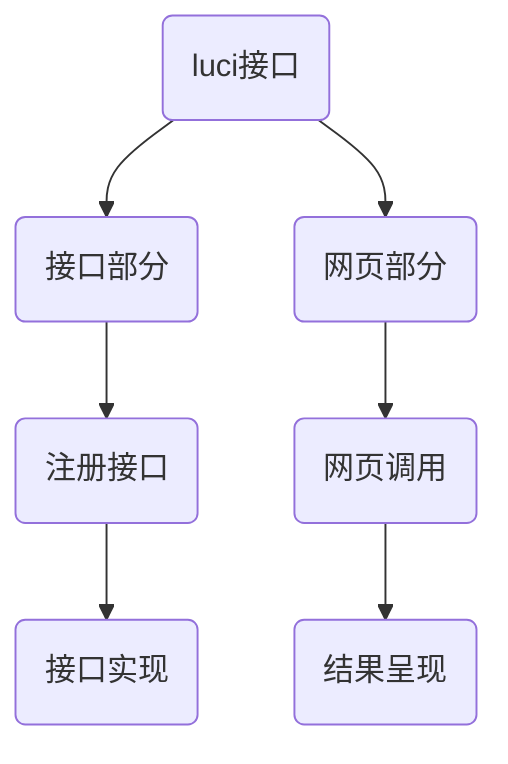
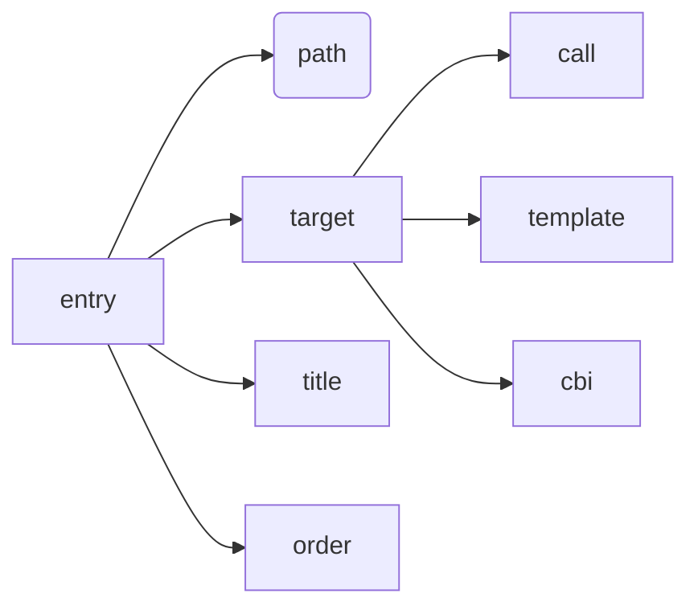

# SiWiFi接口开发手册

**目录**

* TOC
{:toc}

## 1 介绍

### 1.1 适用人员

适用于用lua语言进行开发的luci接口开发人员。

### 1.2 开发环境

Ubuntu，siflower SDK，siflower硬件平台，网页浏览器

### 1.3 功能概述

本文档将通过新增接口实例，详细介绍了luci接口开发的过程。

## 2 项目引用

[openwrt uci官方文档](https://oldwiki.archive.openwrt.org/zh-cn/doc/techref/uci)
[SiWiFi接口测试手册](toadd)
[管理网页开发手册](toadd)

## 3 开发详情 

### 3.1 开发流程

#### 3.1.1 流程图

网页接口的开发流程图如下所示。若为app接口，则网页部分可省略。


#### 3.1.2 接口部分

##### 3.1.2.1 主要步骤

接口部分的代码均在feeds/luci/modules/luci-mod-admin-full-siflower/luasrc/controller/路径下的admin和api文件夹中其中admin下存放网页接口相关的lua文件，api文件夹下存放app接口相关的lua文件。通过串口访问路由器时，代码位于/usr/lib/lua/luci/controller下。每个lua文件完成不同的功能。我们可以新增lua文件来开发新接口（如代码实现部分的例子）。流程如下：
- 1、新建lua文件并在开头用module函数定义该模块的调用路径
- 2、声明调用的其他模块。
- 3、完成index()函数，index()中主要用entry函数完成每个模块函数的注册（网页、接口注册等）
- 4、entry函数注册好接口后实现接口功能

也可以在已存在的lua文件里直接注册并实现接口，只需在index函数末尾添加entry语句，并在该文件内实现即可。

##### 3.1.2.2 entry函数

entry函数是接口的重要组成部分，在index()函数中被调用。主要参数如下：

调用形式一般为：
```
entry(path,call("function")).leaf = true
entry(path,target,title,order)
```

- path为调用路径，例如获取wan口设置的接口get_wan的路径为{"admin","networknew","get_wan"}

- target为调用方式，包括：call+function调用函数，template+htm文件路径调用htm文件；cbi调用cbi模块。

- title为生成菜单的文本，可省略

- order为调用顺序，数字越小越靠前调用，可省略

##### 3.1.2.3 接口实现

接口的结构一般如下所示：
```
function name()
  --arg_list相关的两行语句用于读取传入参数，有些get函数不需要传入参数的可省略。
  local arg_list, data_len = luci.http.content()
  local arg_list_table = json.decode(arg_list)

  --result为构造的table用于储存返回的数据
  local result = {
    code = 0,
    msg = "OK"
  }
...
  --luci.http相关语句用于将result数据返回给调用者
  luci.http.prepare_content("application/json")
  luci.http.write_json(result)
end
```

##### 3.1.2.4 代码实例

以网络参数界面为例介entry的使用方法和接口注册流程：

- 首先注册了一个名叫“Parameters”（中文设置下翻译为网络参数）的一级标题；firstchild()为生成一级标题所需的函数，已在其他lua文件实现；_("Parameters")为标题名称；order=60决定顺序，数字越大标题越靠后；logo="network"为标题左侧显示的log图案。
```
entry({"admin", "networknew"}, firstchild(), _("Parameters"), 60).logo="network";
```

- 然后注册了六个界面，分别对应六个部分：“WAN口设置”、“LAN口设置”、“MAC地址”、“DHCP服务器”、“IP与MAC绑定”、“ipv6”。以WAN口设置为例：{"admin", "networknew", "wan"}为WAN口设置界面的访问路径；template("new_siwifi/network_params/wan")为该界面的htm文件相对路径；_("WAN setting")为小标题；order=x为显示顺序。
```
entry({"admin", "networknew", "wan"}, template("new_siwifi/network_params/wan") , _("WAN setting"), 1);
entry({"admin", "networknew", "lan"}, template("new_siwifi/network_params/lan") , _("LAN setting"), 2);
entry({"admin", "networknew", "mac"}, template("new_siwifi/network_params/mac") , _("MAC address"), 3);
entry({"admin", "networknew", "dhcp"}, template("new_siwifi/network_params/dhcp") , _("DHCP server"), 4);
entry({"admin", "networknew", "ip_mac"}, template("new_siwifi/network_params/ip_mac") , _("IP and MAC bound"), 5);
entry({"admin", "networknew", "ipv6"}, template("new_siwifi/network_params/ipv6") , _("IPv6"), 6);
```

- 然后是接口注册部分，如get_wan、set_wan等。{"admin", "networknew", "get_wan"}为get_wan的调用路径，call("get_wan")为调用函数，在此lua文件里实现。
```
entry({"admin", "networknew", "get_wan"}, call("get_wan")).leaf = true;
entry({"admin", "networknew", "set_wan"}, call("set_wan")).leaf = true;
entry({"admin", "networknew", "set_pppoe_advanced"}, call("set_pppoe_advanced")).leaf = true;
entry({"admin", "networknew", "set_pppoe_connection_mode"}, call("set_pppoe_connection_mode")).leaf = true;
```

- 最后是接口实现,下面是一个简单的示例。将获取到的wan口speed信息传入result，然后返回给调用接口的网页。
```
function get_wan()
  ...
  result["wanspeed"] = _uci_real:get("network","wan","speed") or "auto"
  ...
  luci.http.prepare_content("application/json")
  luci.http.write_json(result)
end
```

- _uci_real:get()函数是适用于lua语言的uci指令，与[config文件配置手册]中提供的uci指令（适用于shell语言）结构及参数大体相似，但需要注意指令名称的不同（例如_uci_real:get()与uci get）。更多适用于lua语言的uci指令请参考[openwrt uci官方文档](https://oldwiki.archive.openwrt.org/zh-cn/doc/techref/uci)

#### 3.1.3 网页部分

网页部分则是基本的网页设计，js中用如下结构的语句对需要的接口路径进行调用即可：
- 不带传入参数的接口：
```
XHR.get('<%=luci.dispatcher.build_url("admin", "test","test_get_lan")%>', null,   //get方法调用，不需要传入参数
    function(x,result){
      
    });
```
- 需要传入参数的接口：
```
var params = {'wantype':wantype, 'manualdns':manualdns, 'dns':dns, 'dnsbak':dnsbak, 'hostname':hostname,
    'unicast':unicast, 'wanspeed':wanspeed, 'packageMTU':packageMTU};
...   //构造传入参数，用param储存
XHR.post('<%=luci.dispatcher.build_url("admin", "networknew","set_wan")%>', params,   //post方法调用，传入参数为params
    function(x, result){
        ...
    }
);
```
详细的调用过程请参考[网页开发手册](toadd)

### 3.2 接口开发实例

此部分通过新增两个接口实（一个app接口和一个网页接口）例来介绍如何开发一个新接口及对应的网页。

#### 3.2.1 网页接口开发

##### 3.2.1.1 网页部分

在feeds/luci/modules/luci-mod-admin-full-siflower/luasrc/view/new_siwifi路径下创建new_functionwen文件夹，将new.htm放入该文件夹。new.htm代码如下：
```
<%+header%>
<fieldset class="new">
    <legend class="title"><%:接口测试%></legend>
    <table class="tb-no-border">
        <tr><td class="wan-td-left">lan_ip</td><td class="wan-td-right"><input id="lanip"></td></tr>
        <tr><td class="wan-td-left">lan_proto</td><td class="wan-td-right"><input id="lanproto"></td></tr>
    </table>
</fieldset>
<%+footer%>
<script>
function get_lan() {
    XHR.get('<%=luci.dispatcher.build_url("admin", "test","test_get_lan")%>', null,
        function(x,result){
            console.log(result);
            document.getElementById('lanip').value = result.lanip;
            document.getElementById('lanproto').value = result.lanproto;
            });
}

get_lan()
</script>
```
- 网页上的两个输入框即显示了调用接口后返回的信息：result.lanip和result.
- feeds/luci/modules/luci-mod-admin-full-siflower/po路径下的翻译文件可实现网页中英文转换。接口部分的"New function"，"new page"在默认语言为中文时被翻译为了新功能、新界面呈现在网页中。

##### 3.2.1.2 接口部分

将test.lua放置在feeds/luci/modules/luci-mod-admin-full-siflower/luasrc/controller/admin/路径下。test.lua代码如下：
```
--声明该模块的调用路径。我们可以在其他的lua文件里调用此文件里的函数
module("luci.controller.admin.test", package.seeall)

声明了uci库，从而可使用uci相关指令，可参考《config文件配置手册》文档。
local uci = require "luci.model.uci"
local _uci_real  = cursor or _uci_real or uci.cursor()

function index()
    --用于生成左侧一级标题。64为顺序，数字越大排列越靠后。设备管理为63，因此新增标题排在设备管理之后。
    entry({"admin", "test"}, firstchild(), _("New function"), 64).logo = "advance";
    
    --网页声明，用于生成左侧小标题并关联相应网页。2为顺序，数字越大排列越靠后。
    entry({"admin", "test", "new"}, template("new_siwifi/new_function/new") , _("new page"), 2);
    
    --接口注册，可通过注册的路径调用声明的函数
    entry({"admin", "test", "test_get_lan"}, call("test_get_lan")).leaf = true;
end

--接口函数实现
function test_get_lan()
    local result = {}
    
    --用uci指令获取到lan口ipaddr信息并存入result
    result["lanip"] = _uci_real:get("network","lan","ipaddr")
    result["lanproto"] = _uci_real:get("network","lan","proto")
    
    --封装的http相关函数将结果返回给调用者
    luci.http.prepare_content("application/json")
    luci.http.write_json(result)
end
```

#### 3.2.2 app接口开发

实现网页接口的lua文件统一存放在feeds/luci/modules/luci-mod-admin-full-siflower/luasrc/controller/api路径下。以sfsystem.lua为例，在文件的index函数末尾新增一个entry函数注册接口，然后在其他任意位置实现该函数
```
function index()
  ...
  --注册一个新的接口
  entry({"api", "sfsystem", "get_lan_test"}, call("get_lan_test"), nil)
end

--接口实现
function get_lan_test()
    local code = 0
    local result = {}
    result["lanip"] = _uci_real:get("network","lan","ipaddr")
    --封装的http函数，将结果返回给调用者
    sysutil.set_easy_return(code,result)
end
```

## 4 测试用例

### 4.1 测试环境配置

ubuntu系统
已添加3.2介绍的接口开发实例并编译完成的siflower SDK
正常工作的siflower硬件版型
PC端浏览器

### 4.2 网页接口测试

#### 4.2.1 测试流程

编译并烧录镜像。电脑网络配置选择自动获取ip，然后打开浏览器访问siwifi.cn即可登录网页。F12可以打开网页调试模式。观察network一项里对接口的调用情况。详细测试流程可参考[luci接口测试手册](#todo)

#### 4.2.2 测试结果

siwifi.cn的主界面左侧显示了“新功能”和“新界面”。点击新界面，网页跳转至新增的界面，界面上显示了lan ip和proto。左侧network栏里也显示了对test_get_lan接口的调用情况。{"lanproto":"static","lanip":"192.168.4.1"}为调用了路径为/admin/test/test_get_lan的新接口后的返回值。如下图所示：


### 4.3 app接口测试

#### 4.3.1 测试流程

可参考[luci接口测试手册](#todo)了解postman的详细使用过程。测试流程为：
- 1、打开postman，新建一个空请求。
- 2、添加url:"http://192.168.4.1/cgi-bin/luci/api/sfsystem/get_stok_local".
- 3、添加传入参数，url下body选项中选择"raw",在下面空白处添加{"version":"V18"，"luci_password":"admin"}。"luci_password"为路由器登录密码。
- 4、点击send，访问get_stok_local获取cookie。
- 5、将获取到cookie的该请求的url改为"http://192.168.4.1/cgi-bin/luci/api/sfsystem/get_lan_test"，点击Send按钮，即可完成对新增app接口的调用，并获取到调用后的返回值。

#### 4.3.2 测试结果

postman调用结果如下图所示：


## 5 FAQ

- **Q：开发的接口出错导致网页报错打不开怎么办？**

  A：当接口出错时，调用该接口时会得到相关错误信息，如下图所示：
  
  其中会提示哪个文件的哪一行出了问题，例如上图为usr/lib/lua/luci/controller/admin/wireless.lua第79行少了一个“)”。通过串口工具（或ssh）打开提示路径下出错的lua文件。先根据错误提示修改有误的地方，然后执行指令rm -rf /tmp/luci*，再重新进入网页即可。

- **Q：除了网页调用外，还有调用接口的方法吗？**

  A：还可以通过postman进行调用，详见[luci接口测试手册](to add)。若接口为不带传入参数的接口，则可将浏览器网址末尾修改为对应路径即可实现调用。例如：LAN口设置对应网址为https://192.168.4.1/cgi-bin/luci/;stok=3ac0d1d68b779ea7941584af25653951/admin/networknew/lan，admin/networknew/lan改为admin/networknew/lan，访问该网址，可直接得到调用get_lan接口的返回值：
  ```
  {
      "mac":"10:16:88:3A:8D:F4",
      "code":0,"netmask":"255.255.255.0",
      "msg":"OK",
      "ip":"192.168.4.1",
      "leasetime":"12h",
      "dhcpend":150,
      "mode":0,
      "dynamic_dhcp":1,
      "dhcpstart":100
  }
  ```

