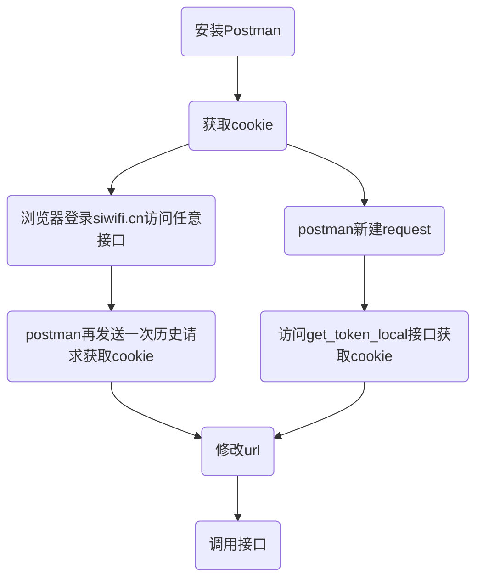

# luci接口测试手册

**目录**

* TOC
{:toc}

## 1 介绍

### 1.1 适用人员

适用于需要对luci接口进行测试的开发人员，需具备如下技能：

- lua语言基础

- 使用postman

- 通过串口查看路由日志

### 1.2 开发环境

Ubuntu，siflower SDK，siflower硬件平台,网页浏览器

### 1.3 功能概述

此文档提供了详细的接口调用方法和测试流程。当网页或者app等调用到接口的地方出现异常时，则可以参考此文档对接口进行测试，查找异常原因

## 2 项目引用

[SiWiFi接口开发手册](#todo)

## 3 测试流程

### 3.1 postman调用接口流程

用postman调用接口时，必须获取到cookie。获取cookie有两种方式：1、浏览器登录siwifi.cn获取；2、调用get_stok_local接口获取。在已获取cookie的请求中修改url，改变调用的接口路径，即可对该接口进行一次调用。postman调用接口流程图如下所示：


#### 3.1.1 浏览器登录获取cookie

- 1、安装浏览器postman插件。用chrome打开网上应用商店，搜索Postman Interceptor插件并安装。安装成功后可在浏览器界面看到postman标志：

  

- 2、测试插件是否正常安装。打开postman，用装好postman插件的浏览器访问siwifi.cn并登陆，访问任意界面并设置任意参数（例如在主人网络界面点击保存）。若浏览器postman插件安装成功，则会在postman软件左侧history中看到chrome调用set_wifi_iface接口的请求。调开该历史请求，可以在左侧查看详细信息。该请求还未携带cookie，body中选中raw可看到调用接口时的传入参数：

  

- 3、再次调用请求获取cookie。在上一步点开的请求中点击send，就能再次调用set_wifi_iface接口。通过此次调用之后，该请求中会携带cookie：

  

#### 3.1.2 调用接口获取cookie

  获取cookie的接口路径为api/sfsystem/get_stok_local。打开postman，点击“+”图标新建一个空请求。在该请求的url中输入"http://192.168.4.1/cgi-bin/luci/api/sfsystem/get_stok_local"，其中192.168.4.1为路由器的lan网关，lan配置不同时可能需要修改。此接需要版本号和登录密码作为传入参数，则可在body下勾选raw，并在下方输入 {"version":"V18","luci_password":"admin"}。其中"luci_password"参数为路由器的登录密码，默认为admin。点击Send调用此接口后，该请求就会携带cookie：

  

#### 3.1.3 修改路径调用其他接口

  获取到cookie之后，修求改该请求的url（只改动后面部分的接口路径），即可完成对其他接口的调用。例如，set_wifi_iface的路径为admin/wirelessnew/set_wifi_iface，postman中Send按钮左侧显示url为"http://192.168.4.1/cgi-bin/luci/admin/wirelessnew/set_wifi_iface"。将url中的路径改为admin/networknew/get_wan，删掉body下raw选项中的传入参数（get_lan没有传入参数），点击Send，即完成了一次对get_wan接口的访问。若访问带传入参数的接口，在body的raw选项下加入传入参数即可：

  

### 3.2 自定义log并查看

#### 3.2.1 syslog函数

lua脚本输出log的函数syslog被封装在nixio.lua中。因此只需要在文件开头声明此模块，就可以在文件任意地方调用此函数了。

```
local nixio = require "nixio"
...
nixio.syslog("crit","xxx")
```

其中"xxx"为打印出的信息，可替换为任意字符串或变量（不能为空）。例如我们要查看某个变量tmp的值，则可用如下语句：

```
nixio.syslog("crit","================"..tmp)
```

#### 3.2.2 查看log

- 1、可以在编译前在lua接口实现的文件中添加nixio.syslog函数，文件路径为:
网页接口：feeds/luci/modules/luci-mod-admin-full-siflower/luasrc/controller/admin/
app接口：feeds/luci/module/luci-mod-admin-full-siflower/luasrc/controller/api/

- 2、也可以直接在串口实时修改lua文件添加nixio.syslog函数，文件路径为：
网页接口：/usr/lib/lua/luci/controller/admin/
app接口：/usr/lib/lua/luci/controller/api
串口添加syslog函数后，需要执行如下指令：rm -rf /tmp/luci-*  来清除缓存

- 3、添加好之后，执行logread -f &  打开log日志。之后再以任意方式调用接口后，就会在串口打印出日志信息，如下所示：

```
Tue Jul 28 15:44:25 2020 user.crit syslog: ==============
```

## 4 测试用例

### 4.1 网页接口测试

以网页上“主人网络”界面调用的两个接口"get_wifi_iface"和"set_wifi_iface"，并修改wifi名称为例，说明如何进行接口测试

#### 4.1.1 测试环境配置

已烧录镜像的路由，网页浏览器，能访问路由的串口工具或ssh

#### 4.1.2 测试流程

##### 4.1.2.1 增加syslog

1、修改lua文件。通过串口打开/usr/lib/lua/luci/controller/admin/wirelessnew.lua（或者编译镜像前修改feeds/luci/modules/luci-mod-admin-full-siflower/luasrc/controller/admin/wirelessnew.lua），找到get_wifi_iface和set_wifi_iface函数，在函数中的前后部分加上对应的log：

```
function get_wifi_iface()
    nixio.syslog("crit","===============get_wifi_iface==================")
    local ifaces = {}
...
    luci.http.prepare_content("application/json")
    luci.http.write_json(result)
    nixio.syslog("crit","===========the first ssid is:"..result["ifaces"][1]["ssid"])
end

function set_wifi_iface()
    nixio.syslog("crit","===============set_wifi_iface==================")
    local arg_list, data_len = luci.http.content()
    local arg_list_table = json.decode(arg_list)
    nixio.syslog("crit","===========set the first ssid to:"..arg_list["ifaces"][1]["ssid"])
    set_wifi_iface_local(arg_list_table["ifaces"])
...
end
```

这4句log分别用于：

- 1 提示当前调用了get_wifi_iface接口

- 2 显示结果中第一组参数的ssid

- 3 提示当前调用了set_wifi_iface接口

- 4 显示传入参数中第一组参数的ssid

log添加完成后，在串口工具下运行如下指令：

- rm -rf /tmp/luci-*，删除缓存，使修改生效

- logread -f &，打开log显示，可在调用接口时看到新增的log。

##### 4.1.2.2 网页调用接口

- 1、打开网页浏览器，按下F12打开调试模式，可在左侧network选项下看到当前浏览器的访问情况

- 2、进入高级设置-主任网络界面。此时即可看到浏览器network选项里对get_wifi_iface接口的调用。

- 3、修改2.4G的“无线名称”，例如改为A28-8dec-2.4G-test，点击保存。此时可以看到浏览器network选项里对set_wifi_iface接口的调用

- 4、查看串口日志，可看到如下log信息,显示对get_wifi_iface和set_wifi_iface接口的调用信息：

```
Fri Jul 31 11:52:01 2020 user.crit syslog: ===============get_wifi_iface=====================
Fri Jul 31 11:52:01 2020 user.crit syslog: 
}
Fri Jul 31 11:52:01 2020 user.crit syslog: ===========the first ssid is:A28-8dec-2.4G
...
Fri Jul 31 11:53:20 2020 user.crit syslog: httpdispatch--/;stok=849f61c6c41104497b089a39ae8ef6d2/admin/wirelessnew/set_wifi_iface
Fri Jul 31 11:53:20 2020 user.crit syslog: ===============set_wifi_iface=====================
Fri Jul 31 11:53:20 2020 user.crit syslog: ===========set the first ssid to:A28-8dec-2.4G-test
```

- 刷新页面，查看无线名称一栏，信息已被成功修改

#### 4.1.3 测试结果

通过网页调用接口，完成了无线名称的修改与显示；相应log正确显示，网页调用接口成功

### 4.2 app接口测试

以app接口的get_lan_type和set_lan_type为例介绍app接口的测试方法。

#### 4.2.1 测试环境配置

已烧录镜像的路由，postman工具，能访问路由的串口工具或ssh

#### 4.2.2 测试流程

##### 4.2.2.1 添加syslog

1、修改lua文件。通过串口打开/usr/lib/lua/luci/controller/api/sfsystem.lua（或者编译镜像前修改feeds/luci/modules/luci-mod-admin-full-siflower/luasrc/controller/api/sfsystem.lua），找到get_lan_type和set_lan_type函数，在函数中加上对应的log：

```
function get_lan_type()
    nixio.syslog("crit","========get_lan_type start==========")
    ...
    sysutil.set_easy_return(code, result)
    return
end
                                                                 
function set_lan_type()
    nixio.syslog("crit","========set_lan_type start==========")
    ...
    sysutil.set_easy_return(code, nil)
    return

```

这两个函数又调用了networkImpl.lua,通过串口打开/usr/lib/lua/luci/siwifi/networkImpl.lua（或者编译镜像前修改feeds/luci/modules/luci-mod-admin-full-siflower/luasrc/siwifi/networkImpl.lua），在对应函数中加入log：

```
function get_lan_type()
	local uci = require "luci.model.uci".cursor()
	local result = {}
	local code = 0

	result["ip"] = uci:get("network","lan","ipaddr")
	nixio.syslog("crit","=============the lan ip is:"..result["ip"])
	result["mtu"] = tonumber(uci:get("network","lan","mtu"))
	...
	return code, result
end

function set_lan_type(arg_list_table)
	...
	local leasetime = arg_list_table["leasetime"]
	local mode = arg_list_table["mode"]
	nixio.syslog("crit","=============the mtu is:"..mtu)
	local mask = arg_list_table["netmask"]
	...
	sysutil.sflog("INFO","LAN configure changed!")
	return code
end
```

log添加完成后，在串口工具下运行如下指令：

- rm -rf /tmp/luci-*，删除缓存，使修改生效

- logread -f &，打开log显示，可在调用接口时看到新增的log。

##### 4.2.2.2 postman调用

- 1、打开postman，新建一个空请求。

- 2、添加url:"http://192.168.4.1/cgi-bin/luci/api/sfsystem/get_stok_local".

- 3、添加传入参数，url下body选项中选择"raw",在下面空白处添加传入参数：{"version":"V18"，"luci_password":"admin"}。"luci_password"为路由器登录密码。

- 4、点击send，访问get_stok_local获取cookie.

- 5、将获取到cookie的该请求的url改为"http://192.168.4.1/cgi-bin/luci/api/sfsystem/get_lan_type"。设置get_lan_type的传入参数为 {"version":"V18"}。

- 6、点击send，即可在下面Body中得到返回结果，如下图所示：


- 7、查看串口日志，可看到如对get_wifi_iface接口的调用信息：

```
Mon Sep  7 05:47:54 2020 user.crit : ========get_lan_type start==========
Mon Sep  7 05:47:54 2020 user.crit : =============the lan ip is:192.168.4.1
```

- 8、将url改为http://192.168.4.1/cgi-bin/luci/api/sfsystem/set_lan_type，body选项中row下的传入参数{"version":"V18"}中添加get_wifi_iface得到的信息，并添加"mtu":1400，如下所示：

<code>{"version":"V18","mtu":1400,"mac":"10:16:88:0C:06:E3","code":0,"netmask":"255.255.255.0","msg":"OK","ip":"192.168.4.1","leasetime":"13h","dhcpend":150,"mode":"0","dynamic_dhcp":1,"dhcpstart":100}</code>

- 9、点击send，完成对set_wifi_iface接口的调用：

 
- 10、Body中得到返回结果，查看串口日志，可看到相应日志：

```
Mon Sep  7 06:17:18 2020 user.crit : ========set_lan_type start==========
Mon Sep  7 06:17:18 2020 user.crit : =============the mtu is:1400
```

#### 4.2.3 测试结果

再次调用get_lan_type接口，得到了设置的mtu数值。说明通过postman调用app接口，完成了对lan信息的获取，并修改了mtu选项；相应log正确显示，app调用接口成功

## 5 FAQ

- **Q：除了网页和postman调用外，还有调用接口的方法吗？**

  A：若接口为不带传入参数的接口，则可将浏览器网址末尾修改为对应路径即可实现调用。例如：LAN口设置对应网址为https://192.168.4.1/cgi-bin/luci/;stok=3ac0d1d68b779ea7941584af25653951/admin/networknew/lan，admin/networknew/lan改为admin/networknew/lan，访问该网址，可直接得到调用get_lan接口的返回值：
  <pre><code>
  {
      "mac":"10:16:88:3A:8D:F4",
      "code":0,"netmask":"255.255.255.0",
      "msg":"OK",
      "ip":"192.168.4.1",
      "leasetime":"12h",
      "dhcpend":150,
      "mode":0,
      "dynamic_dhcp":1,
      "dhcpstart":100
  }
  </code></pre>

- **Q：测试的接口已发现错误，如何修改？**

  A：当接口出错时，调用该接口时会得到相关错误信息，如下图所示：
  
  其中会提示哪个文件的哪一行出了问题，例如上图为usr/lib/lua/luci/controller/admin/wireless.lua第79行少了一个“)”。通过串口工具（或ssh）打开提示路径下出错的lua文件。先根据错误提示修改有误的地方，然后执行指令rm -rf /tmp/luci*，再重新进入网页即可。。
