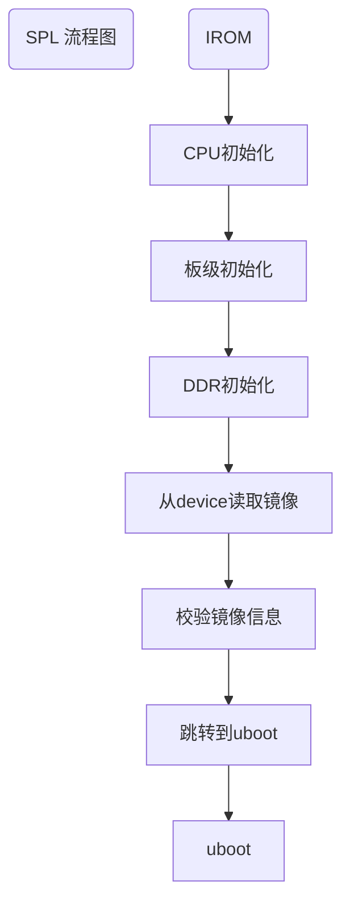

# U-boot代码框架介绍

**目录**

* TOC
{:toc}

## 1. 介绍
本文主要介绍了Uboot 的代码框架。其中主要包含了矽昌自主添加的功能和uboot中的命令操作使用描述。
### 1.1. 适用人员
需要使用uboot的人员。

### 1.2. 开发环境
- 可以正常编译通过的Siflower SDK环境  
  该环境的搭建请参考[快速入门](https://siflower.github.io/2020/08/05/quick_start)

### 1.3 功能概述

本文介绍了U-boot的结构和uboot命令行操作使用方法。

## 2. Uboot代码框架描述
### 2.1  U-boot的介绍

#### bare spl

SPL是介于芯片内部rom程序与uboot之间的一个BootLoader，其主要功能为初始化ddr，系统管理器，时钟，以及加载uboot。SPL程序本身需要加载到系统内部ram中运行，是一个轻量级的uboot。   
在U-boot开源程序中，本身是包含SPL选项的。FULLMASK版本将芯片内部ram减少到了64KB，不足以同时支持Uboot-spl的rom+ram的需求，因此采用了一份裸机实现的bare_spl。  
Bare_spl相比于原Uboot-spl更加简单可控，也可以同样实现引导uboot的功能。同时，bare_spl也同时支持mpw0和mpw1芯片，并且减少了存储空间，为flash优化、分区的重新定义提供了支持。  
SPL的流程如下（uboot-spl和bare-spl实现主要功能一致）：  

在bare_spl中，默认支持三种boot device：spi-flash，sd card，emmc。按照spi>sd>emmc的优先级，只要检测到device存在，spl便会自动从其启动。因此如果想要在同时包含spi-flash与sd的板子中，使用sd作为device存放uboot镜像，需要定义SKIP_SPI_FLASH。由于spi与emmc存在复用关系，因此不会同时存在。Uboot-spl需要在编译阶段就指定使用哪一种boot device。而SF19A2890目前仅支持一种boot device：spi-flash，依据读取flash型号决定使用nand falsh还是nor flash。  
SPL与uboot相同，引导的镜像需要包含一个uimage的header，其中会包含所引导镜像的类型。因此，SPL不只可以引导uboot，进而启动内核，还可以引导pcba测试程序。   

#### U-boot

Uboot的启动分为两个阶段：stage1和stage2。stage1可以认为是uboot认定的rom阶段，stage2是ram阶段。Stage1向stage2转换的主要标志就是代码段的relocation，即将代码段从“rom”复制到“ram”。   
Uboot的流程图如下：  
  

每个stage都有一个主要执行的函数序列，即init_sequence_f和init_sequence_r。由于SPL的存在，uboot的stage1其实并没有什么实质性的功能，整个uboot都是运行在ddr上的。在进入stage2前，uboot会进行一个代码段的重定向，由于uboot本身是位置无关的，因此只需要同时更新堆栈信息，全局变量表等即可，重定向后的代码依旧可以正常执行。按照uboot的思想，这个stage2是运行在ram中的，因此速度要比stage1要快。   
init_sequence_r中主要是进行了各个模块驱动的初始化，网络的初始化和一些其他准备工作，比如环境变量的初始化等。在准备结束后，uboot最终会进入一个main_loop，进行控制台的初始化。此时uboot提供了一个3s的倒计时，如果不在时间内从控制台（默认串口）进行输入，则会进入自动启动流程，根据预设的环境变量参数，进行引导启动；如果有输入，就可以停下来进入控制台，与uboot进行交互。此时uboot会根据输入的命令情况进行解析并执行。命令具体的使用和介绍见后文。  

### 2.2 uboot源码整体框架

下面简要整理了uboot源码中主要文件和文件夹的大致功能描述:

| 文件路径 | 功能描述 |
|---|---|
| bare_spl | 初始化ddr，系统管理器，时钟，以及加载uboot镜像文件 |
| arch/mips/cpu | 与处理器相关的文件。每个子目录中都包括cpu.c和interrupt.c、start.S、u-boot.lds。|
| | **cpu.c**：初始化CPU、设置指令Cache和数据Cache等 |
| |**interrupt.c：**设置系统的各种中断和异常 |
| |**start.S**：是U-boot启动时执行的第一个文件，它主要做最早期的系统初始化，代码重定向和设置系统堆栈，为进入U-boot第二阶段的C程序奠定基础。|
| | **u-boot.lds**：链接脚本文件，对于代码的最后组装非常重要。 |
| board/siflower/ | 对应开发板相关文件 |
| common | 与处理器体系结构无关的通用代码，U-boot的命令解析代码/common/command.c、所有命令的上层代码**cmd.c**、U-boot环境变量处理代码env.c等都位于该目录下 |
| drivers | 包含几乎所有外围芯片的驱动，网卡、USB、串口、LCD、Nand Flash等等 |
| disk  fs net | 支持CPU无关的重要子系统：|
|  | 磁盘驱动的分区处理代码 | 
| | 文件系统：FAT、JFFS2、EXT2等 |
| | 网络协议：NFS、TFTP、RARP、DHCP等等 |
| include | 头文件，包括各CPU的寄存器定义，文件系统、网络等等 |
| | configs子目录下的文件是与目标板相关的配置头文件 |
| doc | U-Boot的说明文档，在修改配置文件的时候可能用得上 |
| Makefile MAKEALL config.mk | 控制整个编译过程的主Makefile文件和规则文件 |
| tools | 编译S-Record或U-Boot映像等相关工具，制作bootm引导的内核映像文件工具mkimage源码 |
| MAINTAINERS README | 介绍性的文档、版权说明  |
| httpd | 以太网驱动，httpd服务，主要用于在uboot中进行镜像文件更新 |

### 2.3 Siflower uboot个性化设计  

#### uboot以太网网页烧录镜像更新功能 

主要功能是用于在uboot命令行中，使用http协议进行开发板镜像文件更新（包含了uboot和kernel镜像文件的两种更新方式），详见《# U-boot移植应用开发手册》以太网烧录章节描述。  

#### bare_spl 框架设计

为了节约内存空间独立设计的裸机代码，主要功能为初始化ddr，系统管理器，时钟，以及加载uboot。在fullmask中，启动设备支持使用norflash和nandflash两种类型。  

####  模块节能设置  
为了降低各模块和总线在放开的情况下的功耗，在uboot将所有可操作模块和总线复位等信号都控制住，可以从根本上降低了系统起来之后的能耗。在kernel boot起来之后，可以根据实际需求打开各自模块和总线的复位使能和时钟开关。

## 3 uboot操作指令

### 3.1 添加uboot命令  

1.在uboot下建立 cmd/命令.c 文件；  

  

2.用 U_BOOT_CMD 来定义命令；  

  

对应参数分别为：name：命令名；maxargs：命令的最大参数个数；repeatable：是否自动重复（按Enter键是否会重复执行）；command：该命令对应的响应函数指针；usage：简短的使用说明；help：较详细的使用说明。  

3.在 cmd/命令.c 文件中实现命令的操作do命令函数 

  

4.将 cmd/命令.c 添加到 cmd/Makefile 中；  

  

5.重新编译并烧录uboot镜像。

### 3.2 uboot下现有命令及描述

| 命令 | 描述 |
| ------ | ------ |
| ？ | alias for 'help' |
| base | print or set address offset （base  显示偏移量；base + offset  重新设置偏移量） |
| bdinfo | print Board Info structure |
| boot | boot default, i.e., run 'bootcmd' |
| boot_test | boot siflower test image |
| bootd | boot default, i.e., run 'bootcmd' |
| bootelf | Boot from an ELF image in memory |
| bootm | boot application image from memory |
| #bootp | boot image via network using BOOTP/TFTP protocol |
| bootvx | Boot vxWorks from an ELF image |
| btn_httpd_detect | check pmu buttom to run httpd（在无法使用串口的情况下，通过按键，通知到CPU，然后用代码去将httpd更新指令输入到串口中，就可以在网页上进行镜像文件更新） |
| cmp | compare memory （cmp ［.b， .w， .l］ addr1 addr2 count，.b以字节为单位，.w以字为单位，.l以长字为单位。注意：cmp.b中间不能保留空格，需要连续敲入命令。第1个参数addr1是第一块内存的起始地址，第2个参数addr2是第二块内存的起始地址，第3个参数count是要比较的数目，单位按照字节、字或者长字。） |
| coninfo | print console devices and information |
| cp | copy memory （cp ［.b， .w， .l］ source target count，第1个参数source是要复制的数据块起始地址，第2个参数target是数据块要复制到的地址。这个地址如果在Flash中，那么会直接调用写Flash的函数操作。所以U-Boot写Flash就使用这个命令，当然需要先把对应Flash区域擦干净，第3个参数count是要复制的数目，根据cp.b cp.w cp.l分别以字节、字、长字为单位。） |
| crc32 | checksum calculation（crc32 address count ［addr］，第1个参数address是需要校验的数据起始地址，第2个参数count是要校验的数据字节数，第3个参数addr用来指定保存结果的地址。） |
| dm | Drive model low level access（dm tree ，Dump drive model tree；dm uclass，Dump list of instances fo each uclass；dm devres，Dump list of device resources for each device） |
| echo | echo args to console（echo [args]） |
| editenv | edit environment variable（editenv name，edit environment viriable 'name' ） |
| #env | environment handling commands（default [-f] -a - [forcibly] ，reset default environment；env default [-f] var [...] - [forcibly] ，reset variable(s) to their default values；env delete [-f] var [...] - [forcibly] ，delete variable；env edit name ，edit environment variable；env exists name ， tests for existence of variable；env flags，print variables that have non-default flags） |
| exit | exit script |
| false | do nothing,unsuccessfully |
| fdt | flattened device tree utility commands（fdt move   <fdt> <newaddr> <length>，Copy the fdt to <addr> and make it active；fdt resize，Resize fdt to size + padding to 4k addr；fdt print  <path> [<prop>]，Recursive print starting at <path>；fdt list   <path> [<prop>]，Print one level starting at <path>；fdt get value <var> <path> <prop>，Get <property> and store in <var>；fdt get name <var> <path> <index>，Get name of node <index> and store in <var>；fdt get addr <var> <path> <prop>，Get start address of <property> and store in <var>；fdt get size <var> <path> [<prop>]，Get size of [<property>] or num nodes and store in <var>；fdt set    <path> <prop> [<val>]，Set <property> [to <val>]；fdt mknode <path> <node>，Create a new node after <path>；fdt rm     <path> [<prop>]，Delete the node or <property>；fdt header，Display header info；fdt bootcpu <id>，Set boot cpuid；fdt memory <addr> <size>，Add/Update memory node；fdt rsvmem print，Show current mem reserves；fdt rsvmem add <addr> <size>，Add a mem reserve；fdt rsvmem delete <index>，Delete a mem reserves；fdt chosen [<start> <end>]，Add/update the /chosen branch in the tree）|
| go | start application at address 'addr'（go addr [arg ...]，start application at address 'addr'） |
| help | print online help |
| httpd | start ww server for firmware recovery with [localAddress] |
| iminfo | print header information for application image |
| imxtract | extract a part of a multi-image |
| itest | return true/false on integer compare |
| loop | infinite loop on address range |
| lzmadec | lzma uncompress a memory region（lzmadec srcaddr dstaddr [dstsize]） |
| md | memory display（md[.b,.w,.l] address [# of objects]） |
| mm | memory modify (mm[.b,.w,.l] address) |
| mw | memory write (mw[.b,.w,.l] address value [count]) |
| nm | memory modify (nm[.b,.w,.l] address) |
| ping | send ICMP ECHO_REQUEST to network host |
| printenv | print environment variables |
| reset | Perform RESET of the CPU |
| rhreset | Rehold all module resets to save power |
| run | run commands in an environment variable （run var [...]，run the commands in an environment variables）|
| saveenv | save environment variables to persistent storage |
| setenv | set environment variables |
| sf | SPI flash sub-system（probe [[bus:]cs] [hz] [mode]，init flash device on given SPI bus and chip select；sf read addr offset/partition len，read `len' bytes starting at、`offset' or from start of mtd、`partition'to memory at `addr'；sf write addr offset/partition len，write `len' bytes from memory、at `addr' to flash at `offset'、or to start of mtd `partition'；sf erase offset/partition [+]len，erase `len' bytes from `offset'、or from start of mtd `partition'、`+len' round up `len' to block size；sf update addr offset|partition len，erase and write `len' bytes from memory、at `addr' to flash at `offset'、or to start of mtd `partition'；sf protect lock/unlock sector len，protect/unprotect 'len' bytes starting、at address 'sector'） |
| showvar | print local hushshell variables |
| spld | update spl from device |
| test | minimal test like /bin/sh |
| tftpboot | boot image via network using TFTP protocol |
| true | do nothing，successfully |
| version | print monitor，compiler and linker version |

 
