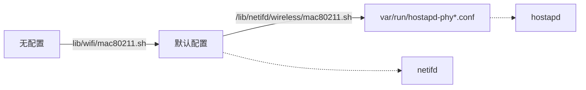
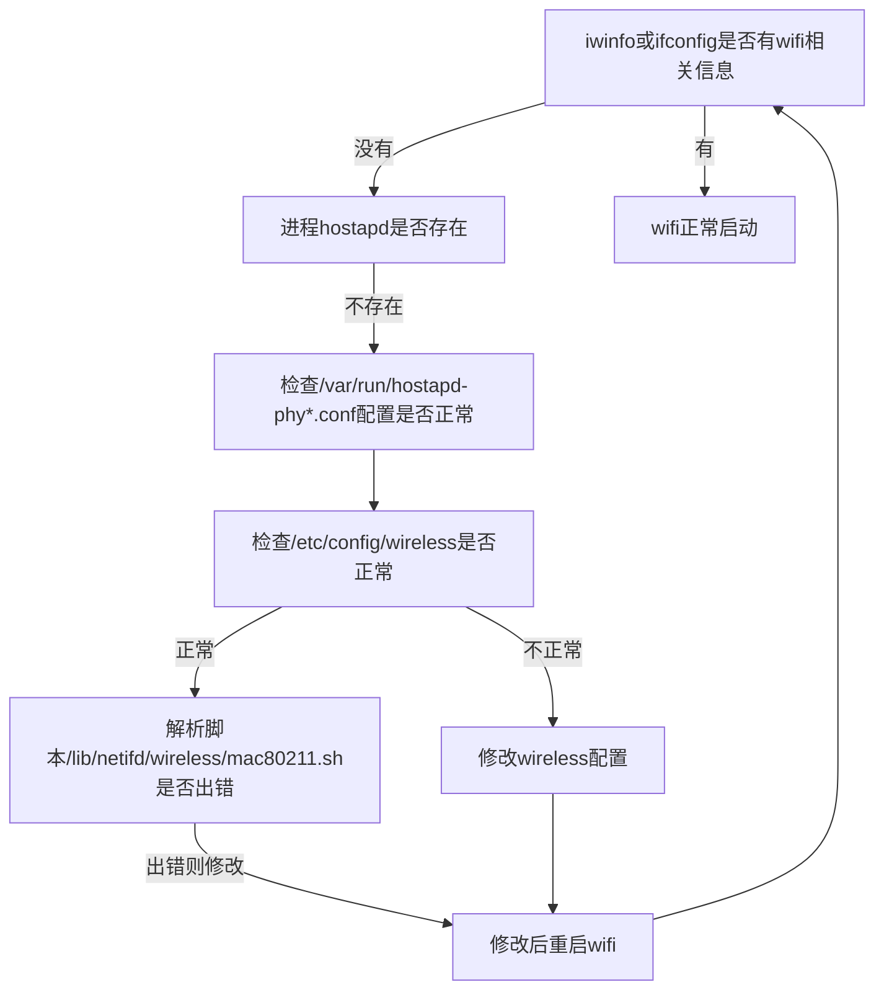
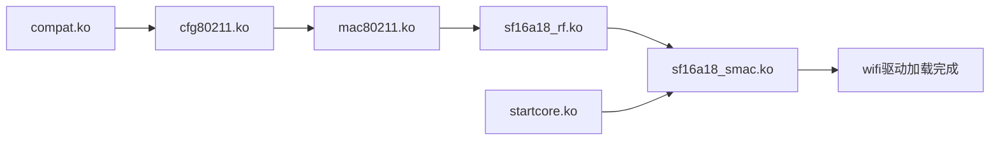

# WiFi架构和配置手册

**版权所有©上海矽昌微电子有限公司2019。保留一切权利。**  
非经本公司许可，任何单位和个人不得擅自摘抄、复制本文档内容的部分或全部，并不得以任何形式传播。

**商标申明**  
SiFlower、矽昌和矽昌其它商标均为上海矽昌微电子有限公司的商标，本文档提及的其它所有商标或注册商标，由各自的所有人拥有。

**注意**  
您购买的产品、服务或特性应受矽昌公司商业合同和条款的约束，本文档所描述的全部或部分产品、服务或特性可能不在您的购买和使用范围内。除合同另有约定，矽昌公司对文档的内容不做任何明示或暗示的声明和保证。

**上海矽昌微电子有限公司**  
地址：上海市浦东新区祖冲之路887弄84号楼408室  
网址：http://www.siflower.com/  
客户服务电话：021-51317015  
客户服务传真：  
客户服务邮箱：  

**目录**  
* TOC
{:toc}

## 1 介绍

本篇文档介绍了从SDK代码开始编译wifi模块，以及wifi模块的配置和流程、查看wifi信息并检测出错点，到最后进行wifi的压力测试。

### 1.1 适用人员

- 熟悉使用linux

### 1.2 开发环境

- 正常的编译和运行环境，请务必先阅读[快速入门，待插入链接]()

### 1.3 功能概述

- 介绍如何编译wifi模块
- 介绍wifi的基本配置
- 提供wifi检测方法和解决问题方案
- 提供测试案例

## 2 项目设计和流程

### 2.1 编译wifi模块

参考[快速入门第6节,待插入链接]()，建议先直接编译一次所需镜像，然后使用2.1.2的方法。

#### 2.1.1 首次编译

如果是第一次编译时就需要添加wifi模块，请检查所需编译版型的配置，配置位于```openwrt-18.06/target/linux/siflower/``` 文件夹下，例如sf19a28_ac28_fullmask_def.config为ac28版型的配置。
查看配置并作对应修改：
```
CONFIG_PACKAGE_dnsmasq=y
CONFIG_PACKAGE_wireless-regdb=y
CONFIG_PACKAGE_kmod-cfg80211=y
CONFIG_PACKAGE_kmod-mac80211=y
CONFIG_PACKAGE_MAC80211_DEBUGFS=y
CONFIG_PACKAGE_MAC80211_MESH=y
CONFIG_PACKAGE_kmod-sf_smac=y
CONFIG_PACKAGE_SFSMAC_DBGINFO_ALLOCS=y
CONFIG_PACKAGE_SFUMAC_WIFI_TEST_SCRIPTS=y
CONFIG_PACKAGE_SFUMAC_WIFI_ATE_TOOLS=y
CONFIG_PACKAGE_SFUMAC_SMAC=y
CONFIG_PACKAGE_libiwinfo=y
CONFIG_PACKAGE_hostapd-common=y
CONFIG_PACKAGE_iw=y
CONFIG_WPA_MSG_MIN_PRIORITY=3
CONFIG_DRIVER_11N_SUPPORT=y
CONFIG_DRIVER_11AC_SUPPORT=y
CONFIG_PACKAGE_wpad-mini=y
CONFIG_PACKAGE_iwinfo=y
```
修改完成后，若编译ac28镜像,则在openwrt-18.06目录下使用```./make.sh ac28```即可编译，编译完成后在当前目录即可得到镜像。

#### 2.1.2 非首次编译

如果不是第一次编译，那么可以使用```make menuconfig```然后选中以下内容：
```
Kernel modules ---> Wireless Drivers--->kmod-sf_smac  
Network--->hostapd-common
Utilities--->iwinfo  
Base system--->dnsmasq
```
修改完成之后保存，在openwrt-18.06目录下使用```make -j V=s```即可编译，镜像在```bin/siflower/openwrt-siflower-sf16a18-mpw0-squashfs-sysupgrade.bin```。

### 2.2 wifi上层配置说明

#### 2.2.1 wifi配置简述

SDK中的配置沿用了openwrt原始的wifi配置，可以参考[openwrt-wifi配置](https://openwrt.org/docs/guide-user/network/wifi/start)  。
配置文件在镜像中的位置为/etc/config/wireless，典型的配置如下：
```
config wifi-device 'radio0'
        option type 'mac80211'
        option country 'CN'
        option channel 'auto'
        option txpower_lvl '2'
        option band '2.4G'
        option hwmode '11g'
        option noscan '0'
        option netisolate '0'
        option max_all_num_sta '40'
        option path 'platform/11000000.wifi-lb'
        option htmode 'HT20'
        option disabled '0'

config wifi-iface 'default_radio0'
        option device 'radio0'
        option network 'lan'
        option mode 'ap'
        option ssid 'SiWiFi-9630-2.4G'
        option encryption 'none'
        option key '12345678'
        option hidden '0'
        option ifname 'wlan0'
        option wpa_group_rekey '3600'
        option isolate '0'
        option group '1'
        option netisolate '0'
```
如图，配置分为两层，由config后的第一个字符串来进行区分。  
其中，wifi-device对应具体硬件的wifi驱动设备,我们支持2.4G和5G两种device；wifi-iface对应单个wifi接口，与单个ssid（即wifi名称）相对应，
一个wifi-device下面可以配置多个wifi-iface，最多支持4个。  

#### 2.2.2 配置选项说明   

##### 2.2.2.1 wifi-device配置选项

配置中的同一个config段的```option ***** '*****'```先后顺序不影响配置。

注：默认值为"/"时表示该选项不一定会出现，只有在进行了某些设置的情况下才会出现；默认值为"-"时表示2.4G和5G有差异，将在描述里进行说明。
  | 选项 |值类型|默认值|描述 |  
  | :---: |:---:|:---:| :---: |
  |wifi-device|string|radio0|驱动设备名称|
  |type|string|mac80211|驱动类型，目前固定为"mac80211"。|
  |country|string|CN|国家码，2个大写字母，默认为CN，表示中国（China），国家码会影响信道和发射功率。其他常见国家代码参见[2.2.5节](#225-常见国家代码)。|
  |channel|string/int|-|信道，默认2.4G为auto（自动选取最优信道），可以按需修改为固定信道，不同国家信道限制不同，如中国地区2.4G信道为1~13 ，5G信道为36~64 、149~165。|
  |txpower_lvl|int|2|发射功率，可设值为0、1、2。该值越大，表示功率越大。|
  |max_all_num_sta|int|40|驱动所能连接设备个数的最大值|
  |netisolate|boolean|0|设备隔离，如果设置为1，则从该device下的设备无法访问同一网桥（bridge）中其它bssid的设备。|
  |noscan|boolean|0|值为1时，表示不扫描周围信道。|
  |path|string|-|对应驱动在/sys/devices/下的节点，一般不作修改。默认2.4G为"platform/11000000.wifi-lb"，5G为"platform/17800000.wifi-hb"。|
  |htmode|string|20MHz|带宽模式，2.4G支持20MHz/40MHz，5G支持20MHz/40MHz/80MHz。|
  |hwmode|string|-|wifi工作模式，2.4G支持11b/11g/11n，5G支持11n/11a/11ac，最终的模式是由htmode和hwmode共同决定的，参见[2.2.3节](#223-htmode和hwmode对应关系)。|
  |disabled|boolean|0|0表示启用该驱动设备，1表示关闭该驱动设备。|
  |ht_coex|boolean|/|值为1时，表示带宽20MHZ/40MHZ共存，与htmode有一定联系，参见[2.2.3节](#223-htmode和hwmode对应关系)。|

##### 2.2.2.2 wifi-iface配置选项

  | 选项 |值类型|默认值|描述 |
  | :---: |:---:|:---:| :---: |
  |wifi-iface|string|default_radio0|wifi-iface节点名称|
  |device|string|-|对应wifi-device驱动名称，默认2.4G为radio0，5G为radio1。|
  ifname|string|wlan0|网卡(iface)的名称，使用ifconfig时会显示对应名称。|
  |network|string|lan|对应的网桥（bridge）名称，如果需要把wifi加入到lan口则配置该值为lan。|
  |mode|string|ap<br>(sta、minotor)|ap对应热点，sta对应站点（station），monitor对应监听模式。默认为ap模式。|
  |ssid|string|SiWIFi-****|wifi的名称，最大不超过32位。支持中文，但在串口会显示为"..."。默认名称中的数字来源于mac地址。|
  |encryption|string|none|加密方式，"none"表示不加密，如果想加密，建议改成"psk2+ccmp"，具体加密方式见[2.2.4节](#224-encryption加密方式)。|
  |key|string|12345678|wifi密码，psk2需设置8位以上。当加密方式为不加密（none）时此选项不生效，而其他加密方式必须配置密码。|
  |hidden|boolean|0|是否隐藏热点，1表示隐藏，0表示不隐藏。隐藏后设备只能通过手动添加SSID才能连接wifi。|
  |wpa_group_rekey|int|3600|刷新GTK（广播/多播加密密钥）的时间间隔（以秒为单位）。若不设置此项，则使用CCMP / GCMP作为组密码时默认为86400秒（每天一次），使用TKIP作为组密码时默认为600秒（每10分钟一次）。|
  |isolate|boolean|0|连接此wifi的各设备之间是否隔离，1表示隔离，0表示不隔离。|
  |group|int|-|bridge中的分组，各个不同的group之间在bridge中是不能互相访问的。默认2.4G为0，5G为1。|
  |netisolate|boolean|0|如果配置为1，则从该bssid下的设备无法访问同一bridge中其它bssid的设备。|
  其他更多选项可参考[openwrt官方配置介绍](https://oldwiki.archive.openwrt.org/doc/uci/wireless)  。

#### 2.2.3 htmode和hwmode对应关系  

  不同的WiFi协议决定了hwmode、htmode可以配置的选项，下面列举不同模式的配置要求。

##### 2.2.3.1 2.4G配置
  
  |2.4G模式|配置|描述|
  |:---:|:---:|:---:|
  |11b|option hwmode 11b|该模式下option htmode必须删除<br>该模式下option ht_coex必须删除|
  |11g|option hwmode 11g|该模式下option htmode必须删除<br>该模式下option ht_coex必须删除|
  |11n|option hwmode 11g<br>option htmode HT20<br>（或option htmode HT40）<br>option ht_coex 1|当ht_coex的值为1时，处于20MHz/40MHz混合模式；<br>当ht_coex的值为0时，htmode的值就是频宽|

##### 2.2.3.2 5G配置
   
  |5G模式|配置|描述|
  |:---:|:---:|:---:|
  |11a|option hwmode 11a|该模式下option htmode必须删除<br>该模式下option ht_coex必须删除|
  |11n|option hwmode 11a<br>option htmode HT20<br>（或option htmode HT40）<br>option ht_coex 1|当ht_coex的值为1时，处于20MHz/40MHz混合模式；<br>当ht_coex的值为0时，htmode的值就是频宽|
  |11ac|option hwmode 11a<br>option htmode VHT20<br>(或option htmode VHT40<br>或option htmode VHT80)|该模式下option ht_coex必须删除|

#### 2.2.4 encryption加密方式
  
  |值|WPA版本|密钥加密协议|
  |:---:|:---:|:---:|
  |psk2+tkip+ccmp<br>psk2+tkip+aes|WPA2 Personal (PSK)|TKIP, CCMP|
  |psk2+tkip|WPA2 Personal (PSK)|TKIP|
  |psk2+ccmp<br>psk2+aes<br>psk2|WPA2 Personal (PSK)|CCMP|
  |psk+tkip+ccmp<br>psk+tkip+aes|WPA Personal (PSK)|TKIP, CCMP|
  |psk+tkip	|WPA Personal (PSK)|TKIP|
  |psk+ccmp<br>psk+aes<br>psk|WPA Personal (PSK)|CCMP|
  |psk-mixed+tkip+ccmp<br>psk-mixed+tkip+aes|WPA/WPA2 Personal (PSK) mixed mode|TKIP, CCMP|
  |psk-mixed+tkip|WPA/WPA2 Personal (PSK) mixed mode|TKIP|
  |psk-mixed+ccmp<br>psk-mixed+aes<br>psk-mixed|WPA/WPA2 Personal (PSK) mixed mode|CCMP|
  |wep|WEP|无|

  注：由于WEP加密不够安全，所以现在基本已被舍弃。如果需要可以配置，配置示例：
  ```
  option encryption wep
  option key 1
  option key1 1234567890
  option key2 abcde
  option key3 12345
  option key4 67890
  ```


#### 2.2.5 常见国家代码

  |Countries or Regions|国家或地区|域名缩写|
  |:---:|:---:|:---:|
  |Australia|澳大利亚|AU|
  |Canada|加拿大|CA|
  |China|中国|CN|
  |France|法国|FR|
  |Germany|德国|DE|
  |India|印度|IN|
  |Italy|意大利|IT|
  |Japan|日本|JP|
  |Korea|韩国|KR|
  |Russia|俄罗斯|RU|
  |Singapore|新加坡|SG|
  |United Kingdom|英国|GB|
  |United States of America|美国|US|
更多代码参见[国家代号与区号](http://www1.jctrans.com/tool/dm.htm)。

### 2.3 wifi配置方法

#### 2.3.1 如何修改配置

1、直接修改配置文件/etc/config/wireless  
2、通过[uci命令，待插入链接]()修改

#### 2.3.2 如何使配置生效

修改配置后，需要使用"wifi"相关指令使wireless配置生效，指令执行脚本位于```/sbin/wifi```。

|指令|参数|描述|
|:----:|:---:|:---:|
|wifi|-|不加任何参数，则重新启用"全部wifi"|
|wifi|config|当"/etc/config/wireless"文件不存在时重新生成该文件|
|wifi|reload|重新启用"配置有所更改的wifi"|
|wifi|down|关闭全部wifi|
|wifi|up|启用全部wifi|
|wifi|status|以json串的方式打印wifi信息|

**示例1** 使用uci指令修改2.4G信道：

```
root@OpenWrt:/# uci show wireless.radio0.channel
wireless.radio0.channel='auto'
root@OpenWrt:/# uci set wireless.radio0.channel='5'
root@OpenWrt:/# uci commit wireless
root@OpenWrt:/# wifi reload
root@OpenWrt:/# [59354.934536] lmac[0] vif_mgmt_register, vif_type : 2
[59354.943982] IPv6: ADDRCONF(NETDEV_UP): wlan0: link is not ready
[59354.959163] br-lan: port 3(wlan0) entered blocking state
[59354.964648] br-lan: port 3(wlan0) entered disabled state
[59354.971229] device wlan0 entered promiscuous mode
[59354.988762] IPv6: ADDRCONF(NETDEV_CHANGE): wlan0: link becomes ready
[59354.996105] br-lan: port 3(wlan0) entered blocking state
[59355.001547] br-lan: port 3(wlan0) entered forwarding state
```

**示例2** 生成wireless文件

```
root@OpenWrt:/# ls etc/config/wireless
ls: etc/config/wireless: No such file or directory
root@OpenWrt:/# wifi config
root@OpenWrt:/# ls etc/config/wireless
etc/config/wireless
```

#### 2.3.3 查看wifi信息

使用"iw"指令可查看wifi相关信息，下面列出常见的iw指令。
|指令|参数|描述|示例
|:----:|:---:|:---:|:---:|
|iwinfo|/|列出所有无线网络信息|iwinfo|
|iw|\<ifname\> info|列出单个wifi信息|iw wlan0 info|
|iw|list|列出所有无线设备信息|iw list|
|iw|\<ifname\>  scan|扫描周围信号|iw wlan1 scan|
|iw|\<ifname\> station dump|列出连接该wifi的所有设备信息|iw wlan0 station sump |

**示例1** 查看无线网络信息

```
root@OpenWrt:/# iwinfo
wlan0     ESSID: "SiWiFi-22a4-2.4G"
          Access Point: 10:16:88:05:22:A4
          Mode: Master  Channel: 11 (2.462 GHz)
          Tx-Power: 20 dBm  Link Quality: 70/70
          Signal: -33 dBm  Noise: unknown
          Bit Rate: 19.5 MBit/s
          Encryption: none
          Type: nl80211  HW Mode(s): 802.11bgn
          Hardware: unknown [Generic MAC80211]
          TX power offset: unknown
          Frequency offset: unknown
          Supports VAPs: yes  PHY name: phy0

wlan1     ESSID: "SiWiFi-22a8"
          Access Point: 10:16:88:05:22:A8
          Mode: Master  Channel: 161 (5.805 GHz)
          Tx-Power: 30 dBm  Link Quality: unknown/70
          Signal: unknown  Noise: unknown
          Bit Rate: unknown
          Encryption: none
          Type: nl80211  HW Mode(s): 802.11nac
          Hardware: unknown [Generic MAC80211]
          TX power offset: unknown
          Frequency offset: unknown
          Supports VAPs: yes  PHY name: phy1
```

**示例2** 列出连接wifi的所有设备信息

```
root@OpenWrt:/# iw wlan0 station dump
Station d8:9c:67:1f:d4:57 (on wlan0)
        inactive time:  1504 ms
        rx bytes:       23655
        rx packets:     271
        tx bytes:       15891
        tx packets:     119
        tx retries:     49
        tx failed:      5
        rx drop misc:   38
        signal:         -29 [-29, -29] dBm
        signal avg:     -28 [-28, -28] dBm
        tx bitrate:     57.8 MBit/s MCS 5 short GI
        rx bitrate:     65.0 MBit/s MCS 7
        expected throughput:    29.21Mbps
        authorized:     yes
        authenticated:  yes
        associated:     yes
        preamble:       short
        WMM/WME:        yes
        MFP:            no
        TDLS peer:      no
        DTIM period:    2
        beacon interval:100
        short preamble: yes
        short slot time:yes
        connected time: 139 seconds
```


#### 2.3.4 新增节点方法（ap、sta）

##### 2.3.4.1 新增ap节点

  在/etc/config/wireless中增加一段即可，最简单的一种配置如下：
  
  ```
  config wifi-iface
        option device 'radio0'
        option network 'lan'  
        option mode 'ap'
        option ssid 'SiWiFi-new-ap'
        option encryption 'psk2+ccmp'
        option key '12345678'
        option ifname 'wlan0-1'
  ```


##### 2.3.4.2 新增sta节点

在/etc/config/wireless中增加一段即可，实例如下：

```
config wifi-iface
        option key '12345678'
        option ifname 'sfi0'
        option network 'wwan'
        option encryption 'psk2+ccmp'
        option device 'radio0'
        option mode 'sta'
        option bssid 'A8:5A:F3:00:02:3F'
        option ssid 'SiWiFi-023c-2.4G-8_1'
```


配置说明
| 选项 |值类型|默认值|描述 |
  | :---: |:---:|:---:| :---: |
  |ssid|string|/|所需连接的目标热点名称，可通过iw \<ifname\> scan的指令得到|
  |bssid|string|/|目标热点的bssid，可通过iw \<ifname\> scan的指令得到，<br>格式为  ```**:**:**:**:**:**```|
  |encryption|string|/|目标热点的加密方式|
  |key|string|/|目标热点的密码|
  |ifname|string|-|该值会影响luci的网络接口能否把他识别成一个无线interface，影响网页的信息获取和设置。<br>目前2.4g默认使用的名字为sfi0,5g为sfi1。|
  |network|string|wwan|网络配置，和/etc/config/network的配置相关|
  |device|string|-|使用的驱动设备名称。<br>2.4G默认使用radio0，5G为radio1|
  |mode|string|sta|表示sta模式|

### 2.4 wifi配置生效流程

##### 2.4.1 如何修改默认配置？

在板子上生成默认配置的脚本为lib/wifi/mac80211.sh，其在源码中位于package/kernel/mac80211/files/lib/wifi/mac80211.sh。

**示例** 将wifi的默认加密方式从不加密改为psk2加密

```
chentong@ubuntu:~/p-tmp/openwrt-18.06$ git diff package/kernel/mac80211/files/lib/wifi/mac80211.sh
diff --git a/package/kernel/mac80211/files/lib/wifi/mac80211.sh b/package/kernel/mac80211/files/lib/wifi/mac80211.sh
index 81e6ac7..fd33cfe 100644
--- a/package/kernel/mac80211/files/lib/wifi/mac80211.sh
+++ b/package/kernel/mac80211/files/lib/wifi/mac80211.sh
@@ -146,7 +146,7 @@ detect_mac80211() {
                        set wireless.default_radio${devidx}.network=lan
                        set wireless.default_radio${devidx}.mode=ap
                        set wireless.default_radio${devidx}.ssid=${ssid}
-                       set wireless.default_radio${devidx}.encryption=none
+                      set wireless.default_radio${devidx}.encryption=psk2+ccmp
                        set wireless.default_radio${devidx}.key=12345678
                        set wireless.default_radio${devidx}.hidden=0
                        set wireless.default_radio${devidx}.ifname=wlan${devidx}

```


##### 2.4.2 默认配置生成后被应用到哪里？

/etc/config/wirelesss会被netifd和hostapd使用。  
对于netifd，将直接读取wireless的配置；  
对于hostapd，会由脚本/lib/netifd/wireless/mac80211.sh读取配置，生成配置文件/var/run/hostapd-phy*.conf以供hostapd使用，该脚本在源码中位于package/kernel/mac80211/files/lib/netifd/wireless/mac80211.sh。

##### 2.4.3 wifi配置流程图




### 2.5 wifi检查及优化

#### 2.5.1 wifi是否正常启动

检测wifi是否正常启动的一般流程：



#### 2.5.2 wifi驱动模块介绍

如果涉及到底层模块问题，那么可以依据5.2节和5.3节来尝试解决。 
wifi模块存放在板子上的目录为```/lib/modules/4.14.90/```，在板子启动过程中这些模块会依序自动加载。

##### 2.5.2.1 wifi驱动相关模块加载流程




##### 2.5.2.2 wifi驱动模块的相关指令

|指令|参数|描述|
|:---:|:---:|:---:|
|insmod|"模块名称" ...|加载该模块，简单指令如```insmod /lib/modules/4.14.90/startcore.ko```<br>(或```insmod startcore.ko```或```insmod startcore```)。需要注意的是，有些模块加载需要附加较多参数，建议使用sfwifi指令进行模块操作。|
|rmmod|"模块名称" ...|卸载该模块|
|modinfo|"模块名称" ...|显示该模块相关信息|
|sfwifi|remove|移除wifi驱动相关模块，包括sf16a18_rf.ko、startcore.ko、sf16a18_smac.ko|
|sfwifi|reload|重新加载wifi驱动模块|
|sfwifi|reset|重新启动wifi驱动相关模块|

**示例** 卸载和加载模块

```
root@OpenWrt:/# sfwifi remove
[  203.862426] wlan1: transmit a DEAUTH frame to ff:ff:ff:ff:ff:ff, Reason: 3
[  203.870097] wlan0: transmit a DEAUTH frame to ff:ff:ff:ff:ff:ff, Reason: 3
[  203.878805] device wlan1 left promiscuous mode
[  203.884133] br-lan: port 3(wlan1) entered disabled state
[  203.920493] device wlan0 left promiscuous mode
[  203.925383] br-lan: port 2(wlan0) entered disabled state
[  204.871058] lmac_glue_stop(0)
[  204.874131] stop_task, 0
[  204.876790] stop aresetn 2 por_resetn 1 
[  204.881702] rwnx_errorinfo_deallocs
[  204.885404] successfully turn off platform 0!
[  204.889942] remove_task, 0
[  204.892846] band 1
[  204.947820] lmac_glue_stop(1)
[  204.951039] stop_task, 1
[  204.953760] stop aresetn 2 por_resetn 1 
[  204.958906] rwnx_errorinfo_deallocs
[  204.962668] successfully turn off platform 1!
[  204.967909] remove_task, 1
[  204.970791] band 2
module is not loaded
module is not loaded
[  205.014666] remove_task, 0
[  205.017426] Invalid task id.
[  205.020339] Task 1 removed.
[  205.023159] remove_task, 1
[  205.025867] Invalid task id.
[  205.028776] Task 2 removed.
[  205.058031] sf_wifi_rf_remove
[  205.061110] sf_wifi_rf_sysfs_unregister
[  205.065344] sf_wifi_rf_irqs_unregister
[  205.069226] sf_wifi_rf_platform_reset
root@OpenWrt:/# 
root@OpenWrt:/#
root@OpenWrt:/#
root@OpenWrt:/#
root@OpenWrt:/#
root@OpenWrt:/# sfwifi reload
[  208.954490] startcore init fill all memory!
[  208.978345] sf_wifi_rf_probe
[  208.981421] irq: type mismatch, failed to map hwirq-194 for /interrupt-controller@1bdc0000!
[  208.989818] rf access base address : b1c00000
[  208.994204] priv->base : b1c00000
[  208.997546] priv->irq : 29
[  209.000286] sf_wifi_rf_platform_reset
[  209.003987] sf_wifi_rf_irqs_register
[  209.007987] get LB1_EXTERNAL_PA_CONF_IN_IDLE==00
[  209.012661] get LB1_EXTERNAL_PA_CONF_IN_RX==06
[  209.017183] get LB1_EXTERNAL_PA_CONF_IN_TX==04
[  209.021667] get LB1_EXTERNAL_PA_CONF_IN_PA==01
[  209.026147] get LB2_EXTERNAL_PA_CONF_IN_IDLE==00
[  209.030833] get LB2_EXTERNAL_PA_CONF_IN_RX==06
[  209.035318] get LB2_EXTERNAL_PA_CONF_IN_TX==04
[  209.039800] get LB2_EXTERNAL_PA_CONF_IN_PA==01
[  209.044283] get HB1_EXTERNAL_PA_CONF_IN_IDLE==00
[  209.048940] get HB1_EXTERNAL_PA_CONF_IN_RX==06
[  209.053425] get HB1_EXTERNAL_PA_CONF_IN_TX==04
[  209.057911] get HB1_EXTERNAL_PA_CONF_IN_PA==01
[  209.062397] get HB2_EXTERNAL_PA_CONF_IN_IDLE==00
[  209.067066] get HB2_EXTERNAL_PA_CONF_IN_RX==06
[  209.071577] get HB2_EXTERNAL_PA_CONF_IN_TX==04
[  209.076071] get HB2_EXTERNAL_PA_CONF_IN_PA==01
[  209.080659] gpio 0 level is 0, hb_ex_pa_exist 0, lb_ex_pa_exist 0
[  209.086801] sf_wifi_rf_fw_load
[  209.090973] 
[  209.090973] ### Now copy rf_pmem.bin firmware with size 66876, @ = 0x4002
[  209.128391] 
[  209.128391] ### Now copy rf_default_reg.bin default reg with size 63548
[  209.166490] Can not find XO config!
[  209.169997] get XO config from sf_factory_read failed
[  209.175088] sf_wifi_rf_cali_config_get_mtd
[  209.179579] Do not find XO cali value in flash,mark is 
[  209.185033] XO config value : 0
[  209.188251] sf_wifi_rf_sysfs_register, parent :aetnensis
[  209.194062] get TRX_PATH_CFG==ff
[  209.197355] rf_bootup
[  209.199666] ml_apb_send_0_params_cmd command : 0x8010, cmd_base : 0x3240, rrq : 1
[  209.207291] command 0x8010 get a repsonse with args : 4
[  209.212543] rf hw version : 0x1b0
[  209.215885] rf sw version : 0x1009
[  209.219313] value : 0x4
[  209.221761] rf_app_prepare
[  209.224496] ml_apb_send_1_params_cmd, rrq = 1, cmd_base : 0x3240, cmd = 0x8101, args0 = 0xff
[  209.233071] command 0x8101 get a repsonse with args : 1
[  209.238321] switch to OPERATING mode
[  209.241929] ml_apb_send_0_params_cmd command : 0x8090, cmd_base : 0x3240, rrq : 1
[  209.511733] command 0x8090 get a repsonse with args : 1
[  209.530498] ml_apb_send_0_params_cmd command : 0x8070, cmd_base : 0x3240, rrq : 1
[  209.538126] command 0x8070 get a repsonse with args : 2
[  210.572813] sf16a18_lb_smac: unknown parameter 'force_mod_name' ignored
[  210.580656] rwnx v - build: franklin Mar 30 2017 11:10:15 - svnUnversioned directory
[  210.588915] band 1
[  210.590988] load_task, /lib/firmware/sf1688_lb_smac.bin, 0
[  210.596640] node->entry_addr=1f00000 node=820b8080
[  210.608590] task id=0 state=0
[  210.611650] priv->base : b1000000
[  210.616085] get wifi address from factory
[  210.620200] the default platform clk rate is 375000000
[  210.625392] Can not find wifi version!
[  210.629171] can not get wifi info from factory
[  210.635696] lb registering.......
[  210.639054] find a empty client seat : 0
[  210.643766] 
[  210.643766] ### Now copy ldpcram.bin firmware, @ = 0xb1109000
[  210.651036] 
[  210.651036] ### size = 980 is_lb=1
[  210.656133] load ldpc cost 0 cnt loop
[  210.659840] lmac_glue_start(0)
[  210.662938] start_task, 0
[  210.665562] task entry_addr=0x1f00000
[  210.669271] start aresetn 0 por_resetn 0 
[  210.673310] wait lmac init(0)>>>>>>>>>>>>>>>>>>>>>>>
[  210.678330] lmac init complete(0)
[  210.678359] lmac[0] v6.0.0.0 - build: robert Mon, 29 Jun 2020 10:46:11 +0800 band: 0
[  210.678373] lmac[0] SW profiling configuration:
[  210.678383] lmac[0]   - TX_IPC_IRQ: 0
[  210.678394] lmac[0]   - TX_APP_EVT: 1
[  210.678404] lmac[0]   - TX_BUF_ALLOC: 2
[  210.678416] lmac[0]   - TX_DMA_IRQ: 3
[  210.678452] lmac[0]   - TX_PAYL_HDL: 4
[  210.678465] lmac[0]   - TX_NEW_TAIL: 5
[  210.678475] lmac[0]   - TX_MAC_IRQ: 6
[  210.678485] lmac[0]   - TX_BUF_FREE: 7
[  210.678495] lmac[0]   - TX_CFM_EVT: 8
[  210.678507] lmac[0]   - TX_CFM_DMA_IRQ: 9
[  210.678518] lmac[0]   - RX_MAC_IRQ: 10
[  210.678528] lmac[0]   - RX_CNTRL_EVT: 11
[  210.678539] lmac[0]   - RX_MPDU_XFER: 12
[  210.678550] lmac[0]   - RX_MPDU_FREE: 13
[  210.678561] lmac[0]   - RX_DMA_IRQ: 14
[  210.678571] lmac[0]   - RX_DMA_EVT: 15
[  210.678582] lmac[0]   - RX_IPC_IND: 16
[  210.678595] lmac[0]   - AGG_FIRST_MPDU_DWNLD: 17
[  210.678607] lmac[0]   - AGG_START_AMPDU: 18
[  210.678618] lmac[0]   - AGG_ADD_MPDU: 19
[  210.678631] lmac[0]   - AGG_FINISH_AMPDU: 20
[  210.678642] lmac[0]   - AGG_BAR_DONETX: 21
[  210.678652] lmac[0]   - AGG_BA_RXED: 22
[  210.678663] lmac[0]   - MM_HW_IDLE: 23
[  210.678674] lmac[0]   - MM_SET_CHANNEL: 24
[  210.678685] lmac[0]   - TX_FRAME_PUSH: 25
[  210.678697] lmac[0]   - TX_FRAME_CFM: 26
[  210.678708] lmac[0]   - TX_AC_BG[0]: 27
[  210.678718] lmac[0]   - TX_AC_BG[1]: 28
[  210.678729] lmac[0]   - TX_AC_IRQ[0]: 29
[  210.811566] wait lmac over(0)<<<<<<<<<<<<<<<<<<<<<<<
[  210.816614] successfully turn on platform 0!
[  210.822065] ieee80211 phy4: PHY features: [NSS=2][CHBW=40][LDPC]
[  210.828147] ieee80211 phy4: FW features: [BCN][AUTOBCN][HWSCAN][CMON][MROLE][PS][UAPSD][DPSM][AMPDU][CHNL_CTXT]
[  210.871096] sf16a18_hb_smac: unknown parameter 'force_mod_name' ignored
[  210.879200] rwnx v - build: franklin Mar 30 2017 11:10:15 - svnUnversioned directory
[  210.887548] band 2
[  210.889597] load_task, /lib/firmware/sf1688_hb_smac.bin, 1
[  210.895253] node->entry_addr=1f80000 node=83287380
[  210.907437] task id=1 state=0
[  210.910558] priv->base : b7800000
[  210.914416] get wifi address from factory
[  210.918667] the default platform clk rate is 375000000
[  210.923896] Can not find wifi version!
[  210.927708] can not get wifi info from factory
[  210.934302] hb registering.......
[  210.937775] find a empty client seat : 1
[  210.942778] 
[  210.942778] ### Now copy ldpcram.bin firmware, @ = 0xb7909000
[  210.950070] 
[  210.950070] ### size = 1500 is_lb=0
[  210.955371] load ldpc cost 0 cnt loop
[  210.959098] lmac_glue_start(1)
[  210.962156] start_task, 1
[  210.964831] task entry_addr=0x1f80000
[  210.968544] start aresetn 0 por_resetn 0 
[  210.972589] wait lmac init(1)>>>>>>>>>>>>>>>>>>>>>>>
[  210.974759] lmac[1] v6.0.0.0 - build: robert Mon, 29 Jun 2020 10:46:14 +0800 band: 1
[  210.985368] lmac[1] SW profiling configuration:
[  210.989940] lmac[1]   - TX_IPC_IRQ: 0
[  210.993641] lmac[1]   - TX_APP_EVT: 1
[  210.997369] lmac[1]   - TX_BUF_ALLOC: 2
[  211.001250] lmac[1]   - TX_DMA_IRQ: 3
[  211.004948] lmac[1]   - TX_PAYL_HDL: 4
[  211.008733] lmac[1]   - TX_NEW_TAIL: 5
[  211.012518] lmac[1]   - TX_MAC_IRQ: 6
[  211.016215] lmac[1]   - TX_BUF_FREE: 7
[  211.019999] lmac[1]   - TX_CFM_EVT: 8
[  211.023698] lmac[1]   - TX_CFM_DMA_IRQ: 9
[  211.027743] lmac[1]   - RX_MAC_IRQ: 10
[  211.031528] lmac[1]   - RX_CNTRL_EVT: 11
[  211.035487] lmac[1]   - RX_MPDU_XFER: 12
[  211.039446] lmac[1]   - RX_MPDU_FREE: 13
[  211.043427] lmac[1]   - RX_DMA_IRQ: 14
[  211.047225] lmac[1]   - RX_DMA_EVT: 15
[  211.051048] lmac[1]   - RX_IPC_IND: 16
[  211.054854] lmac[1]   - AGG_FIRST_MPDU_DWNLD: 17
[  211.059509] lmac[1]   - AGG_START_AMPDU: 18
[  211.063728] lmac[1]   - AGG_ADD_MPDU: 19
[  211.067688] lmac[1]   - AGG_FINISH_AMPDU: 20
[  211.071995] lmac[1]   - AGG_BAR_DONETX: 21
[  211.076127] lmac[1]   - AGG_BA_RXED: 22
[  211.079998] lmac[1]   - MM_HW_IDLE: 23
[  211.083784] lmac[1]   - MM_SET_CHANNEL: 24
[  211.087917] lmac[1]   - TX_FRAME_PUSH: 25
[  211.091963] lmac[1]   - TX_FRAME_CFM: 26
[  211.095920] lmac[1]   - TX_AC_BG[0]: 27
[  211.099793] lmac[1]   - TX_AC_BG[1]: 28
[  211.103664] lmac[1]   - TX_AC_IRQ[0]: 29
[  211.107669] lmac init complete(1)
[  211.111406] wait lmac over(1)<<<<<<<<<<<<<<<<<<<<<<<
[  211.116516] successfully turn on platform 1!
[  211.122153] ieee80211 phy5: PHY features: [NSS=2][CHBW=80][LDPC]
[  211.128332] ieee80211 phy5: FW features: [BCN][AUTOBCN][HWSCAN][CMON][MROLE][PS][UAPSD][DPSM][AMPDU][CHNL_CTXT][VHT]
WARNING: Wifi detect is deprecated. Use wifi config instead
For more information, see commit 5f8f8a366136a07df661e31decce2458357c167a
band=2.4G device=radio0
band=5G device=radio1
device=
root@OpenWrt:/# [  212.598173] lmac[0] vif_mgmt_register, vif_type : 2
[  212.607065] IPv6: ADDRCONF(NETDEV_UP): wlan0: link is not ready
[  212.623468] br-lan: port 2(wlan0) entered blocking state
[  212.629003] br-lan: port 2(wlan0) entered disabled state
[  212.635616] device wlan0 entered promiscuous mode
[  212.654201] IPv6: ADDRCONF(NETDEV_CHANGE): wlan0: link becomes ready
[  212.661383] br-lan: port 2(wlan0) entered blocking state
[  212.666897] br-lan: port 2(wlan0) entered forwarding state
[  212.719811] lmac[1] vif_mgmt_register, vif_type : 2
[  212.730402] IPv6: ADDRCONF(NETDEV_UP): wlan1: link is not ready
[  212.747680] br-lan: port 3(wlan1) entered blocking state
[  212.753518] br-lan: port 3(wlan1) entered disabled state
[  212.760246] device wlan1 entered promiscuous mode
[  212.767095] br-lan: port 3(wlan1) entered blocking state
[  212.772625] br-lan: port 3(wlan1) entered forwarding state
[  212.785294] ----------rwnx_send_scan_req----------
[  213.030314] IPv6: ADDRCONF(NETDEV_CHANGE): wlan1: link becomes ready
```


##### 2.5.2.3 设置wifi驱动不自动加载

如果想开机时不自动加载wifi驱动，可用如下方法：  
- 第一步，在package/kernel/sf_smac/config/99_rf_misc注释掉下面这一行
```
#boot_hook_add preinit_main insmod_rf
```
- 第二步，在package/kernel/sf_smac/Makefile注释掉以下部分
```
#ifndef CONFIG_PACKAGE_SFSMAC_HB_LA_ENABLE
#   echo 'boot_hook_add preinit_main insmod_$(SF_UMAC_TYPE)_lb' >> $(1)/lib/preinit/99_rf_misc
#endif
#ifndef CONFIG_PACKAGE_SFSMAC_LB_LA_ENABLE
#   echo 'boot_hook_add preinit_main insmod_$(SF_UMAC_TYPE)_hb' >> $(1)/lib/preinit/99_rf_misc
#endif

```


- 需要时可以使用sfwifi reset来加载驱动，启用wifi。

#### 2.5.3 wifi信号优化

可以尝试如下方法改善wifi信号:
- 更换wifi信道为自动（auto），自动信道会选择最合适的信道
- 增大发射功率txpower_lvl
- 尽量避开障碍物

## 3 测试用例

### 3.1修改配置测试

#### 3.1.1 修改wifi名称


```
root@OpenWrt:/# iw wlan0 info | grep ssid
        ssid SiWiFi-22a4-2.4G
root@OpenWrt:/# 
root@OpenWrt:/# uci set wireless.default_radio0.ssid='SiWiFi-new-ssid'
root@OpenWrt:/# uci commit wireless
root@OpenWrt:/# wifi reload
[76113.591003] device wlan0 left promiscuous mode
[76113.595975] br-lan: port 3(wlan0) entered disabled state
root@OpenWrt:/# [76113.763507] wlan0: transmit a DEAUTH frame to ff:ff:ff:ff:ff:ff, Reason: 3
[76115.196555] lmac[0] vif_mgmt_register, vif_type : 2
[76115.207418] IPv6: ADDRCONF(NETDEV_UP): wlan0: link is not ready
[76115.220666] br-lan: port 3(wlan0) entered blocking state
[76115.226395] br-lan: port 3(wlan0) entered disabled state
[76115.233062] device wlan0 entered promiscuous mode
[76115.239392] br-lan: port 3(wlan0) entered blocking state
[76115.244882] br-lan: port 3(wlan0) entered forwarding state
[76115.617903] br-lan: port 3(wlan0) entered disabled state
[76122.741016] IPv6: ADDRCONF(NETDEV_CHANGE): wlan0: link becomes ready
[76122.748100] br-lan: port 3(wlan0) entered blocking state
[76122.753524] br-lan: port 3(wlan0) entered forwarding state
root@OpenWrt:/# 
root@OpenWrt:/# iw wlan0 info | grep ssid
        ssid SiWiFi-new-ssid
root@OpenWrt:/# 
```


### 3.2 wifi压力测试

#### 3.2.1 wifi_onoff测试

**测试方法**
在板子起来后，运行wifi_onoff.sh 'band'，可进行wifi-device的不停重载。'band'可选择2或者5，其他参数则会随机重载，例如```wifi_onoff.sh 2```。

**示例**


```
root@OpenWrt:/# wifi_onoff.sh 2
mkdir: can't create directory '/mnt/sda1/onoff_test': No such file or directory
radio0 wlan0 radio1 wlan1
sh: out of range

====cycle is 0====
test name=radio0 test_int=wlan0 test_int_idx=0
start time is 2020-07-18T14:25:09+0800
'radio0' is disabled
'radio0' is disabled
[77162.238595] wlan0: transmit a DEAUTH frame to ff:ff:ff:ff:ff:ff, Reason: 3
[77162.296884] device wlan0 left promiscuous mode
[77162.302219] br-lan: port 3(wlan0) entered disabled state
=======radio0 turn off success=======
sh: out of range

====cycle is 1====
test name=radio0 test_int=wlan0 test_int_idx=0
start time is 2020-07-18T14:25:16+0800
[77169.078499] lmac[0] vif_mgmt_register, vif_type : 2
[77169.086554] IPv6: ADDRCONF(NETDEV_UP): wlan0: link is not ready
[77169.103964] br-lan: port 3(wlan0) entered blocking state
[77169.109422] br-lan: port 3(wlan0) entered disabled state
[77169.115717] device wlan0 entered promiscuous mode
=======radio0 turn on success=======
sh: out of range

====cycle is 2====
test name=radio0 test_int=wlan0 test_int_idx=0
start time is 2020-07-18T14:25:22+0800
'radio0' is disabled
'radio0' is disabled
[77176.613513] IPv6: ADDRCONF(NETDEV_CHANGE): wlan0: link becomes ready
[77176.620713] br-lan: port 3(wlan0) entered blocking state
[77176.626140] br-lan: port 3(wlan0) entered forwarding state
====cycle is 2===radio0 turn off failed,continue 1 times=======
====cycle is 2===radio0 turn off failed,continue 2 times=======
====cycle is 2===radio0 turn off failed,continue 3 times=======
====cycle is 2===radio0 turn off failed,continue 4 times=======
[77191.789039] wlan0: transmit a DEAUTH frame to ff:ff:ff:ff:ff:ff, Reason: 3
[77191.812590] device wlan0 left promiscuous mode
[77191.817635] br-lan: port 3(wlan0) entered disabled state
====cycle is 2===radio0 turn off failed,continue 5 times=======
=======after retest radio0 turn off success=======
sh: out of range

====cycle is 3====
test name=radio0 test_int=wlan0 test_int_idx=0
start time is 2020-07-18T14:25:44+0800
[77197.147304] lmac[0] vif_mgmt_register, vif_type : 2
[77197.155360] IPv6: ADDRCONF(NETDEV_UP): wlan0: link is not ready
[77197.172849] br-lan: port 3(wlan0) entered blocking state
[77197.178626] br-lan: port 3(wlan0) entered disabled state
[77197.185663] device wlan0 entered promiscuous mode
=======radio0 turn on success=======

...
```

**测试结果分析**
测试不中断则为正常;
测试失败时会持续打印（根目录下有日志文件on_off.log）：
```====cycle is $x===radio1 turn on failed,continue $y times=======```
（\$x: 压力测试的次数 $y: check测试结果的次数）
若最后出现
```=======after retest radio0 turn off success=======```
也是正常情况,这是由于检测信道造成的。

#### 3.2.2 sfwifi reset测试

**测试方法**
板子起来后使用指令```sfwifi stress```，该指令会不停的重启wifi驱动（sfwifi reset）。
**示例**

```
root@OpenWrt:/# sfwifi stress
======sfwifi stess test start=====================
sh: can't kill pid 18479: No such process
====cycle is 0====
[77492.003825] wlan1: transmit a DEAUTH frame to ff:ff:ff:ff:ff:ff, Reason: 3
[77492.011409] wlan0: transmit a DEAUTH frame to ff:ff:ff:ff:ff:ff, Reason: 3
[77492.048607] device wlan0 left promiscuous mode
[77492.053595] br-lan: port 3(wlan0) entered disabled state
[77492.081198] device wlan1 left promiscuous mode
[77492.086131] br-lan: port 2(wlan1) entered disabled state
[77493.005035] lmac_glue_stop(0)
[77493.008156] stop_task, 0
[77493.010736] stop aresetn 2 por_resetn 1 
[77493.015475] rwnx_errorinfo_deallocs
[77493.019117] successfully turn off platform 0!
[77493.023799] remove_task, 0
[77493.026620] band 1
[77493.088729] lmac_glue_stop(1)
[77493.091869] stop_task, 1
[77493.094678] stop aresetn 2 por_resetn 1 
[77493.099641] rwnx_errorinfo_deallocs
[77493.103341] successfully turn off platform 1!
[77493.109221] remove_task, 1
[77493.112003] band 2
module is not loaded
module is not loaded
[77493.166376] remove_task, 0
[77493.169171] Invalid task id.
[77493.172084] Task 1 removed.
[77493.174878] remove_task, 1
[77493.177617] Invalid task id.
[77493.180559] Task 2 removed.
[77493.207533] sf_wifi_rf_remove
[77493.210599] sf_wifi_rf_sysfs_unregister
[77493.214828] sf_wifi_rf_irqs_unregister
[77493.218762] sf_wifi_rf_platform_reset
[77494.303561] startcore init fill all memory!
[77494.352719] sf_wifi_rf_probe
[77494.355746] irq: type mismatch, failed to map hwirq-194 for /interrupt-controller@1bdc0000!
[77494.364158] rf access base address : b1c00000
[77494.368545] priv->base : b1c00000
[77494.371861] priv->irq : 29
[77494.374592] sf_wifi_rf_platform_reset
[77494.378293] sf_wifi_rf_irqs_register
[77494.449792] get LB1_EXTERNAL_PA_CONF_IN_IDLE==00
[77494.454516] get LB1_EXTERNAL_PA_CONF_IN_RX==06
[77494.459016] get LB1_EXTERNAL_PA_CONF_IN_TX==04
[77494.463508] get LB1_EXTERNAL_PA_CONF_IN_PA==01
[77494.467989] get LB2_EXTERNAL_PA_CONF_IN_IDLE==00
[77494.472653] get LB2_EXTERNAL_PA_CONF_IN_RX==06
[77494.477141] get LB2_EXTERNAL_PA_CONF_IN_TX==04
[77494.481625] get LB2_EXTERNAL_PA_CONF_IN_PA==01
[77494.486110] get HB1_EXTERNAL_PA_CONF_IN_IDLE==00
[77494.490769] get HB1_EXTERNAL_PA_CONF_IN_RX==06
[77494.495256] get HB1_EXTERNAL_PA_CONF_IN_TX==04
[77494.499744] get HB1_EXTERNAL_PA_CONF_IN_PA==01
[77494.504238] get HB2_EXTERNAL_PA_CONF_IN_IDLE==00
[77494.508901] get HB2_EXTERNAL_PA_CONF_IN_RX==06
[77494.513391] get HB2_EXTERNAL_PA_CONF_IN_TX==04
[77494.517883] get HB2_EXTERNAL_PA_CONF_IN_PA==01
[77494.522410] gpio 0 level is 0, hb_ex_pa_exist 0, lb_ex_pa_exist 0
[77494.528548] sf_wifi_rf_fw_load
[77494.647394] 
[77494.647394] ### Now copy rf_pmem.bin firmware with size 66876, @ = 0x4002
[77494.685789] 
[77494.685789] ### Now copy rf_default_reg.bin default reg with size 63548
[77494.724112] Can not find XO config!
[77494.727611] get XO config from sf_factory_read failed
[77494.732697] sf_wifi_rf_cali_config_get_mtd
[77494.737110] Do not find XO cali value in flash,mark is 
[77494.742567] XO config value : 0
[77494.745738] sf_wifi_rf_sysfs_register, parent :aetnensis
[77494.751837] get TRX_PATH_CFG==ff
[77494.755174] rf_bootup
[77494.757489] ml_apb_send_0_params_cmd command : 0x8010, cmd_base : 0x3240, rrq : 1
[77494.765121] command 0x8010 get a repsonse with args : 4
[77494.770384] rf hw version : 0x1b0
[77494.773761] rf sw version : 0x1009
[77494.777204] value : 0x4
[77494.779652] rf_app_prepare
[77494.782397] ml_apb_send_1_params_cmd, rrq = 1, cmd_base : 0x3240, cmd = 0x8101, args0 = 0xff
[77494.790983] command 0x8101 get a repsonse with args : 1
[77494.796251] switch to OPERATING mode
[77494.799833] ml_apb_send_0_params_cmd command : 0x8090, cmd_base : 0x3240, rrq : 1
[77495.070307] command 0x8090 get a repsonse with args : 1
[77495.088107] ml_apb_send_0_params_cmd command : 0x8070, cmd_base : 0x3240, rrq : 1
[77495.095733] command 0x8070 get a repsonse with args : 2
[77496.274694] sf16a18_lb_smac: unknown parameter 'force_mod_name' ignored
[77496.282543] rwnx v - build: franklin Mar 30 2017 11:10:15 - svnUnversioned directory
[77496.290772] band 1
[77496.292835] load_task, /lib/firmware/sf1688_lb_smac.bin, 0
[77496.310982] node->entry_addr=1f00000 node=8096a900
[77496.419267] task id=0 state=0
[77496.422313] priv->base : b1000000
[77496.427037] get wifi address from factory
[77496.431223] the default platform clk rate is 375000000
[77496.436438] Can not find wifi version!
[77496.440217] can not get wifi info from factory
[77496.446707] lb registering.......
[77496.450090] find a empty client seat : 0
[77496.552432] 
[77496.552432] ### Now copy ldpcram.bin firmware, @ = 0xb1109000
[77496.559740] 
[77496.559740] ### size = 980 is_lb=1
[77496.564849] load ldpc cost 0 cnt loop
[77496.568552] lmac_glue_start(0)
[77496.571610] start_task, 0
[77496.574267] task entry_addr=0x1f00000
[77496.577984] start aresetn 0 por_resetn 0 
[77496.582047] wait lmac init(0)>>>>>>>>>>>>>>>>>>>>>>>
[77496.587073] lmac init complete(0)
[77496.587103] lmac[0] v6.0.0.0 - build: robert Mon, 29 Jun 2020 10:46:11 +0800 band: 0
[77496.587118] lmac[0] SW profiling configuration:
[77496.587128] lmac[0]   - TX_IPC_IRQ: 0
[77496.587138] lmac[0]   - TX_APP_EVT: 1
[77496.587149] lmac[0]   - TX_BUF_ALLOC: 2
[77496.587159] lmac[0]   - TX_DMA_IRQ: 3
[77496.587170] lmac[0]   - TX_PAYL_HDL: 4
[77496.587180] lmac[0]   - TX_NEW_TAIL: 5
[77496.587190] lmac[0]   - TX_MAC_IRQ: 6
[77496.587201] lmac[0]   - TX_BUF_FREE: 7
[77496.587212] lmac[0]   - TX_CFM_EVT: 8
[77496.587222] lmac[0]   - TX_CFM_DMA_IRQ: 9
[77496.587233] lmac[0]   - RX_MAC_IRQ: 10
[77496.587244] lmac[0]   - RX_CNTRL_EVT: 11
[77496.587254] lmac[0]   - RX_MPDU_XFER: 12
[77496.587265] lmac[0]   - RX_MPDU_FREE: 13
[77496.587276] lmac[0]   - RX_DMA_IRQ: 14
[77496.587287] lmac[0]   - RX_DMA_EVT: 15
[77496.587297] lmac[0]   - RX_IPC_IND: 16
[77496.587310] lmac[0]   - AGG_FIRST_MPDU_DWNLD: 17
[77496.587322] lmac[0]   - AGG_START_AMPDU: 18
[77496.587334] lmac[0]   - AGG_ADD_MPDU: 19
[77496.587346] lmac[0]   - AGG_FINISH_AMPDU: 20
[77496.587358] lmac[0]   - AGG_BAR_DONETX: 21
[77496.587368] lmac[0]   - AGG_BA_RXED: 22
[77496.587378] lmac[0]   - MM_HW_IDLE: 23
[77496.587390] lmac[0]   - MM_SET_CHANNEL: 24
[77496.587401] lmac[0]   - TX_FRAME_PUSH: 25
[77496.587412] lmac[0]   - TX_FRAME_CFM: 26
[77496.587423] lmac[0]   - TX_AC_BG[0]: 27
[77496.587433] lmac[0]   - TX_AC_BG[1]: 28
[77496.587444] lmac[0]   - TX_AC_IRQ[0]: 29
[77496.720429] wait lmac over(0)<<<<<<<<<<<<<<<<<<<<<<<
[77496.725556] successfully turn on platform 0!
[77496.731006] ieee80211 phy2: PHY features: [NSS=2][CHBW=40][LDPC]
[77496.737158] ieee80211 phy2: FW features: [BCN][AUTOBCN][HWSCAN][CMON][MROLE][PS][UAPSD][DPSM][AMPDU][CHNL_CTXT]
[77496.782863] sf16a18_hb_smac: unknown parameter 'force_mod_name' ignored
[77496.791067] rwnx v - build: franklin Mar 30 2017 11:10:15 - svnUnversioned directory
[77496.799591] band 2
[77496.801776] load_task, /lib/firmware/sf1688_hb_smac.bin, 1
[77496.807672] node->entry_addr=1f80000 node=822cae80
[77496.929096] task id=1 state=0
[77496.932203] priv->base : b7800000
[77496.936241] get wifi address from factory
[77496.940527] the default platform clk rate is 375000000
[77496.945888] Can not find wifi version!
[77496.949803] can not get wifi info from factory
[77496.956667] hb registering.......
[77496.960163] find a empty client seat : 1
[77496.965067] 
[77496.965067] ### Now copy ldpcram.bin firmware, @ = 0xb7909000
[77496.972459] 
[77496.972459] ### size = 1500 is_lb=0
[77496.977855] load ldpc cost 0 cnt loop
[77496.981718] lmac_glue_start(1)
[77496.984913] start_task, 1
[77496.987927] task entry_addr=0x1f80000
[77496.991670] start aresetn 0 por_resetn 0 
[77496.996164] wait lmac init(1)>>>>>>>>>>>>>>>>>>>>>>>
[77496.998332] lmac[1] v6.0.0.0 - build: robert Mon, 29 Jun 2020 10:46:14 +0800 band: 1
[77497.009013] lmac[1] SW profiling configuration:
[77497.013597] lmac[1]   - TX_IPC_IRQ: 0
[77497.017312] lmac[1]   - TX_APP_EVT: 1
[77497.021027] lmac[1]   - TX_BUF_ALLOC: 2
[77497.024915] lmac[1]   - TX_DMA_IRQ: 3
[77497.028632] lmac[1]   - TX_PAYL_HDL: 4
[77497.032433] lmac[1]   - TX_NEW_TAIL: 5
[77497.036276] lmac[1]   - TX_MAC_IRQ: 6
[77497.040009] lmac[1]   - TX_BUF_FREE: 7
[77497.043896] lmac[1]   - TX_CFM_EVT: 8
[77497.047658] lmac[1]   - TX_CFM_DMA_IRQ: 9
[77497.051728] lmac[1]   - RX_MAC_IRQ: 10
[77497.055525] lmac[1]   - RX_CNTRL_EVT: 11
[77497.059482] lmac[1]   - RX_MPDU_XFER: 12
[77497.063437] lmac[1]   - RX_MPDU_FREE: 13
[77497.067390] lmac[1]   - RX_DMA_IRQ: 14
[77497.071172] lmac[1]   - RX_DMA_EVT: 15
[77497.074952] lmac[1]   - RX_IPC_IND: 16
[77497.078736] lmac[1]   - AGG_FIRST_MPDU_DWNLD: 17
[77497.083384] lmac[1]   - AGG_START_AMPDU: 18
[77497.087600] lmac[1]   - AGG_ADD_MPDU: 19
[77497.091553] lmac[1]   - AGG_FINISH_AMPDU: 20
[77497.095857] lmac[1]   - AGG_BAR_DONETX: 21
[77497.099983] lmac[1]   - AGG_BA_RXED: 22
[77497.103919] lmac[1]   - MM_HW_IDLE: 23
[77497.107830] lmac[1]   - MM_SET_CHANNEL: 24
[77497.112133] lmac[1]   - TX_FRAME_PUSH: 25
[77497.116228] lmac[1]   - TX_FRAME_CFM: 26
[77497.120244] lmac[1]   - TX_AC_BG[0]: 27
[77497.124177] lmac[1]   - TX_AC_BG[1]: 28
[77497.128086] lmac[1]   - TX_AC_IRQ[0]: 29
[77497.132159] lmac init complete(1)
[77497.132284] wait lmac over(1)<<<<<<<<<<<<<<<<<<<<<<<
[77497.141283] successfully turn on platform 1!
[77497.147794] ieee80211 phy3: PHY features: [NSS=2][CHBW=80][LDPC]
[77497.154876] ieee80211 phy3: FW features: [BCN][AUTOBCN][HWSCAN][CMON][MROLE][PS][UAPSD][DPSM][AMPDU][CHNL_CTXT][VHT]
WARNING: Wifi detect is deprecated. Use wifi config instead
For more information, see commit 5f8f8a366136a07df661e31decce2458357c167a
band=2.4G device=radio0
band=5G device=radio1
device=
[77499.057458] lmac[0] vif_mgmt_register, vif_type : 2
[77499.065987] IPv6: ADDRCONF(NETDEV_UP): wlan0: link is not ready
[77499.085389] br-lan: port 2(wlan0) entered blocking state
[77499.090906] br-lan: port 2(wlan0) entered disabled state
[77499.098162] device wlan0 entered promiscuous mode
[77499.153996] lmac[1] vif_mgmt_register, vif_type : 2
[77499.162478] IPv6: ADDRCONF(NETDEV_UP): wlan1: link is not ready
[77499.178006] br-lan: port 3(wlan1) entered blocking state
[77499.183632] br-lan: port 3(wlan1) entered disabled state
[77499.190900] device wlan1 entered promiscuous mode
[77499.197012] br-lan: port 3(wlan1) entered blocking state
[77499.202648] br-lan: port 3(wlan1) entered forwarding state
[77499.459991] IPv6: ADDRCONF(NETDEV_CHANGE): wlan1: link becomes ready
[77506.798599] IPv6: ADDRCONF(NETDEV_CHANGE): wlan0: link becomes ready
[77506.805540] br-lan: port 2(wlan0) entered blocking state
[77506.810931] br-lan: port 2(wlan0) entered forwarding state

...
```

**测试结果分析**
测试不中断则为正常;
若中断，出错信息在/tmp/sfwifi.log。

#### 3.2.3 双band iperf测试

**测试方法**
两台机器，一台作为master，一台作为slave
进入串口，执行顺序如下：
master:setup-wifi.sh master 456     // 455是可变序号，不同组测试用不同序号
slave:setup-wifi.sh slave 456
master:run-wifi.sh master
slave:run-wifi.sh slave
 两侧均出现速度代表测试已正常开始

**示例**

```
root@OpenWrt:/# setup-wifi.sh master 456
setup wifi master 456
Command failed: Not found
[  184.164327] set port:1 pvid:1
[  184.167623] set port:2 pvid:1
[  184.170659] set port:0 pvid:1
[  184.174794] add port:1 for vlan:1 tagged:0
[  184.179576] add port:2 for vlan:1 tagged:0
[  184.184348] add port:0 for vlan:1 tagged:0
[  184.189224] add port:5 for vlan:1 tagged:1
[  184.193544] set port:3 pvid:2
[  184.197592] add port:3 for vlan:2 tagged:0
[  184.202492] add port:5 for vlan:2 tagged:1
[  184.206638] get wan port:3 vlan:2
[  185.251878] wlan1: transmit a DEAUTH frame to ff:ff:ff:ff:ff:ff, Reason: 3
[  185.262142] wlan0: transmit a DEAUTH frame to ff:ff:ff:ff:ff:ff, Reason: 3
[  185.483611] device wlan0 left promiscuous mode
[  185.488537] br-lan: port 3(wlan0) entered disabled state
[  185.512234] device wlan1 left promiscuous mode
[  185.517145] br-lan: port 2(wlan1) entered disabled state
[  186.277877] device eth0 left promiscuous mode
[  186.288054] br-lan: port 1(eth0.1) entered disabled state
[  186.375843] device eth0.1 left promiscuous mode
[  186.380721] br-lan: port 1(eth0.1) entered disabled state
[  186.442664] End intel_rgmii_init
[  186.459530] br-lan: port 1(eth0.1) entered blocking state
[  186.465524] br-lan: port 1(eth0.1) entered disabled state
[  186.471823] device eth0.1 entered promiscuous mode
[  186.476722] device eth0 entered promiscuous mode
[  186.485121] br-lan: port 1(eth0.1) entered blocking state
[  186.490709] br-lan: port 1(eth0.1) entered forwarding state
[  187.648267] lmac[0] vif_mgmt_register, vif_type : 0
[  187.656827] IPv6: ADDRCONF(NETDEV_UP): sfi0: link is not ready
killall: iperf: no process killed
root@OpenWrt:/# ------------------------------------------------------------
Server listening on TCP port 5001
TCP window size: 85.3 KByte (default)
------------------------------------------------------------
[  188.560837] lmac[1] vif_mgmt_register, vif_type : 2
[  188.569367] IPv6: ADDRCONF(NETDEV_UP): wlan1: link is not ready
[  188.596461] br-lan: port 2(wlan1) entered blocking state
[  188.602063] br-lan: port 2(wlan1) entered disabled state
[  188.613286] device wlan1 entered promiscuous mode
[  188.621882] br-lan: port 2(wlan1) entered blocking state
[  188.627447] br-lan: port 2(wlan1) entered forwarding state
[  188.669921] br-lan: port 2(wlan1) entered disabled state
[  189.061248] IPv6: ADDRCONF(NETDEV_CHANGE): wlan1: link becomes ready
[  189.068357] br-lan: port 2(wlan1) entered blocking state
[  189.073774] br-lan: port 2(wlan1) entered forwarding state
[  197.710688] set port:1 pvid:1
[  197.713802] set port:2 pvid:1
[  197.716854] set port:0 pvid:1
[  197.720852] add port:1 for vlan:1 tagged:0
[  197.725612] add port:2 for vlan:1 tagged:0
[  197.730373] add port:0 for vlan:1 tagged:0
[  197.735154] add port:5 for vlan:1 tagged:1
[  197.739451] set port:3 pvid:2
[  197.743465] add port:3 for vlan:2 tagged:0
[  197.748229] add port:5 for vlan:2 tagged:1
[  197.752358] get wan port:3 vlan:2
[  198.666232] wlan1: transmit a DEAUTH frame to ff:ff:ff:ff:ff:ff, Reason: 3
[  198.715684] device wlan1 left promiscuous mode
[  198.720592] br-lan: port 2(wlan1) entered disabled state
[  199.617009] device eth0 left promiscuous mode
[  199.625317] br-lan: port 1(eth0.1) entered disabled state
[  199.707423] device eth0.1 left promiscuous mode
[  199.712363] br-lan: port 1(eth0.1) entered disabled state
[  199.858243] End intel_rgmii_init
[  199.871064] br-lan: port 1(eth0.1) entered blocking state
[  199.877383] br-lan: port 1(eth0.1) entered disabled state
[  199.883972] device eth0.1 entered promiscuous mode
[  199.888992] device eth0 entered promiscuous mode
[  199.900098] br-lan: port 1(eth0.1) entered blocking state
[  199.905690] br-lan: port 1(eth0.1) entered forwarding state
[  201.019862] lmac[0] vif_mgmt_register, vif_type : 0
[  201.039878] IPv6: ADDRCONF(NETDEV_UP): sfi0: link is not ready
[  201.788690] lmac[1] vif_mgmt_register, vif_type : 2
[  201.797021] IPv6: ADDRCONF(NETDEV_UP): wlan1: link is not ready
[  201.812963] br-lan: port 2(wlan1) entered blocking state
[  201.818496] br-lan: port 2(wlan1) entered disabled state
[  201.825994] device wlan1 entered promiscuous mode
[  201.832118] br-lan: port 2(wlan1) entered blocking state
[  201.837644] br-lan: port 2(wlan1) entered forwarding state
[  201.852360] br-lan: port 2(wlan1) entered disabled state
[  202.305386] IPv6: ADDRCONF(NETDEV_CHANGE): wlan1: link becomes ready
[  202.312665] br-lan: port 2(wlan1) entered blocking state
[  202.318173] br-lan: port 2(wlan1) entered forwarding state
[  206.744807] sfi0: authenticate with 12:16:88:21:19:c8
[  206.752716] sfi0: send auth to 12:16:88:21:19:c8 (try 1/3)
[  206.797001] sfi0: authenticated
[  206.803254] sfi0: associate with 12:16:88:21:19:c8 (try 1/3)
[  206.819417] sfi0: RX AssocResp from 12:16:88:21:19:c8 (capab=0x431 status=0 aid=1)
[  206.829558] sfi0: associated
[  206.855907] IPv6: ADDRCONF(NETDEV_CHANGE): sfi0: link becomes ready

root@OpenWrt:/# 
root@OpenWrt:/# run-wifi.sh master
bind failed: Address in use
------------------------------------------------------------
Client connecting to 192.100.200.1, TCP port 5001
TCP window size: 43.8 KByte (default)
------------------------------------------------------------
[  4] local 192.100.200.55 port 55928 connected with 192.100.200.1 port 5001
[  4] local 192.100.200.55 port 5001 connected with 192.100.200.1 port 41950
[ ID] Interval       Transfer     Bandwidth
[  4]  0.0- 1.0 sec  1.25 MBytes  10.5 Mbits/sec
[  4]  1.0- 2.0 sec  1.88 MBytes  15.7 Mbits/sec
[  4]  2.0- 3.0 sec  1.88 MBytes  15.7 Mbits/sec
[  4]  3.0- 4.0 sec  2.25 MBytes  18.9 Mbits/sec
[  4]  4.0- 5.0 sec  1.62 MBytes  13.6 Mbits/sec
[  4]  5.0- 6.0 sec   522 KBytes  4.28 Mbits/sec
[  4]  6.0- 7.0 sec  1.75 MBytes  14.7 Mbits/sec
[  4]  7.0- 8.0 sec  1.38 MBytes  11.5 Mbits/sec
[  4]  8.0- 9.0 sec   768 KBytes  6.29 Mbits/sec

####################################################################################

root@OpenWrt:/# setup-wifi.sh slave 456
setup wifi slave 456
Command failed: Not found
[  384.549266] set port:1 pvid:1
[  384.552400] set port:2 pvid:1
[  384.555454] set port:0 pvid:1
[  384.559450] add port:1 for vlan:1 tagged:0
[  384.564390] add port:2 for vlan:1 tagged:0
[  384.569176] add port:0 for vlan:1 tagged:0
[  384.573948] add port:5 for vlan:1 tagged:1
[  384.578261] set port:3 pvid:2
[  384.582413] add port:3 for vlan:2 tagged:0
[  384.587368] add port:5 for vlan:2 tagged:1
[  384.591603] get wan port:3 vlan:2
[  385.633811] wlan1: transmit a DEAUTH frame to ff:ff:ff:ff:ff:ff, Reason: 3
[  385.642348] wlan0: transmit a DEAUTH frame to ff:ff:ff:ff:ff:ff, Reason: 3
[  385.827612] device wlan0 left promiscuous mode
[  385.832539] br-lan: port 2(wlan0) entered disabled state
[  385.856197] device wlan1 left promiscuous mode
[  385.861073] br-lan: port 3(wlan1) entered disabled state
[  386.668144] device eth0 left promiscuous mode
[  386.678994] br-lan: port 1(eth0.1) entered disabled state
[  386.766240] device eth0.1 left promiscuous mode
[  386.771390] br-lan: port 1(eth0.1) entered disabled state
[  386.841082] End intel_rgmii_init
[  386.854772] br-lan: port 1(eth0.1) entered blocking state
[  386.860818] br-lan: port 1(eth0.1) entered disabled state
[  386.867152] device eth0.1 entered promiscuous mode
[  386.872083] device eth0 entered promiscuous mode
[  386.881137] br-lan: port 1(eth0.1) entered blocking state
[  386.886799] br-lan: port 1(eth0.1) entered forwarding state
killall: iperf: no process killed
root@OpenWrt:/# ------------------------------------------------------------
Server listening on TCP port 5001
TCP window size: 85.3 KByte (default)
------------------------------------------------------------
[  388.616280] lmac[1] vif_mgmt_register, vif_type : 0
[  388.624872] IPv6: ADDRCONF(NETDEV_UP): sfi1: link is not ready
[  389.436945] lmac[0] vif_mgmt_register, vif_type : 2
[  389.445197] IPv6: ADDRCONF(NETDEV_UP): wlan0: link is not ready
[  389.460230] br-lan: port 2(wlan0) entered blocking state
[  389.465696] br-lan: port 2(wlan0) entered disabled state
[  389.474026] device wlan0 entered promiscuous mode
[  389.480187] br-lan: port 2(wlan0) entered blocking state
[  389.485662] br-lan: port 2(wlan0) entered forwarding state
[  389.704883] br-lan: port 2(wlan0) entered disabled state
[  389.918891] IPv6: ADDRCONF(NETDEV_CHANGE): wlan0: link becomes ready
[  389.926182] br-lan: port 2(wlan0) entered blocking state
[  389.931743] br-lan: port 2(wlan0) entered forwarding state
[  390.608766] sfi1: authenticate with 14:16:88:21:19:c8
[  390.616419] sfi1: send auth to 14:16:88:21:19:c8 (try 1/3)
[  390.624929] sfi1: authenticated
[  390.631196] sfi1: associate with 14:16:88:21:19:c8 (try 1/3)
[  390.639661] sfi1: RX AssocResp from 14:16:88:21:19:c8 (capab=0x11 status=0 aid=1)
[  390.648480] sfi1: associated
[  390.662052] IPv6: ADDRCONF(NETDEV_CHANGE): sfi1: link becomes ready
[  391.653868] set port:1 pvid:1
[  391.657091] set port:2 pvid:1
[  391.660181] set port:0 pvid:1
[  391.664229] add port:1 for vlan:1 tagged:0
[  391.669036] add port:2 for vlan:1 tagged:0
[  391.673907] add port:0 for vlan:1 tagged:0
[  391.678742] add port:5 for vlan:1 tagged:1
[  391.683260] set port:3 pvid:2
[  391.687381] add port:3 for vlan:2 tagged:0
[  391.692225] add port:5 for vlan:2 tagged:1
[  391.696391] get wan port:3 vlan:2
[  392.787969] wlan0: transmit a DEAUTH frame to ff:ff:ff:ff:ff:ff, Reason: 3
[  392.807287] sfi1: deauthenticating from 14:16:88:21:19:c8 by local choice (Reason: 3=DEAUTH_LEAVING)
[  392.823113] device wlan0 left promiscuous mode
[  392.828139] br-lan: port 2(wlan0) entered disabled state
[  393.741159] device eth0 left promiscuous mode
[  393.749588] br-lan: port 1(eth0.1) entered disabled state
[  393.830938] device eth0.1 left promiscuous mode
[  393.835829] br-lan: port 1(eth0.1) entered disabled state
[  393.936400] End intel_rgmii_init
[  393.950875] br-lan: port 1(eth0.1) entered blocking state
[  393.957073] br-lan: port 1(eth0.1) entered disabled state
[  393.963709] device eth0.1 entered promiscuous mode
[  393.968773] device eth0 entered promiscuous mode
[  393.978333] br-lan: port 1(eth0.1) entered blocking state
[  393.983975] br-lan: port 1(eth0.1) entered forwarding state
[  395.128271] lmac[1] vif_mgmt_register, vif_type : 0
[  395.136741] IPv6: ADDRCONF(NETDEV_UP): sfi1: link is not ready
[  395.587521] lmac[0] vif_mgmt_register, vif_type : 2
[  395.595812] IPv6: ADDRCONF(NETDEV_UP): wlan0: link is not ready
[  395.611256] br-lan: port 2(wlan0) entered blocking state
[  395.616760] br-lan: port 2(wlan0) entered disabled state
[  395.623828] device wlan0 entered promiscuous mode
[  395.629614] br-lan: port 2(wlan0) entered blocking state
[  395.635137] br-lan: port 2(wlan0) entered forwarding state
[  395.974905] br-lan: port 2(wlan0) entered disabled state
[  396.073332] IPv6: ADDRCONF(NETDEV_CHANGE): wlan0: link becomes ready
[  396.080490] br-lan: port 2(wlan0) entered blocking state
[  396.085998] br-lan: port 2(wlan0) entered forwarding state
[  396.658666] sfi1: authenticate with 14:16:88:21:19:c8
[  396.665831] sfi1: send auth to 14:16:88:21:19:c8 (try 1/3)
[  396.682840] sfi1: authenticated
[  396.687169] sfi1: associate with 14:16:88:21:19:c8 (try 1/3)
[  396.706370] sfi1: RX AssocResp from 14:16:88:21:19:c8 (capab=0x11 status=0 aid=1)
[  396.719056] sfi1: associated
[  396.740496] IPv6: ADDRCONF(NETDEV_CHANGE): sfi1: link becomes ready
[  4] local 192.100.200.1 port 5001 connected with 192.100.200.55 port 55970
------------------------------------------------------------
Client connecting to 192.100.200.55, TCP port 5001
TCP window size: 43.8 KByte (default)
------------------------------------------------------------
root@OpenWrt:/#
root@OpenWrt:/#
root@OpenWrt:/# run-wifi.sh slave
------------------------------------------------------------
Server listening on TCP port 9977
TCP window size: 85.3 KByte (default)
------------------------------------------------------------
------------------------------------------------------------
Client connecting to 192.168.200.1, TCP port 9977
TCP window size: 43.8 KByte (default)
------------------------------------------------------------
[  4] local 192.168.200.55 port 35676 connected with 192.168.200.1 port 9977
[  5] local 192.168.200.55 port 9977 connected with 192.168.200.1 port 46200
[ ID] Interval       Transfer     Bandwidth
[  4]  0.0- 1.0 sec   512 KBytes  4.19 Mbits/sec
[  5]  0.0- 1.0 sec   298 KBytes  2.44 Mbits/sec
[  4]  1.0- 2.0 sec   488 KBytes  4.00 Mbits/sec
[  4]  2.0- 3.0 sec  53.7 KBytes   440 Kbits/sec
[  4]  3.0- 4.0 sec  7.07 KBytes  57.9 Kbits/sec
[  4]  4.0- 5.0 sec  0.00 Bytes  0.00 bits/sec
[  4]  5.0- 6.0 sec  0.00 Bytes  0.00 bits/sec
[  4]  6.0- 7.0 sec  99.0 KBytes   811 Kbits/sec
[  4]  7.0- 8.0 sec   221 KBytes  1.81 Mbits/sec
[  4]  8.0- 9.0 sec   384 KBytes  3.15 Mbits/sec
[  4]  9.0-10.0 sec   512 KBytes  4.19 Mbits/sec
[  4] 10.0-11.0 sec  1.12 MBytes  9.44 Mbits/sec

```

**测试结果分析**
测试未中断即为正常。

## FAQ

### Q1、为什么手机连接wifi时拿不到IP地址?

 A：检测dhcp服务是否开启（查看进程里是否有dnsmasq），尝试使用```/etc/init.d/dnsmasq restart```重启dhcp服务；检测dhcp服务池是否已满。

### Q2、为什么wifi-iface里设置了key，但是手机不需要密码就能连接？

 A：检查encryption后的字符串是否和[2.2.4节](#2.2.4\ encryption加密方式)列表一致，错误的字符串会导致wifi设置成开放模式。