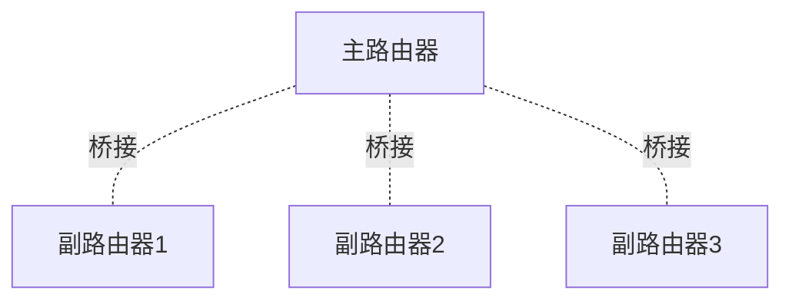
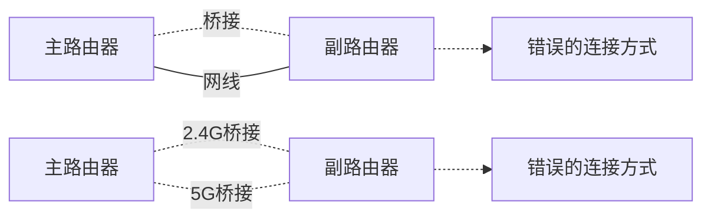
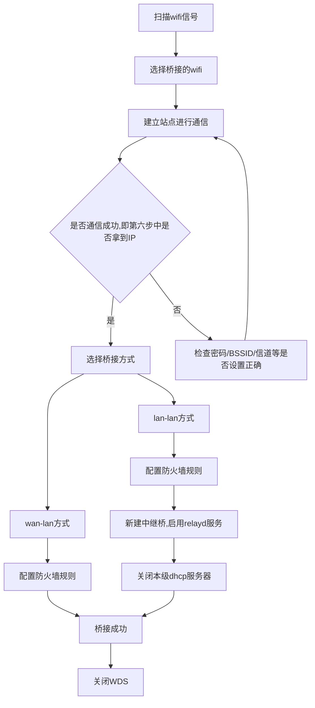

# WDS开发及使用手册

**目录**  
* TOC
{:toc}

## 1 介绍

### 1.1 适用人员

- 掌握基本的wifi配置方法，见[WiFi架构和配置手册](https://siflower.github.io/2020/08/12/wifi_architecture_and_configuration_manual/)
- 掌握network、firewall的配置方法，见[config文件配置手册](https://siflower.github.io/2020/09/11/config_setting/)

### 1.2 开发环境

- 正常编译环境
- 能烧录SDK镜像(其中包含wifi模块)的硬件平台
- 可以访问硬件系统，使用串口线或SSH
- 一个其他wifi信号源

### 1.3 相关背景

单台无线路由器的覆盖范围有限，导致局域网可能存在无线盲点或信号较弱区域。WDS（Wireless Distribution System，无线分布式系统）桥接功能可以将无线路由器通过无线方式连接到已有信号，实现以下需求：
- 消除盲点
- 扩展范围
- 移动漫游

### 1.4 功能概述

在本文中，开启WDS功能表示通过无线网络桥接（中继），以达到扩展无线信号和省去有线连接便可上网和互连的目的。在WDS设置成功后，连接到路由器的设备统一由中继的host（最上级路由器）统一管理，因此中继到同一host的路由器及其下面连接的设备之间也是可以互相交互的。

### 1.5 应用拓扑

普通的应用环境下，主要是两台路由器之间进行无线桥接（中继）。一些特殊的环境需要进行多台路由器的桥接（中继），如下：

- 星型拓扑：多台无线路由器桥接到一台主路由器，副路由器的数量取决于主路由器的无线带机量。




- 直线型拓扑：所谓的“A桥接B、B桥接C…”，主要为长方形覆盖区域扩展应用。根据基本通信原理，建议不超过三级WDS桥接（三级以上的WDS桥接，不能保证网络的稳定性和无线速率）。


## 2 项目介绍

### 2.1 编译说明

- 编译wifi模块,见[WiFi架构和配置手册](https://siflower.github.io/2020/08/12/wifi_architecture_and_configuration_manual/)
- 添加relayd服务，make menuconfig选中


```
LuCI--->5. Protocols--->CONFIG_PACKAGE_luci-proto-relay
Network--->Routing and Redirection--->CONFIG_PACKAGE_relayd
```


### 2.2 WDS配置说明

#### 2.2.1 无线站点配置

想要通过无线桥接（中继）到另一个ap（无线热点）上，首先需要在/etc/config/wireless添加一个对应的station（站点）与其进行连接。具体配置可参见[WiFi架构和配置手册](https://siflower.github.io/2020/08/12/wifi_architecture_and_configuration_manual/)。
一个可用的配置示例如下：

```
config wifi-iface
        option key '12345678'
        option ifname 'sfi0'
        option network 'wwan'
        option encryption 'psk2+ccmp'
        option device 'radio0'
        option mode 'sta'
        option bssid 'A8:5A:F3:00:02:3F'
        option ssid 'SiWiFi-023c-2.4G-8_1'
```

需要注意，device信道的设置一定要与host一致，否则会连接不上。
配置后重启wifi，使用ifconfig指令看到对应的interface。

#### 2.2.2 Station获取ip地址

在建立station后，设备会自动与host ap（目标热点）进行连接。此时如果参数配置正确，是可以正常连接的，但并不会自动获取到ip地址。想要通过dhcp获取ip地址，还要在对应的interface上再启动一个dhcp client。此时需要在/etc/config/network中添加一个新的interface wwan，并与wifi station（以下简称sfi*）绑定，同时将其proto设为dhcp。具体配置参见[config文件配置手册](https://siflower.github.io/2020/09/11/config_setting/)。
配置示例：

```
config interface 'wwan'
        option ifname 'sfi0'
        option proto 'dhcp'
```

如果不配置dhcp，手动为sfi*配置一个host ap的lan地址也是可以进行正常交互的。
此时，路由器与host之间已经可以正常交互了，但连接到路由器的用户，也就是路由器的lan段，还是不能访问host。

#### 2.2.3 桥接

**桥接方式**
新增的站点网络wwan可作为wan或者lan来进行网络桥接。

**wan-lan**
wan-lan桥接即使用无线连接代替路由器之间的网线，结构图如下


**lan-lan**
lan-lan通过relayd服务进行通信，结构图如下：


##### 2.2.3.1 Relayd服务介绍

为了实现WDS功能，需要启用Relayd服务，该服务实现了lan和wireless client之间类似于桥接的行为，同时支持dhcp和广播包的中继。
在make menuconfig配置中，选中CONFIG_PACKAGE_luci-proto-relay和CONFIG_PACKAGE_relayd以添加relay服务。添加后，就可以通过network的interface中将proto设为relay来使能relay服务。
Relay支持一组配置参数，可以通过修改config来实现一部分。其中大部分的配置在默认脚本/etc/init.d/relayd中已经配置好了，需要额外注意的是需要额外添加-P参数，表示对于dhcp包中option字段的处理，如果不设置会导致最后wds配置完成后，连接到路由器的设备在特定情况下无法访问路由器。需要在config中添加的参数有ipaddr，也就是从host通过dhcp获取到的地址，用来访问路由器使用，其余均使用默认配置即可。

##### 2.2.3.2 配置lan和sfix之间的relayd

接下来需要配置lan和wwan之间的relayd服务。首先需要在network中再添加一个interface stabridge用来将lan和raix桥接到一起，将其proto设置为relay，network设置为"lan wwan"，以及前面提到的另外两个参数，ipaddr设置为从host dhcp获取的地址，disable_dhcp_parse设置为1关闭option字段的解析。需要注意的是，上级host的lan地址可能与设置wds的路由器lan地址在同一个网段，因此需要进行判断，在相同时修改br-lan的ip地址。同时，因为WDS要求连接到路由器的设备由上级host统一管理，所以需要关闭lan的dhcp server，使得设备的dhcp请求由上级host进行回应。因为relayd默认打开了广播包和dhcp包的转发，因此设备的dhcp请求可以穿过lan-wwan，达到上级host。
一个可用的示例如下：
```
config interface 'stabridge'
        option ipaddr '192.168.8.182'
        option proto 'relay'
        option network 'lan wwan'
        option disable_dhcp_parse '1'
```
在防火墙的配置中，将lan的配置设为”lan wwan”，视为一个bridge，修改示例如下：
```
config zone
        option name 'lan'
        option input 'ACCEPT'
        option output 'ACCEPT'
        option forward 'ACCEPT'
        option network 'lan wwan'
```
此时pc或是连接到路由器的设备已经可以正常访问上级host了，只要host可以访问外网，就可以正常上网了，同时可以通过stabridge的地址或br-lan地址来访问路由器，进行其他的配置操作。

#### 2.2.4 其他防火墙设置

在Firewall配置中，将wwan配置的与wan的配置相同。具体配置参见[config文件配置手册](https://siflower.github.io/2020/09/11/config_setting/)
需要修改或增添的配置示例如下：
```
...
config zone
        option name 'wwan'
        list network 'wwan'
        option input 'REJECT'
        option output 'ACCEPT'
        option forward 'REJECT'
        option masq '1'
        option mtu_fix '1'
...
config forwarding
        option src 'guest'
        option dest 'wwan'
...
config forwarding
        option src 'lease'
        option dest 'wwan'
```


### 2.3 网页设置WDS流程

#### 2.3.1 注意事项

- 设置主、副路由器进行WDS桥接前，请勿使用网线连接两个路由器，避免形成环路（会导致广播风暴）。如果为主、副路由器均为双频路由器，5GHz和2.4GHz也不能同时进行WDS桥接，如下图所示：



#### 2.3.2 网页设置

**原生网页**

- 第一步，选择网络->无线->扫描，开始扫描无线网络。

- 第二步，选择要桥接的无线网络，请记住选择网络的信道和BSSID以便后续使用，然后点击“加入网络”。

- 第三步，输入要桥接的无线网络的密码，若使用wan-lan连接方式，则防火墙区域选择wan。

若使用lan-lan连接（后续需要额外进行第七步），则防火墙区域选择lan：

- 第四步，将设备配置的信道改成与桥接网络一致，并在接口配置填写桥接网络的BSSID。

- 第五步接口配置的高级设置中填写接口名称，可任意填写。

- 第六步，保存并应用，此时可见无线设置中有以下状态。若上级路由器能够上网，则通过本路由器lan口或wifi也能够上网。


- 第七步，特别的，若第三步中选择lan-lan连接，则需要进行如下额外设置：
在网络->接口中添加新接口。请记住wwan接口的IP地址。


接口名称可任意填写，协议选择中继桥。


将前面wwan接口的IP地址填入作为中继桥的地址，网络间中继勾选lan和wwan。


关闭lan的dhcp服务。


勾选忽略此接口。


保存应用即可。

**siflower 网页**

- 连接路由器wifi或者以太网，打开浏览器，输入192.168.4.1，输入密码进入路由器管理页面
  
  

- 点击高级设置->无线设置->WDS，打开WDS无线桥接设置页面

  

- 点击下一步，选择使用2.4G或者5G桥接
  
  

- 在以下列表中选择以下您将桥接的主路由无线信号名称，弹出密码输入窗口，输入要桥接的主路由器的无线密码，点击下一步
  
  

- 设置wds后，本路由的SSID和密码，如果不设置的话默认保持和主路由一致
  
  

- 点击下一步，开始进行桥接，设置完成
  
  

  **需要断开wds连接使用正常wan口连接的话，需要重新进入网页，点击关闭，等待断开即可**


#### 2.3.3 后续访问网页及关闭wds

**连接设备本级路由器的设备如何访问网页**

wan-lan连接方式直接访问网关即可;

lan-lan连接方式有两种访问方式:
- 可以访问中继桥的地址来访问网页;
- 固定IP为路由器的网段，然后访问网关，这种方式要求两个网络的网关地址不同。

**如何取消WDS**

wan-lan:删除新增的无线站点;

lan-lan:打开本地dhcp服务，删除新增的网络接口，删除新增的无线站点;

两种方式取消后都需要重启无线驱动，可选择重启路由器。

#### 2.3.4 流程图




### 2.4 内部相关

#### 2.4.1 redime

SDK文档见[RM#7140](http://redmine.siflower.cn/redmine/issues/7140)


## 3 FAQ

### 3.1 如何设置无线漫游网络？

WDS桥接设置中，将副路由器的无线SSID、密码设置为与主路由器相同，则可以实现移动过程中自动漫游。
WDS桥接的漫游网络中，正常情况下只能搜到一个（信号最强），也可能有极少数终端会搜到多个相同名字的
信号。移动过程中会实现自动切换（切换机制取决于无线终端），无需手动操作。

### 3.2 不同型号、品牌的路由器是否可以实现无线桥接？

主副路由器中，只要有一个支持WDS桥接功能即可，支持WDS桥接功能的路由器作为副路由器，扫描桥接另一个路由器即可。主、副路由器可以为不同品牌、不同型号的路由器。
注意：理论上不同品牌间的路由器WDS可以使用，也可能会有兼容性问题。

### 3.3 设置成功后，如何连接副路由上网？

设置好WDS桥接后，电脑、手机等连接副路由器的LAN口或无线信号即可上网。

### 3.4 各路由器的管理地址如何设置？

需要将所有路由器的管理IP地址修改为不同，为了便于管理，建议将副路由器的管理地址设置为与主路由器（连接宽带的路由器）同一网段。
比如主路由器IP地址为192.168.4.1，则将副路由器修改为192.168.4.2、192.168.4.3等IP地址。

### 3.5 路由器不支持WDS功能，怎么办？

主、副路由器任意一者支持WDS桥接功能即可，如果均不支持WDS功能，则无法使用。

### 3.6 路由器桥接不成功或桥接后不稳定怎么办？

设置WDS桥接过程中，为保证桥接成功且运行稳定，副路由器扫描主路由器的信号强度信号应至少三格（20dB）以上。如果强度不足，请尝试减少障碍物或距离。

### 3.7 如何更换桥接的上级wifi？

更换无线节点的ESSID、BSSID、加密方式、密码、信道等信息与目标wifi一致即可。

### 3.8 主路由器状态发生变化时，副路由器是如何处理的？

当路由器桥接的host状态发生变化时（如密码变更、信号干扰、路由器远离等），会导致与host的wifi连接断开，此时用户就无法通过路由器上网。由于在中继网络中，用户的手机或电脑的ip地址为上级host分配，路由器的dhcp功能是关闭的，因此发生这种情况是就需要系统获取错误的状态，重新打开本地的dchp server功能，使用户至少可以连接到路由器，关闭或修改wds的设置。
这个功能通过wpa_cli实现。在sfi（station）发生连接和断开时间时，wpa_cli会接受这个事件并触发usr/bin/wpa_cli_event.sh。在wpa_cli_event.sh脚本中，通过控制led闪烁来提示用户当前连接已经断开，同时踢出路由器上的所有连接设备，打开dhcp server。此时用户再重新连接到路由器时，将获得路由器本地分配的ip地址，便可以正常访问路由器进行设置。当产生了连接时间时，恢复led的配置并关闭本地的dhcp server，保证用户可以从上级host分配到新的ip地址。
网页上为了凸显这种配置，增加了连接状态判断的接口，支持“无法连接到主机”和“主机密码改变”两种错误情况。通过wpa_cli scan_result来获取host信息，如果host存在，则认为断开的原因是密码修改；如果不存在，说明无法连接主机。
