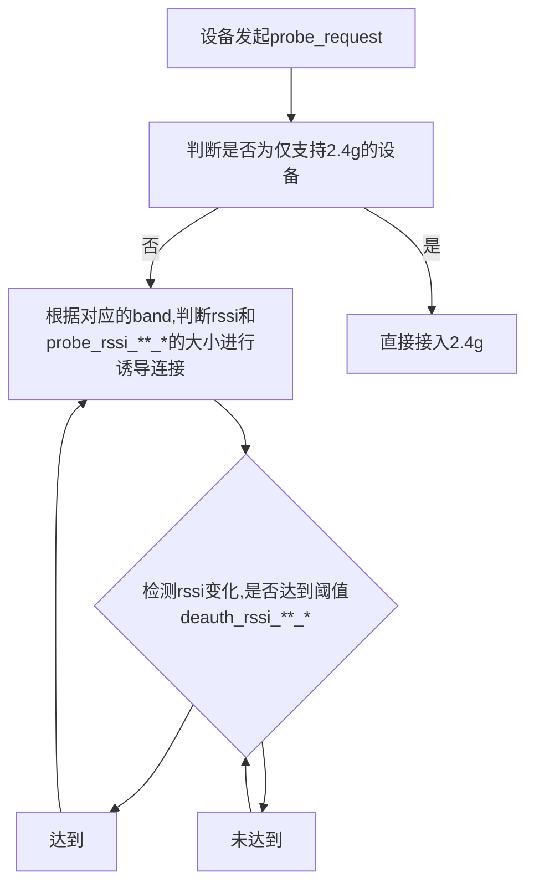

# WiFi双频合一使用手册

**目录**
* TOC
{:toc}

## 1 介绍

### 1.1 适用人员

 - 熟悉wifi配置，见[WiFi架构和配置手册，todo]()

### 1.2 开发环境

 - 正常的编译和运行环境，见[快速入门，todo]()

### 1.3 功能概述

双频合一功能，是指把2.4G和5G的WIFI信号合并成一个信号，只要设置一个SSID与密码，设备能够自动选择合适的接入频段以及自动切换的功能。
该功能主要包含两个特点：
1.诱导设备连接更合适的频段。比如信号较强时诱导连接5G wifi，速度更快。
2.当设备已经连接时，自动切换更合适的频段。比如用户设备从距离AP较近的位置远离AP时，2.4G wifi的衰减更小，设备与路由器的连接会从5G切换到2.4G。

## 2 项目设计

### 2.1 编译

make menuconfig需要选中：
```
Utilities--->wifi-dbss
```


### 2.2 自动切换策略

双频合一功能的核心策略就是通过wifi信号强度（rssi）来区分设备更适合连接2.4G还是5G。
2.4G信号频宽较窄，而且现在的无线设备大多使用2.4G频段，所以无线环境比较拥挤，干扰比较大。但由于2.4G的频率低，传播遇到障碍物时衰减比较小，可以传播到更远的距离。5G信号频宽比较宽，无线环境干净，干扰少，网速稳定，无线速率更高。但5G的频率高，信号传播时衰减比较大，穿墙能力远小于2.4G，传播距离相对较近。

详细策略见[RM#7424](http://redmine.siflower.cn/redmine/issues/7424)

### 2.3 流程图



### 2.4 配置说明

#### 2.4.1 配置

etc/config/wireless中iface节点启用配置
```
option cond_hidden 1
```

#### 2.4.2 启动和停止

 启动：```/etc/init.d/advanced_wifi start```
 停止：```/etc/init.d/advanced_wifi stop```

#### 2.4.2 wifi-dbss参数说明

/etc/init.d/advanced中可以指定以下参数：
①-r：设定2.4G诱导连接5G rssi阈值probe_rssi_24g_r。
②-l：设定5G诱导连接2.4G rssi阈值probe_rssi_5g_l。
③-R：设定2.4G切换到5G rssi阈值deauth_rssi_24g_r。
④-L：设定5G切换到2.4G rssi阈值deauth_rssi_5g_l。
⑤-d：设置debug level。默认为5。
⑥-t：设置band切换时间间隔check_deauth_time，最多为30秒。

## FAQ