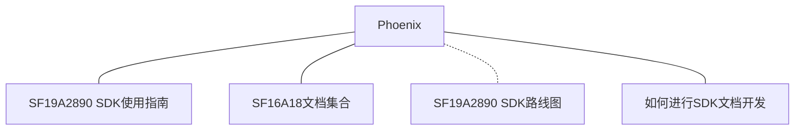
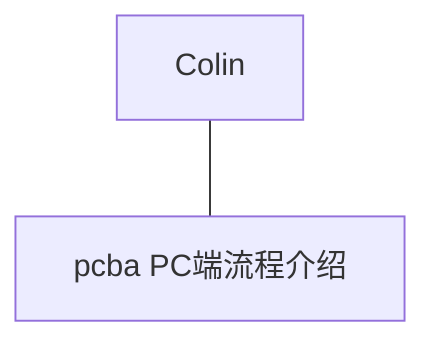
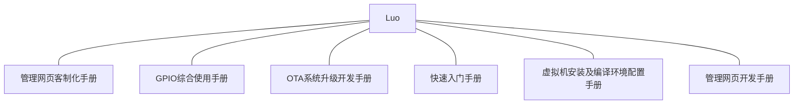
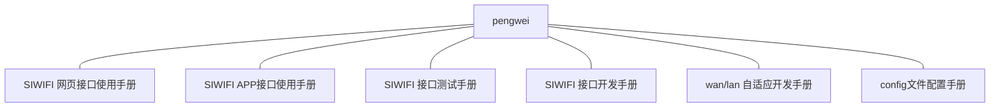
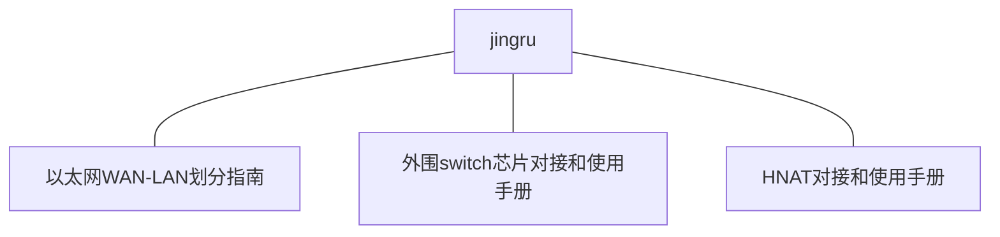
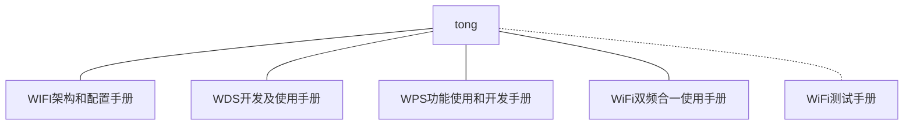
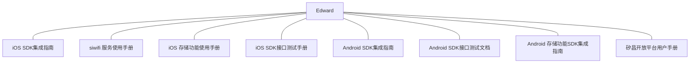

* TOC
{:toc}

# SF19A2890 SDK使用指南

## SF19A2890 SDK介绍

### 相关背景

SDK是以矽昌通信基于自主研发的SF19A2890芯片开发，SF19A2890芯片是一颗高集成度，主要用于网络通信产品，具备千兆有线网络，2x2 双频段WIFI以及丰富的外部接口。

- Applications Processor Subsystem
  - Quad-processing MIPS32® interAptiv
  - 8-Channel Direct Memory Access (DMA)
  - 3x Universal Asynchronous Receivers/Transmitters (UARTs)
  - 1x Serial Peripheral Interfaces (SPIs)
  - 1x Inter-integrated Circuits (I2Cs)
  - 2x General-Purpose Timers (GPTs)
  - 1x Watchdog Timer Module
  - 2x 16-Bit Pulse-Width Modulation (PWM) Interfaces
  - 1x USB2.0 OTG
  - Programmable GPIO Pins

 

- Wired Ethernet Network Processor Subsystem
  - 1x Reduced Gigabit Media-Independent Interface (RGMII), 10/100/1000Mbps
  - Support hardware network address translation(HW-NAT) 

 

- Wi-Fi Network Processor Subsystem
  - 2.4GHz 802.11b/g/n, 20/40M
  - 5GHz 802.11a/n/ac,  20/40/80M 
  - 2x2 MIMO 2.4GHz/5GHz Dual-Band 

### 开发环境
SDK开发环境可以使用基于linux发行的操作系统，具体可以参考快速入门  ，同时支持路由器，中继器，AC/AP三种产品形态。

### 功能设计和流程

SDK提供了基于OpenWrt 系统的全功能路由方案，支持功能包括:
 

todo 详情参见

### 版本情况

最新release版本:

正在维护的release版本:   

停止维护的release版本:

### 开发计划

SDK开发计划以 SF19A2890 Roadmap

### 适用人员

本SDK适用于需要适用SF19A2890芯片开发路由器及网络通信产品的开发人员。

## 如何使用SDK

本章节介绍如何适用SF19A2890 SDK进行开发。需要准备相应的硬件。

### 硬件和相应的SDK配置选择

- 需要有SDK支持的硬件平台
  - AC28 路由板型(intel switch芯片)
  - AC22 路由板型(realtek switch芯片)

详情参见 快速入门手册 https://siflower.github.io/2020/08/05/quick_start/

### 如何基于SDK，进行硬件适配

如果自行进行了硬件开发，那么需要在SDK上进行二次开发，增加对应的配置。
详情参见 新的版型引入指南 https://siflower.github.io/2020/09/08/newBoardImportGuide/

### SDK siflower开发和linux对接

如果想针对SDK进行一些功能开发，我们提供了

#### LINUX 开发介绍

- [Linux DTS说明文档](https://siflower.github.io/2020/09/03/linux_dts_introduce/)
- [Pinctrl 和 GPIO 使用手册](https://siflower.github.io/2020/07/30/pinctrl_gpio/)

#### 外围Switch芯片对接介绍

- [外围switch芯片对接和使用手册](https://siflower.github.io/2020/09/11/new_switch_import_guide/)

### 如何基于SDK进行客制化

如果想要适用siflower商业化版本，进行简单客制化完成产品化项目，软件版本需要联系siflower，获得专门授权，可以参见
- [管理网页客制化手册](https://siflower.github.io/2020/07/31/manage_web_custom_guide/)

### 如何基于SDK进行二次开发

#### 功能开发介绍

- [wifi架构和配置手册](https://siflower.github.io/2020/08/12/wifi_architecture_and_configuration_manual/)

- [WDS开发及使用手册](https://siflower.github.io/2020/09/02/WDS_development_and_user_manual/)

- [SiWiFi接口开发手册](https://siflower.github.io/2020/09/11/SiWiFi_interface_develop/)

- [wan-lan自适应开发手册](https://siflower.github.io/2020/09/11/wan_lan_auto_adapt/)

#### 页面显示开发介绍

- [管理网页开发手册](https://siflower.github.io/2020/08/05/manage_web_develop_guide/)

#### APP开发介绍

- [iOS SDK集成指南](https://siflower.github.io/2020/08/05/iOS_SDK/)
- [Android SDK集成指南](https://siflower.github.io/2020/07/29/android_sdk/)

### 如何根据需求调整镜像的配置

- [FLASH分区开发手册](https://siflower.github.io/2020/09/08/flashPartitionGuide/)

### 如何修改系统的初始化配置

TODO

### 如何对于SDK进行测试
- [以太网测试介绍](https://siflower.github.io/2020/09/08/ethernetTestGuide/#%E4%BB%A5%E5%A4%AA%E7%BD%91%E6%B5%8B%E8%AF%95%E4%BB%8B%E7%BB%8D)

## 文档索引及负责人

- 底层平台

```mermaid
graph TB

D[Kaijun]
D---D1[USB驱动开发手册]
D---D2[SPI驱动开发手册]
D---D3[Siflower IOMUX Table]
D---D4[I2C驱动开发手册]
D---D5[Pinctrl和GPIO使用手册]
D---D6[UART驱动开发手册]
D---D7[DDR和FLASH物料调试指南]
D---D8[Linux DTS说明文档]
D---D9[PCBA 板端开发手册]
D---D10[irom patch功能介绍]


click D1 "https://siflower.github.io/2020/09/03/usb_driver/" "USB驱动开发手册"
click D2 "https://siflower.github.io/2020/09/03/spi_driver/" "SPI驱动开发手册"
click D3 "https://siflower.github.io/2020/09/03/iomux_table/" "Siflower IOMUX Table"
click D4 "https://siflower.github.io/2020/09/03/i2c_driver/" "I2C驱动开发手册"
click D5 "https://siflower.github.io/2020/07/30/pinctrl_gpio/" "Pinctrl 和 GPIO 使用手册"
click D6 "https://siflower.github.io/2020/09/03/uart_driver/" "UART 驱动开发手册"
click D7 "https://siflower.github.io/2020/09/03/ddr_flash/" "DDR和FLASH物料调试指南"
click D8 "https://siflower.github.io/2020/09/03/linux_dts_introduce/" "Linux DTS说明文档"
```
  

- 系统平台

- WiFi

- 应用平台

## 项目引用

此项目参考文档

- [wiki-markdown](https://siflower.github.io/wiki/markdown/)

### 内部相关

## FAQ

- 如何反馈SDK存在问题，获得解决方案
  可以通过github提交issue，我们会尽快处理解决，同时也欢迎给此项目贡献代码。

- 如何和siflower取得联系，或者获取siflower硬件。
  请联系phoenix.shen@siflower.com.cn 获取详细信息和支持。 
