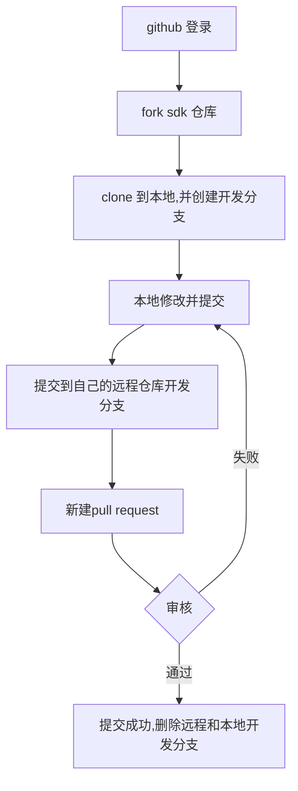

# 通过github pull request 提交代码


* TOC
{:toc}

## 介绍

本文档主要介绍了如何使用github pull request的方式向本项目提交代码

### 适用人员

本项目适用于熟悉使用git 命令， 熟悉github 项目的开发人员。

### 开发环境

适用于linux windows mac 等，具有git 工具环境。

## 项目引用

https://docs.github.com/en/github/collaborating-with-issues-and-pull-requests/about-pull-requests


### 功能设计和流程


详细步骤：

- 登录github网站后，点击https://github.com/Siflower/siflower.github.io，并点击页面fork按钮，将改代码仓库fork 到自己的github账号中。


- fork 成功之后，进入自己的github 账号仓库页面，找到对应的github仓库，git   clone 到本地。


- 使用git checkout命令建立本地分支
```
   git checkout -b test_br
```

- 此时进行本地更改然后提交，git commit 提交内容模板如下

```
feat: 添加github pull request 文档

介绍了如何通过github pull request 进行代码提交​
​
Issue #3
Closes #3
RM#7168
```
第一行为type用于说明 commit 的类别，可以使用如下类别：
```
feat：新功能（feature）
fix：修补
bug
doc：文档（documentation）
style： 格式（不影响代码运行的变动）
refactor：重构（即不是新增功能，也不是修改bug的代码变动）
test：增加测试
chore：构建过程或辅助工具的变动
```
后面通过issue 关联github问题，关闭github 问题
最后关联siflower 内部redmine


- 本地提交完成后，开始进行代码合并工作
   首先切换到master分支,检查一下自己的远程配置


- 设置siflower仓库为本地仓库的upstream, 


- 然后进行一次同步，降siflower仓库和本地master进行同步。


- 在切换到开发分test_br, 将master和test_br 再进行一次同步。

```
git rebase master
```

- 上述动作完成后，test_br的改动就可以直接进行push了。 push之后，网站上可以看到


- 进入pull request选项之后，选择好对应的仓库和分支


  
此时提交，就可以想siflower仓库提交此次开发的pull request，等待审核通过。


## FAQ

- 为什么要和siflower仓库进行一次同步？
  
  为了保证此次需要合并的提交，和现在最新的siflower仓库没有冲突，可以合入。

- 开发完成后，如何处理开发分支

可以直接删除开发分支，等待siflower仓库合入提交后，更新自己的master分支即可。
